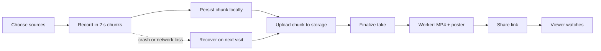
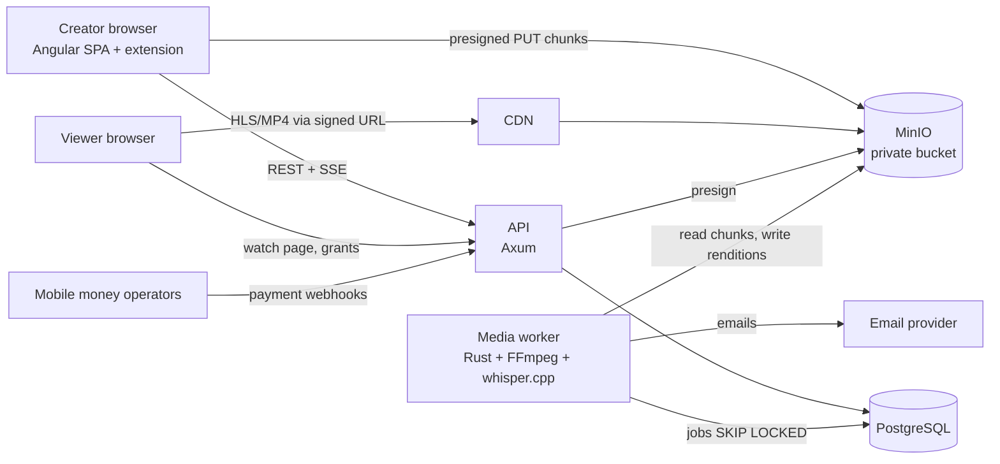
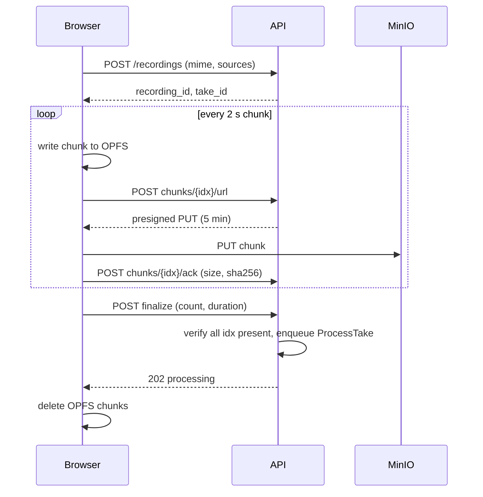
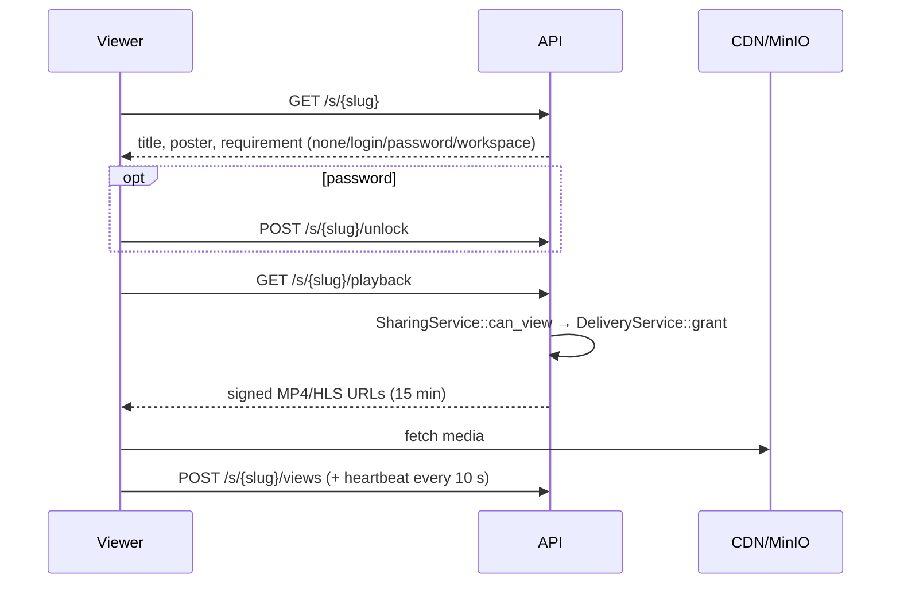
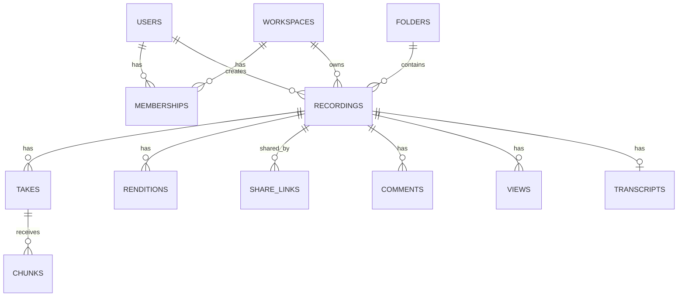
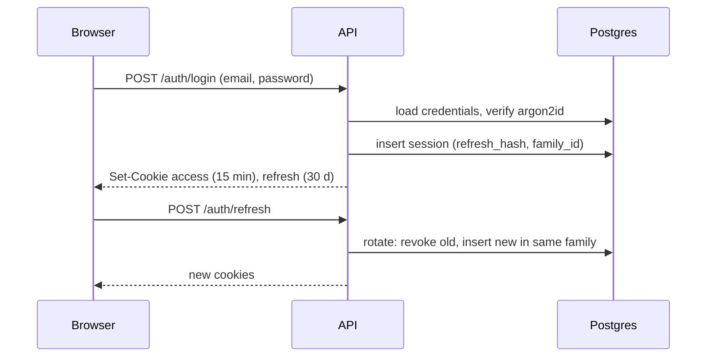
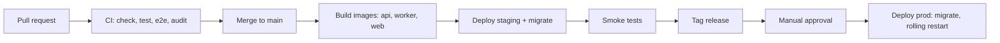
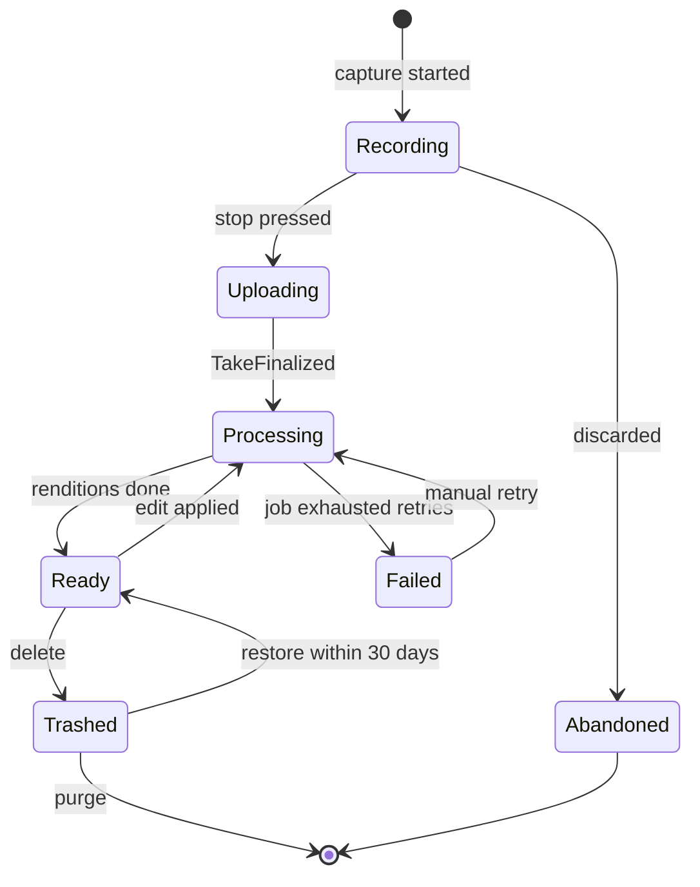

<div align="center">

# Sintade

**Browser-based screen, audio and webcam recording that turns every recording into a shareable link seconds after you press stop.**

-yellow)


</div>

> [!IMPORTANT]
> **Repository status: in development (Day 30 of the [daily build plan](docs/plan/daily-build-plan.md), M3 — Capture engine; M1 Foundation and M2 Identity complete).** The Cargo workspace (`crates/kernel`, `crates/platform`, `crates/identity`, `crates/tenancy`, `bin/api`, `bin/worker`) exists and builds; local dependencies (Postgres, MinIO, Mailpit) run via `compose.yml` + `just deps-up`; the API serves `/healthz` and `/readyz` on `:8080` with RFC 9457 problem+json error responses; `platform` provides `ObjectStore`, a `SKIP LOCKED` job queue with a dead-letter queue, a transactional outbox relay, `Mailer`, and a Postgres-backed `RateLimiter`; GitHub Actions CI is green and builds/pushes Docker images for api/worker/web on merge to `main` (no staging VPS exists yet — see `docs/plan/PROGRESS.md`). The Angular app (`web/`) now has a real, working signup → verify-email → login → protected-home flow (`/debug`'s capability matrix is still there too), CSRF/credentials wired through `HttpClient`, a route guard, and silent refresh on `401`, verified against the real API and a real Mailpit-delivered email in both unit tests and a Playwright e2e test. Since Day 18, `crates/tenancy` owns workspaces and memberships, and provides `authorize()` with the `Role`/`Permission` matrix. The API has a `WorkspaceContext` extractor, every route is declared once in a classified route table, and a generated tenant-isolation harness runs over that table on every PR. Day 19 added profile settings (`PATCH /me`), log out everywhere (`POST /auth/logout-all`), and an OpenAPI contract (`docs/api/openapi.json`, from utoipa) with generated TypeScript DTOs that the frontend compiles against, drift-checked in CI. This README is derived entirely from the *Sintade — Product & Architecture Document* (the design document). Every feature, endpoint, table, variable and procedure below is **planned**, not implemented, unless explicitly marked otherwise. Items that the design document does not settle are marked `TODO: Verify`.
>
> When code lands, each section must be re-verified against the repository and its status markers updated. See `docs/plan/PROGRESS.md` for the current day and build log.

### Status legend

| Marker | Meaning |
| --- | --- |
| ✅ Implemented | Exists in the repository and is tested |
| 🟡 Partial | Exists but incomplete |
| 📋 Planned (MVP / V1 / V2) | Specified in the design document and scheduled for that phase |
| 🔮 Future | Specified as a future capability, not yet scheduled |
| `TODO: Verify` | Not determined; must be confirmed |

At the time of writing, **no item is ✅ or 🟡**.

---

## 1. Project Overview

### Executive summary

Sintade is a web-based screen recording platform. A creator records their screen, microphone, system audio and optional webcam in the browser; chunks upload while recording; a background worker converts the recording to a universally playable MP4 (and later HLS); and the creator receives a shareable link within seconds of stopping. The first target segment is **developers and tech teams** in Tanzania, with plans priced in **TZS** and paid through **direct mobile money APIs**. The platform is built from scratch as a Rust/Axum modular monolith with a separate media worker, PostgreSQL, self-hosted MinIO object storage and an Angular SPA, plus a Chrome/Edge browser extension.

| Item | Value |
| --- | --- |
| Application name | Sintade (from Spanish *cinta de casete*, "cassette tape") |
| Short description | Record your screen in the browser, share a link instantly |
| Project status | Pre-development (design complete, no code) |
| Current version | Not released. `TODO: Verify` initial version scheme at first tag |
| License | `TODO: Define project license.` |
| Repository | `TODO: Verify` repository URL (placeholder `<repo-url>` in design document) |
| Domain | `TODO: Verify` — domain not yet registered |

### Problem being solved

Explaining something on a screen — a bug, a code path, a PR, a status update — usually costs a meeting or a long written message. Sintade replaces both with a short recording that is ready to share immediately, survives browser crashes and network loss, and plays in any browser.

### Target users

| Priority | Segment | Primary job | Phase |
| --- | --- | --- | --- |
| 1 | Developers and tech teams (5–200 seats) | Async technical communication in a shared library | MVP onward |
| 2 | Individual professionals | Replace a meeting with a video | V1 |
| 3 | Support and sales | Personalised video replies | V2 |
| 4 | Educators and trainers | Lessons and tutorials | V2 |

### Primary use cases

- Bug reports with the browser console and network tab visible.
- Code and architecture walkthroughs; PR explanations before review.
- Async standups and status updates.
- A searchable team library of onboarding and how-it-works videos.

### Core value proposition

1. **Record-to-link in ≤ 5 s** (p95, 30-minute recording at 1080p, 10 Mbps uplink).
2. **Zero lost recordings** — every chunk is persisted locally before upload.
3. **Plays everywhere** — MP4/HLS output, including Safari and mobile viewers.
4. **Downloadable** — creators can always download their recordings as MP4.
5. **Self-hostable core** — no mandatory third-party SaaS in the media path.

---

## 2. Table of Contents

1. [Project Overview](#1-project-overview)
2. [Table of Contents](#2-table-of-contents)
3. [Product Overview](#3-product-overview)
4. [Features](#4-features)
5. [User Roles and Permissions](#5-user-roles-and-permissions)
6. [System Architecture](#6-system-architecture)
7. [Technology Stack](#7-technology-stack)
8. [Repository Structure](#8-repository-structure)
9. [Architecture and Design Principles](#9-architecture-and-design-principles)
10. [Application Data Flow](#10-application-data-flow)
11. [Database Documentation](#11-database-documentation)
12. [API Documentation](#12-api-documentation)
13. [API Conventions](#13-api-conventions)
14. [Authentication](#14-authentication)
15. [Authorization](#15-authorization)
16. [Configuration](#16-configuration)
17. [Installation](#17-installation)
18. [Local Development](#18-local-development)
19. [Docker](#19-docker)
20. [Database Setup and Migrations](#20-database-setup-and-migrations)
21. [Testing](#21-testing)
22. [Code Quality](#22-code-quality)
23. [Development Workflow](#23-development-workflow)
24. [Git and Versioning](#24-git-and-versioning)
25. [CI/CD](#25-cicd)
26. [Deployment](#26-deployment)
27. [Production Operations](#27-production-operations)
28. [Monitoring and Observability](#28-monitoring-and-observability)
29. [Logging](#29-logging)
30. [Security](#30-security)
31. [Privacy and Data Protection](#31-privacy-and-data-protection)
32. [Error Handling](#32-error-handling)
33. [Business Logic and Rules](#33-business-logic-and-rules)
34. [Integrations](#34-integrations)
35. [Background Jobs and Scheduled Tasks](#35-background-jobs-and-scheduled-tasks)
36. [Notifications](#36-notifications)
37. [File and Media Storage](#37-file-and-media-storage)
38. [Caching](#38-caching)
39. [Performance](#39-performance)
40. [Scalability](#40-scalability)
41. [Disaster Recovery](#41-disaster-recovery)
42. [Troubleshooting](#42-troubleshooting)
43. [Health Checks](#43-health-checks)
44. [API Examples](#44-api-examples)
45. [Frontend Documentation](#45-frontend-documentation)
46. [Backend Documentation](#46-backend-documentation)
47. [Environment Matrix](#47-environment-matrix)
48. [System Requirements](#48-system-requirements)
49. [Known Limitations](#49-known-limitations)
50. [Roadmap](#50-roadmap)
51. [Frequently Asked Questions](#51-frequently-asked-questions)
52. [Glossary](#52-glossary)
53. [Contribution Guide](#53-contribution-guide)
54. [Security Reporting](#54-security-reporting)
55. [Support](#55-support)
56. [License](#56-license)
57. [Changelog](#57-changelog)
58. [Documentation Roadmap](#58-documentation-roadmap)
59. [Documentation TODO](#59-documentation-todo)

---

## 3. Product Overview

### What the product does

1. The creator opens the recorder (web app or browser extension), selects a screen/window/tab, microphone, system audio and optionally a webcam.
2. The browser records in 2-second chunks. Each chunk is written to local browser storage (OPFS) and then uploaded directly to object storage.
3. On stop, the server verifies all chunks and queues processing.
4. A worker builds a fast-start MP4 and a poster image; the recording becomes playable.
5. The creator shares a link with a chosen visibility; viewers watch in any browser.

### Main workflows



### Major user types

| User type | Description |
| --- | --- |
| Creator | Signed-in user who records, manages and shares recordings |
| Workspace member | User belonging to a workspace with a role (owner, admin, member, viewer) — 📋 V1 |
| Viewer | Anyone opening a share link; may be anonymous depending on visibility |
| Operator | Person deploying and running the platform |

### Main system capabilities

Capture · reliable chunked upload · media processing · playback · sharing and access control · library management · authentication · workspaces (V1) · editing (V1) · transcription (V1) · engagement (V1) · billing (V1) · notifications · integrations (V2).

### Business/domain concepts

| Concept | Meaning |
| --- | --- |
| Recording | The logical video a user creates; owns metadata, visibility and renditions |
| Take | One capture session; a recording has one take unless re-recorded or stitched |
| Chunk | A timesliced blob from `MediaRecorder` (2 s), the unit of local persistence and upload |
| Upload session | Server-side state tracking received chunks for one take |
| Rendition | A processed output: MP4, HLS ladder, thumbnail, sprite, captions |
| Share link | A slug plus access policy (visibility, password, expiry, download) |
| Workspace | A tenant: owns members, recordings, billing and policies |
| Entitlements | Plan-derived limits computed by Billing (max duration, storage, seats, resolution) |

Ubiquitous-language rules: a Recording is never called a "video" in code; visibility lives on ShareLink, never on Recording; other modules never read plan names, only Entitlements.

---

## 4. Features

All features are 📋 Planned. Phase shown per feature. Endpoints and tables are the planned ones from the design document.

### 4.1 Capture — 🟡 MVP in progress (webcam etc. V1)

> Day 21: the framework-free capture package exists at `web/src/app/capture/` (ESLint forbids Angular and outside imports there). `SourceManager` acquires the display (`getDisplayMedia`, 30 fps, optional system audio) and microphone (`getUserMedia`, exact device), lists mics with live `devicechange` updates, reports browser-ended shares, and normalises failures into `CaptureError` kinds. `/debug` previews both live. Day 22: `AudioMixer` mixes mic + display audio into one Web Audio track, with RMS level meters per input and for the mix; a device-free self-test on `/debug` proves a recorded clip contains both sources on every engine. Day 23: `ChunkRecorder` records a take in 2 s timesliced chunks (VP9 → VP8 → H.264/MP4 MIME preference) with `chunks$`/`state$`; a self-test proves the concatenated chunks play to the end. Day 24: pause/resume with a timer that excludes pauses, and the recording stops itself when the shared screen ends ("Stop sharing"); a paused clip plays correctly. Day 25: `ChunkStore` persists chunks locally in OPFS (IndexedDB fallback where OPFS isn't writable), verified to survive a page reload byte-for-byte. Day 26: crash recovery. Each take is journaled (start time, pause-excluding length) as chunks land, a Web Lock marks takes still recording in some tab, and an app-wide dialog offers unfinished recordings ("Unfinished recording from 14:02, 6 min 20 s") with Save a copy / Discard; Upload waits for streaming upload. Day 27: the recorder page (`/record`, signed-in) chooses screen/window/tab with a live preview, a microphone (list refreshed with real names after permission, last choice remembered), and system audio, where the toggle is disabled with a one-line reason on Firefox/Safari and carries a tab-only note on Chromium outside Windows. Day 28: opening a mic shows a live level meter (peak-hold so short sounds register), and Start recording runs a 3-2-1 countdown that Esc skips. Day 29: the first real takes from the UI. After the countdown, a `TakeSession` (framework-free: mix, record, persist) records with a control bar (Pause/Resume, Stop, a pause-excluding `m:ss` timer), fully keyboard-operable with screen-reader labels and focus that follows the take. Takes are saved on the device with "Save a copy" until uploads land. Error states follow on Day 30.

| Item | Detail |
| --- | --- |
| What | Screen/window/tab via `getDisplayMedia`; microphone with device picker; system/tab audio; mic + system audio mixed via Web Audio API; runtime capability detection |
| Who | Signed-in creators on desktop Chrome, Edge, Firefox, Safari (latest 2 versions) |
| Rules | Options unsupported by the browser are disabled with a one-line reason; mobile browsers cannot record (view only) |
| V1 additions | Webcam bubble composited on canvas; camera-only mode; per-source volume/mute; level meters; noise suppression/AEC/AGC; region crop; 720p/1080p/4K, 30/60 fps presets |
| Endpoints | `POST /api/v1/recordings` (creates recording + take + upload session) |
| Entities | `recordings`, `takes` |
| Dependencies | Browser APIs: `getDisplayMedia`, `getUserMedia`, Web Audio, `MediaRecorder`, Canvas |

**System audio support**

| Capability | Chrome/Edge (Windows) | Chrome/Edge (macOS/Linux) | Firefox | Safari |
| --- | --- | --- | --- | --- |
| Screen/window/tab | Yes | Yes | Yes (no tab) | Yes (no tab) |
| System audio | Full screen + tab | Tab only | No | No |
| `MediaRecorder` output | WebM VP8/VP9 + Opus; MP4 in recent versions | Same | WebM | MP4 H.264 + AAC |
| Recording on mobile | No | No | No | No |

### 4.2 Recording controls — 📋 MVP

Start, stop, pause, resume; 3-2-1 countdown (skippable with `Esc`); elapsed timer excluding paused time; the browser's "Stop sharing" button is handled like Stop (`track.onended`); click highlights and keystroke display via the extension. V1: restart/discard take, keyboard shortcuts, plan max duration, cursor show/hide.

### 4.3 Recording reliability — 📋 MVP / V1

| Item | Detail |
| --- | --- |
| MVP | 2 s timesliced chunks; OPFS chunk store (IndexedDB fallback); crash-recovery dialog (Upload / Discard) |
| V1 | Streaming upload while recording; resumable retry with backoff; storage quota check; Wake Lock; `beforeunload` guard |
| Rules | A chunk is always written locally before its upload starts; recovered recordings may lose at most the last unflushed timeslice (≤ 2 s) |
| Endpoints | `GET /api/v1/takes/{id}/status`, chunk endpoints (4.4) |

### 4.4 Upload and ingest — 📋 MVP

| Item | Detail |
| --- | --- |
| What | Presigned PUT per chunk directly to MinIO; per-chunk SHA-256 acknowledgement; finalize with chunk count and duration |
| Rules | Chunk index 0-based and contiguous; same-hash re-upload is a no-op; different hash → `409`; finalize with missing indexes → `422` listing them; max chunk 16 MB |
| Endpoints | `POST /takes/{id}/chunks/{idx}/url`, `POST /takes/{id}/chunks/{idx}/ack`, `POST /takes/{id}/finalize`, `GET /takes/{id}/status` |
| Entities | `takes`, `chunks` (planned `upload_sessions` table listed in module ownership; `TODO: Verify` whether separate from `takes`) |
| Events | Emits `TakeFinalized` |

### 4.5 Processing pipeline — 📋 MVP / V1

MVP: Postgres job queue; concatenate chunks; ffprobe validation; fix WebM duration/cues; fast-start MP4 (H.264/AAC); poster. V1: HLS ladder 360p/720p/1080p, animated preview, scrub sprite, loudness normalisation, status via SSE. Entities: `renditions`, `jobs`, `outbox_events`. Events: `RecordingReady`, `RenditionReady`, `AudioReady`, `ProcessingFailed`.

### 4.6 Playback — 📋 MVP / V1

MVP: play/pause/seek/volume/fullscreen; 0.5–2× speed; keyboard seek ±5 s. V1: HLS with quality selector, captions (WebVTT), resume position, hover sprite, chapters. Endpoint: `GET /s/{slug}/playback` returns signed URLs (15-minute TTL).

### 4.7 Download — 📋 MVP

Creators can always download their recordings as MP4 (H.264/AAC) through a signed, short-lived URL. Viewers can download only when the share link's `allow_download` is true (V1 toggle). `TODO: Verify` exact download endpoint — not specified in the design document.

### 4.8 Editing — 📋 V1 / V2

V1: trim start/end, cut segments, non-destructive edit decision list (EDL) rendered by FFmpeg, title/description. V2: stitch, text overlays, blur/redact, zoom/pan, transcript-based cuts, re-record segment. Endpoint: `POST /recordings/{id}/edits`. Entity: `edits`.

### 4.9 Transcription and AI — 📋 V1 / V2

V1: whisper.cpp on CPU on the worker VPS; VTT/SRT captions; searchable transcript with click-to-seek. V2: summaries, auto-title, chapters, filler-word removal, caption translation. Endpoint: `GET /recordings/{id}/transcript`. Entities: `transcripts`, `transcript_segments`, `captions`, `summaries`.

### 4.10 Sharing and access — 📋 MVP / V1

MVP: unguessable slug (≥ 70 bits entropy); visibility `private` / `link` / `public`; owner MP4 download. V1: `workspace` visibility, password, expiry, invite by email, download toggle, revoke/regenerate, Open Graph + oEmbed. Endpoints: `/recordings/{id}/links[/{link}]`, `GET /s/{slug}`, `POST /s/{slug}/unlock`, `GET /oembed`. Entities: `share_links`, `share_invites`, `link_unlocks`.

### 4.11 Viewer engagement — 📋 V1

Timestamped comments, emoji reactions, threads and @mentions, view counts (unique viewer dedupe per viewer per 30 min). Endpoints: `/recordings/{id}/comments`, `POST /s/{slug}/views`, heartbeat. Entities: `comments`, `reactions`, `views`, `view_segments`.

### 4.12 Library — 📋 MVP / V1

MVP: list newest first (thumbnail, title, duration, date; cursor pagination 24/page), rename, trash. V1: folders, search (title + transcript), filters/sort, trash restore within 30 days, bulk actions. Entities: `recordings`, `folders`, `tags`.

### 4.13 Accounts and authentication — 📋 MVP / V1

See [14. Authentication](#14-authentication).

### 4.14 Workspaces and teams — 📋 MVP (personal) / V1

Personal workspace auto-created at signup (MVP). V1: multi-workspace membership, roles, invites, shared library. V2: team spaces, admin policies, audit log.

### 4.15 Billing and plans — 📋 V1 (stub in MVP)

MVP: billing module returns hard-coded free-tier entitlements (50 recordings, 10 min each, up to 1080p). V1: TZS plans and seats, direct mobile money APIs (M-Pesa, Airtel Money, Mixx by Yas, HaloPesa), usage metering, proration, invoices. Endpoints: `GET /billing/entitlements`, `POST /billing/checkout`, `POST /webhooks/payments/{provider}`.

### 4.16 Notifications — 📋 MVP / V1

MVP: "recording ready" email. V1: in-app centre, comment/mention/first-view emails, preferences.

### 4.17 Browser extension — 📋 MVP

Manifest V3 extension for Chrome/Edge: start recording from any tab, click highlights, keystroke overlay; reuses the framework-free capture package; session handoff from the web app.

### 4.18 Integrations and public API — 🔮 V2

Public REST API with scoped keys, webhooks, Slack unfurl, Jira/GitHub/Notion/Drive, Zapier/Make.

### 4.19 Analytics — 📋 V1 / V2

V1: views, unique viewers, average watch time. V2: retention curve, workspace dashboard, CSV export.

### 4.20 Future: Camtasia parity — 🔮 Future

The design document maps 55 Camtasia capabilities to Sintade phases (guided "looks", full multi-track timeline, device frames, transitions, cursor effects, AI voiceover/avatars, quizzes, SCORM export, direct publishing, live streaming, native and mobile recorders, and more). See the *Future versions* table in the design document.

---

## 5. User Roles and Permissions

**Model:** role-based access control (RBAC) scoped per workspace, combined with resource-level checks (ownership, share-link policy). Roles are a Postgres enum `member_role`. Authorization entry point: `TenancyService::authorize(user, Permission, WorkspaceId)` (✅ Day 18; non-member → `404`, member without the permission → `403`) and the `WorkspaceContext` extractor's `ctx.require(Permission)` (✅ Day 18). The per-resource form `ctx.require(Permission::…, &resource)` arrives with the catalog days.

### Roles

| Role | Phase | Scope |
| --- | --- | --- |
| `owner` | MVP (personal workspace) | Full control of a workspace, including billing and deletion |
| `admin` | V1 | Manage members, policies and all recordings |
| `member` | V1 | Create and manage own recordings; view workspace-shared recordings |
| `viewer` | V1 | View workspace-shared recordings only |
| Anonymous viewer | MVP | No account; access only through `link` or `public` share links |

Role hierarchy: `owner` ⊃ `admin` ⊃ `member` ⊃ `viewer`.

### Permission matrix

> [!WARNING]
> The design document defines the four roles and the `Permission` enum pattern (e.g. `Permission::EditRecording`) but **not** the full permission set. The matrix below is a draft for implementation. `TODO: Verify` and finalize before building Tenancy (V1).

| Action | owner | admin | member | viewer | Anonymous |
| --- | --- | --- | --- | --- | --- |
| Create recording | ✔ | ✔ | ✔ | ✖ | ✖ |
| Edit/rename/trash own recording | ✔ | ✔ | ✔ | ✖ | ✖ |
| Edit/trash others' recordings | ✔ | ✔ | ✖ | ✖ | ✖ |
| Create/revoke share links on own recordings | ✔ | ✔ | ✔ | ✖ | ✖ |
| Watch `workspace` recordings | ✔ | ✔ | ✔ | ✔ | ✖ |
| Watch `link` / `public` recordings | ✔ | ✔ | ✔ | ✔ | ✔ |
| Download own recording (MP4) | ✔ | ✔ | ✔ | ✖ | ✖ |
| Download others' recordings | If link allows | If link allows | If link allows | If link allows | If link allows |
| Comment / react | ✔ | ✔ | ✔ | ✔ | `TODO: Verify` (V2 anonymous name capture) |
| Invite members / change roles | ✔ | ✔ | ✖ | ✖ | ✖ |
| Manage billing | ✔ | `TODO: Verify` | ✖ | ✖ | ✖ |
| Delete workspace | ✔ | ✖ | ✖ | ✖ | ✖ |

### Protected resources

Every tenant-owned row carries `workspace_id`; every query is scoped by it. All media is in a private bucket and served only through signed URLs issued after `SharingService::can_view`. Unauthorised access to a private recording returns `404` (not `403`) to avoid disclosing existence.

---

## 6. System Architecture

Five runtime containers. Media bytes flow browser → storage → worker → storage → CDN and **never** through the API process.



| Component | Technology | Responsibility | Scales by |
| --- | --- | --- | --- |
| SPA | Angular, static files on CDN | UI, capture engine | CDN |
| Browser extension | Manifest V3 (Chrome/Edge) | Record from any tab, click/keystroke overlay | n/a |
| API | `bin/api`, Axum on Tokio | Metadata, auth, signing, SSE | Horizontal (stateless) |
| Worker | `bin/worker` | FFmpeg/whisper jobs, emails, webhooks, sweeps | Horizontal by queue depth |
| Database | PostgreSQL 16+ | Metadata, job queue, outbox, search | Vertical, then read replica |
| Object storage | MinIO on a dedicated VPS | All media bytes | Add disks, then multi-node erasure coding |
| CDN | Cloudflare or Bunny (`TODO: Verify` choice) | Media egress, static SPA | Provider |
| Email | SES / Postmark / self-hosted SMTP (`TODO: Verify` choice) | Transactional email | Provider |

Caching: in-process only (entitlements 60 s, delivery grants). Messaging: Postgres `SKIP LOCKED` jobs table plus transactional outbox; no external broker. Authentication: in-house (`identity` module), no external IdP in MVP.

---

## 7. Technology Stack

Versions are not pinned yet; they will be fixed in `rust-toolchain.toml`, `Cargo.lock`, `.nvmrc` and `package-lock.json` at repository creation. `TODO: Verify` all versions.

| Layer | Technology | Version | Purpose |
| --- | --- | --- | --- |
| Backend language | Rust | stable (`TODO: Verify`) | API and worker |
| Web framework | Axum on Tokio | `TODO: Verify` | HTTP API |
| Middleware | tower-http, tower-governor | `TODO: Verify` | Tracing, CORS, compression, rate limiting |
| Query layer | sqlx (compile-checked queries) | `TODO: Verify` | Database access, migrations |
| Database | PostgreSQL | 16+ | Relational data, FTS, job queue, LISTEN/NOTIFY |
| Object storage | MinIO (S3 API) | `TODO: Verify` | Media storage |
| Media processing | FFmpeg + ffprobe | ≥ 6.0 | Remux, transcode, HLS, thumbnails |
| Transcription | whisper.cpp | `TODO: Verify` | Captions and transcripts (V1) |
| API docs | utoipa (OpenAPI 3.1) → openapi-typescript | 6 / 7.13 | Contract in `docs/api/openapi.json`; TS DTOs in `web/src/app/api/schema.ts` (`just openapi`; drift fails `just check` and CI's `contract` job) — ✅ Day 19 |
| Password hashing | argon2id | — | Credential storage |
| Frontend | Angular (standalone components, signals), RxJS | `TODO: Verify` | SPA |
| Player | hls.js + native `<video>` | `TODO: Verify` | Playback |
| Extension | Manifest V3 | — | Chrome/Edge extension |
| Node runtime | Node.js LTS | `.nvmrc` (`TODO: Verify`) | Frontend build |
| Task runner | just | current | Developer commands |
| Containers | Docker + Compose | current | Local deps, images |
| CI/CD | GitHub Actions, GHCR | — | Build, test, deploy |
| Testing | cargo test, proptest, sqlx::test, testcontainers, Vitest/Jest, Playwright, k6 | `TODO: Verify` | See §21 |
| Security tooling | cargo audit, cargo deny, npm audit, gitleaks, OWASP ZAP | — | Scanning |
| Observability | tracing, OpenTelemetry, Prometheus, Grafana, Sentry | `TODO: Verify` | Logs, metrics, traces, errors |
| Local email | Mailpit | — | Dev email capture |

---

## 8. Repository Structure

Planned layout (from the design document). `TODO: Verify` once the repository exists.

```text
sintade/
├── Cargo.toml                 # Cargo workspace
├── rust-toolchain.toml        # pinned Rust version
├── crates/
│   ├── core/                  # L0 shared kernel: IDs, errors, clock, Entitlements, events
│   ├── platform/              # L1 config, PgPool, ObjectStore, Mailer, telemetry, jobs, outbox
│   ├── identity/              # L2 users, sessions, OAuth, 2FA
│   ├── tenancy/               # L2 workspaces, memberships, roles, policies
│   ├── catalog/               # L3 recording metadata, folders, tags, trash, search
│   ├── billing/               # L3 plans, subscriptions, usage, entitlements
│   ├── ingest/                # L4 upload sessions, chunk presign/ack, finalize
│   ├── media/                 # L4 processing jobs, renditions, edits
│   ├── delivery/              # L4 playback grants, signed URLs
│   ├── sharing/               # L4 share links, access policy, invites
│   ├── engagement/            # L4 comments, reactions, views
│   ├── intelligence/          # L4 transcripts, captions, summaries
│   └── messaging/             # L4 notifications, webhooks
├── bin/
│   ├── api/                   # L5 Axum routers, extractors, middleware
│   └── worker/                # L5 job runner
├── migrations/                # sqlx migrations, module-prefixed
├── web/                       # Angular app (+ capture package, extension build)
├── docs/
│   ├── adr/                   # architecture decision records
│   ├── runbooks/              # deploy, rollback, incidents
│   ├── incidents/             # post-mortems
│   └── fixtures/              # golden media files for tests
├── deploy/                    # Dockerfiles, compose.prod.yml, CI helpers
├── compose.yml                # local dependencies
├── .env.example
├── .nvmrc
└── justfile
```

**Module crate internal shape** (every crate in `crates/` except `core`/`platform`):

| Folder/file | Responsibility | Rule |
| --- | --- | --- |
| `domain/` | Entities and invariants | No `async`, no `sqlx`, no I/O |
| `app/` | Service trait + implementation, commands, queries | Owns transactions |
| `infra/` | sqlx repositories, adapters | Only this crate's tables |
| `events.rs` | Published domain events | PastTense names |
| `lib.rs` | Exports service trait, DTOs, events only | Nothing else public |

**Architectural boundaries:** a crate may depend only on crates in lower layers (§9). A module's tables are queried only from that module's `infra/`. The `web/src/app/capture` package is framework-free TypeScript so the extension reuses it unchanged.

---

## 9. Architecture and Design Principles

All patterns below are **planned**.

| Pattern | Application |
| --- | --- |
| Modular monolith | One Cargo workspace, one crate per bounded context; only the media worker is a separate process |
| Domain-driven design | 12 bounded contexts with a context map (below) |
| Layered architecture | L0 kernel → L1 platform → L2 foundation → L3 domain base → L4 features → L5 binaries |
| Service layer + repository pattern | `app/` services own transactions; `infra/` repositories take `&mut PgConnection` |
| Ports and adapters | `ObjectStore`, `Mailer`, `JobQueue`, `PaymentProvider`, `Transcriber` traits |
| Event-driven (in-process) | Domain events written to a transactional outbox, relayed by the worker |
| REST | JSON over HTTP under `/api/v1` |
| Feature-based frontend | `feature/<name>/{components,services,routes.ts}` |

### Bounded contexts

| Context | Type | Owns | Epics |
| --- | --- | --- | --- |
| Capture | Core (client-only) | CaptureSession, SourceConfig, LocalChunk | Capture, controls, reliability |
| Ingest | Core | UploadSession, ChunkReceipt | Reliability, upload |
| Media | Core | Recording media state, Take, Rendition, Job | Processing, editing |
| Delivery | Core | PlaybackGrant, Manifest | Playback |
| Catalog | Supporting | Recording metadata, Folder, Tag, TrashEntry | Library |
| Sharing | Core | ShareLink, AccessPolicy, Invite | Sharing |
| Engagement | Supporting | Comment, Reaction, View | Engagement, analytics |
| Intelligence | Supporting | Transcript, Caption, Summary, Chapter | Transcription |
| Identity | Generic | User, Credential, Session, OAuthLink, TotpSecret | Auth |
| Tenancy | Supporting | Workspace, Membership, Role, Policy | Workspaces |
| Billing | Generic | Plan, Subscription, UsageRecord, Invoice | Billing |
| Messaging | Generic | Notification, Preference, Webhook | Notifications, integrations |

### Dependency layers

| Layer | Crates | May depend on |
| --- | --- | --- |
| L0 Kernel | `core` | std + `uuid`, `time`, `serde`, `thiserror` |
| L1 Platform | `platform` | L0 |
| L2 Foundation | `identity`, `tenancy` | L0–L1 (tenancy → identity allowed) |
| L3 Domain base | `catalog`, `billing` | L0–L2 |
| L4 Features | `ingest`, `media`, `delivery`, `sharing`, `engagement`, `intelligence`, `messaging` | L0–L3 + explicit edges |
| L5 Binaries | `api`, `worker` | Everything |

Allowed L4 edges: `delivery → sharing` (trait `AccessPolicy`), `delivery → media` (trait `RenditionQuery`), `engagement → sharing` (trait `AccessPolicy`). All other L4 interactions go through events.

### Key principles

1. Media never touches the API process.
2. Chunks are the source of truth until processed.
3. Idempotent chunk uploads, jobs and webhook deliveries.
4. Postgres is the queue until measured need says otherwise.
5. Authorization at every resource; no public bucket.
6. Progressive capability detection instead of silent failure.

### Recorded decisions

| Decision | Choice |
| --- | --- |
| Architecture | Modular monolith + separate worker |
| Upload path | Presigned PUT per chunk, direct to storage |
| Job queue | Postgres `SKIP LOCKED` + outbox |
| Playback | Fast-start MP4 first, HLS async |
| Local persistence | OPFS with IndexedDB fallback |
| Chunk timeslice | 2 s |
| Object storage | Self-hosted MinIO, CDN in front |
| First segment | Developers and tech teams |
| Pricing / payments | TZS plans; direct mobile money APIs |
| Free tier | 50 recordings, 10 min each, up to 1080p |
| Transcription | whisper.cpp on CPU on the worker VPS |
| Browser extension | Built alongside the MVP |
| Data residency | No requirement |

ADRs 0001–0010 are to be written in `docs/adr/` (`TODO: Verify` once written).

---

## 10. Application Data Flow

### Generic request flow

```text
Browser
 ↓  HTTPS (cookie session)
Router + middleware (trace, request ID, CORS, rate limit, body limit, timeout)
 ↓
Extractors (SessionClaims, WorkspaceContext + role)
 ↓
Handler (input validation → one service call → DTO)
 ↓
Service (authorization, business rules, transaction)
 ↓
Repository (sqlx) + Outbox writer (same transaction)
 ↓
PostgreSQL
 ↓
Response (JSON or RFC 9457 problem+json)
```

### Record and upload (upload protocol v1)



On reconnect, presigned URLs are requested in batches (`?count=10`).

### Process (worker `ProcessTake`)

1. Download chunks in index order; verify SHA-256 against `chunks`.
2. Concatenate into `source.webm`.
3. `ffprobe` validates container, codecs, duration; unexpected input is rejected.
4. Produce fast-start MP4 (remux only if already H.264/AAC).
5. Poster at 1 s; state → `ready`; emit `RecordingReady`.
6. Enqueue `BuildHls`, `GenerateSprite`, `Transcribe` at lower priority.

```bash
ffmpeg -y -i source.webm -c:v libx264 -preset veryfast -crf 23 -pix_fmt yuv420p \
  -c:a aac -b:a 128k -af loudnorm -movflags +faststart default.mp4
ffmpeg -y -ss 1 -i default.mp4 -frames:v 1 -vf scale=1280:-2 poster.jpg
```

### Watch



### Recover

1. On app load, `ChunkStore.listOrphans()` finds takes with local chunks not finalized.
2. Dialog offers Upload or Discard with date and duration.
3. Upload: `GET /takes/{id}/status` → upload missing indexes → `finalize`.
4. Server: `SweepStaleUploads` marks sessions idle > 24 h `abandoned`; their chunks are deleted after 7 days.

### Error flow

Service errors are module-specific `thiserror` enums, converted to `AppError` at the handler boundary and rendered as RFC 9457 problem+json. Worker job failures retry with exponential backoff; after the final attempt the job is dead-lettered and `ProcessingFailed` is emitted.

---

## 11. Database Documentation

**Technology:** PostgreSQL 16+. **Keys:** UUIDv7. **Tenancy:** `workspace_id` on every tenant-owned row. **Timestamps:** `timestamptz` UTC, suffix `_at`. **Soft delete:** `trashed_at` on recordings (30-day restore), `deleted_at` on comments, `revoked_at` on sessions/links. **Transaction boundary:** one service method = one transaction; domain events written to `outbox_events` in the same transaction.

### Entity relationships



### Enumerations

| Enum | Values |
| --- | --- |
| `member_role` | `owner`, `admin`, `member`, `viewer` |
| `recording_state` | `recording`, `uploading`, `processing`, `ready`, `failed`, `abandoned`, `trashed` |
| `rendition_kind` | `mp4`, `hls`, `thumbnail`, `preview`, `sprite`, `captions`, `audio` |
| `visibility` | `private`, `workspace`, `link`, `public` |

### MVP tables

| Table | Module | Purpose | Important columns | Relationships |
| --- | --- | --- | --- | --- |
| `users` | identity | Accounts | `email citext UNIQUE`, `display_name`, `email_verified` | → memberships, recordings |
| `credentials` | identity | Password hash | `password_hash` (argon2id PHC) | 1:1 users, cascade |
| `sessions` | identity | Refresh sessions | `refresh_hash`, `family_id`, `expires_at`, `revoked_at`, `ip`, `user_agent` | → users, cascade |
| `workspaces` | tenancy | Tenants | `name`, `is_personal` | → memberships, recordings |
| `memberships` | tenancy | User ↔ workspace | PK (`workspace_id`, `user_id`), `role` | → users, workspaces |
| `recordings` | catalog/media | Recording metadata and state | `state`, `title`, `duration_ms`, `width`, `height`, `size_bytes`, `current_take`, `trashed_at`, `search_tsv` | → workspaces, users, takes, renditions, share_links |
| `takes` | ingest | Capture sessions | `mime_type`, `has_system_audio`, `has_mic`, `has_camera`, `finalized_at` | → recordings, cascade |
| `chunks` | ingest | Received chunks | PK (`take_id`, `idx`), `size_bytes`, `sha256` | → takes, cascade |
| `renditions` | media | Processed outputs | `kind`, `variant`, `storage_key`, `meta jsonb`; UNIQUE (`recording_id`, `take_id`, `kind`, `variant`) | → recordings, takes |
| `share_links` | sharing | Access policy | `slug UNIQUE`, `visibility`, `password_hash`, `allow_download`, `expires_at`, `revoked_at` | → recordings, cascade |
| `jobs` | platform | Job queue | `kind`, `payload`, `run_at`, `attempts`, `max_attempts`, `locked_by`, `locked_until`, `done_at`, `dead_at` | — |
| `outbox_events` | platform | Transactional outbox | `event_type`, `aggregate_id`, `payload`, `dispatched_at` | — |

### Important indexes

| Index | Purpose |
| --- | --- |
| `recordings_ws_created (workspace_id, created_at DESC) WHERE trashed_at IS NULL` | Library listing |
| `recordings_search USING gin (search_tsv)` | Title/description search |
| `jobs_ready (kind, run_at) WHERE done_at IS NULL AND dead_at IS NULL` | Job polling |
| `comments (recording_id, at_ms)` (V1) | Timeline comments |
| GIN on `transcript_segments.tsv` (V1) | Transcript search |

### V1 tables

`oauth_links`, `totp_secrets`, `email_tokens`, `workspace_invites`, `workspace_policies`, `folders` (max depth 5), `tags`, `recording_tags`, `edits` (EDL jsonb), `comments`, `reactions`, `views` (partition by month when large), `view_segments`, `transcripts`, `transcript_segments`, `captions`, `summaries`, `plans`, `subscriptions`, `usage_records`, `invoices`, `payment_events`, `notifications`, `notification_prefs`, `webhook_endpoints`, `webhook_deliveries`, `share_invites`, `link_unlocks`, `upload_sessions` (`TODO: Verify` relationship to `takes`), `media_jobs` (`TODO: Verify` vs. generic `jobs`).

### Migrations

sqlx, forward-only, one concern per file, module-prefixed (e.g. `20260921_1200_ingest_add_chunks.sql`). Zero-downtime rules: add nullable column → backfill in a job → add constraint `NOT VALID` → `VALIDATE`; `CREATE INDEX CONCURRENTLY` in its own migration. Never edit a migration that has reached production. Commands in §20.

---

## 12. API Documentation

> [!NOTE]
> Endpoints are **planned** unless their section is marked otherwise. Implemented endpoints' request/response schemas are generated from the code into [`docs/api/openapi.json`](docs/api/openapi.json) (utoipa, since Day 19); the rest remain `TODO: Verify`. Base path: `/api/v1`.

### Identity — 🟢 MVP complete, hardened, with an Angular UI

| Method | Path | Auth | Description | Notable statuses |
| --- | --- | --- | --- | --- |
| POST | `/auth/register` | None | Create user + personal workspace; send verification email | 201, 422, 429 (3/hour/IP) |
| POST | `/auth/login` | None | Issue access + refresh + CSRF cookies | 200, 401, 429 (5/min/IP+email) |
| POST | `/auth/refresh` | Refresh cookie + CSRF | Rotate refresh token; reusing a retired one revokes the whole session family | 200, 401, 403 (missing/invalid CSRF token) |
| POST | `/auth/logout` | Refresh cookie + CSRF | Revoke session; idempotent, clears all three cookies | 204, 403 |
| POST | `/auth/logout-all` | Session + CSRF | Log out everywhere: revoke every session of the user and clear this browser's cookies; other devices' access cookies lapse within 15 min | 204, 401, 403 |
| POST | `/auth/verify-email` | Token | Verify email (24 h, single use) | 200, 400 |
| POST | `/auth/password/forgot` | None | Send reset link (identical response for unknown emails) | 202 |
| POST | `/auth/password/reset` | Token | Reset password (1 h, single use); revokes all sessions | 200, 400, 422 (weak new password) |
| GET | `/me` | Session | Current user and workspaces | 200, 401 |
| PATCH | `/me` | Session + CSRF | Profile settings: update `display_name` (trimmed, 1–80 chars) | 200, 401, 403, 422 |

Validation: password ≥ 10 characters, checked against a top-100k breached-password list; duplicate email returns a generic message. Access cookie (`sintade_session`) is a compact HMAC-SHA256-signed token (15 min TTL, `Path=/`); refresh cookie (`sintade_refresh`) is an opaque random token hashed server-side in `sessions` (30 day TTL, `Path=/api/v1/auth`); both `HttpOnly; Secure; SameSite=Lax`. Refresh rotation retires (not deletes) each used token row so replaying it is detectable; detection revokes every session in that refresh token's family. `/auth/logout` and `/auth/refresh` key off the refresh cookie rather than the access-cookie session, so a still-valid refresh token keeps working even after the (much shorter-lived) access cookie has expired. `email_tokens` (shared by verify-email and password-reset, distinguished by `purpose`) rows are hashed, single-use (`used_at`), and TTL'd (24 h / 1 h respectively); a password reset revokes every session for that user in the same transaction as the password change.

**Hardening (§11):** login (5/min/IP+email) and signup (3/hour/IP) rate limits are enforced by a Postgres-backed fixed-window `RateLimiter`, keyed off `X-Forwarded-For` (the architecture always puts a CDN in front — see §2); a `429` is returned once the window's limit is reached. CSRF double-submit (`sintade_csrf` cookie, readable by JS, echoed back as `X-CSRF-Token`) protects `/auth/refresh` and `/auth/logout` specifically — the only two routes that act on an *ambient* cookie without a body secret, which is the actual CSRF threat surface; register/login/verify-email/forgot/reset all require a password or token in the body that a cross-site attacker can't supply on a victim's behalf, so double-submit adds nothing there. Every response carries `Strict-Transport-Security`, `X-Content-Type-Options: nosniff`, `Referrer-Policy: strict-origin-when-cross-origin`, a `Content-Security-Policy` with no inline scripts, and `Permissions-Policy: display-capture=(self)`.

### Recordings and ingest — 📋 MVP

| Method | Path | Auth | Description | Notable statuses |
| --- | --- | --- | --- | --- |
| POST | `/recordings` | Session | Create recording + take + upload session | 201, 402/403 on entitlement (`TODO: Verify`) |
| POST | `/takes/{id}/chunks/{idx}/url` | Session (owner) | Presigned PUT (5 min); `?count=` for batches | 200 |
| POST | `/takes/{id}/chunks/{idx}/ack` | Session (owner) | Confirm size + SHA-256 | 200, 409 (hash mismatch) |
| POST | `/takes/{id}/finalize` | Session (owner) | Declare chunk count and duration; enqueue processing | 202, 422 (missing indexes) |
| GET | `/takes/{id}/status` | Session (owner) | Received chunk indexes (resume) | 200 |
| GET | `/recordings` | Session | List, filter, search; cursor pagination | 200 |
| GET | `/recordings/{id}` | Session | Read | 200, 404 |
| PATCH | `/recordings/{id}` | Session (edit permission) | Rename/update | 200, 404 |
| DELETE | `/recordings/{id}` | Session (edit permission) | Move to trash | 204, 404 |
| POST | `/recordings/{id}/restore` | Session | Restore from trash (V1) | 200 |
| GET | `/recordings/{id}/events` | Session | SSE processing status (V1) | 200 stream |
| POST | `/recordings/{id}/edits` | Session | Submit EDL (V1) | 202 |

### Sharing and delivery — 📋 MVP / V1

| Method | Path | Auth | Description |
| --- | --- | --- | --- |
| POST / PATCH / DELETE | `/recordings/{id}/links[/{link}]` | Session (owner/editor) | Manage share links |
| GET | `/s/{slug}` | Depends on visibility | Watch-page data: title, poster, access requirement |
| POST | `/s/{slug}/unlock` | None | Password check; sets unlock cookie (V1) |
| GET | `/s/{slug}/playback` | Depends on visibility | Signed MP4/HLS URLs, 15-minute TTL |
| GET | `/oembed?url=` | None | oEmbed JSON (V1) |

### Engagement and intelligence — 📋 V1

| Method | Path | Description |
| --- | --- | --- |
| POST | `/s/{slug}/views` | Start a view |
| POST | `/s/{slug}/views/{id}/heartbeat` | Progress every 10 s |
| GET / POST | `/recordings/{id}/comments` | Timestamped comments |
| GET | `/recordings/{id}/transcript` | Segments with timings |

### Tenancy and billing — 📋 V1

| Method | Path | Description |
| --- | --- | --- |
| CRUD | `/workspaces`, `/workspaces/{id}/members`, `/invites` | Team management |
| GET | `/billing/entitlements` | Current plan limits |
| POST | `/billing/checkout` | Start a mobile money payment |
| POST | `/webhooks/payments/{provider}` | Operator callbacks (signature verified) |

### Download — 📋 MVP

`TODO: Verify` — download is a stated goal (owner always; viewers when `allow_download`), but no dedicated endpoint is specified in the design document.

### Domain events (internal)

| Event | Producer | Consumers |
| --- | --- | --- |
| `TakeFinalized` | ingest | media |
| `RecordingReady` | media | catalog, messaging, engagement |
| `RenditionReady { kind, variant }` | media | delivery cache, SSE |
| `AudioReady` | media | intelligence |
| `ProcessingFailed { reason }` | media | catalog, messaging |
| `TranscriptReady` | intelligence | catalog, messaging |
| `LinkCreated`, `InviteCreated` | sharing | messaging |
| `CommentCreated`, `FirstView` | engagement | messaging |
| `SubscriptionChanged` | billing | tenancy, ingest |

---

## 13. API Conventions

| Convention | Rule |
| --- | --- |
| Base URL | `<PUBLIC_API_URL>/api/v1` — `TODO: Verify` production host |
| Versioning | URL path (`/v1`) |
| Authentication | Cookie session for the SPA; bearer API keys for the V2 public API |
| Content type | `application/json`; errors `application/problem+json` |
| Pagination | Cursor-based (library: 24 per page) |
| Filtering/sorting/search | Query parameters on list endpoints; parameter names `TODO: Verify` |
| Validation | `validator` crate at handler boundary |
| Error format | RFC 9457 problem details |
| Status conventions | `404` for inaccessible private resources; `409` chunk hash conflict; `422` validation/missing chunks; `429` rate limit |
| Idempotency | Chunk ack keyed by (`take_id`, `idx`); jobs and webhook deliveries idempotent |
| Rate limiting | See §30 |
| Request IDs | Request ID middleware; propagated in logs — header name `TODO: Verify` |
| Date/time | UTC, `time::OffsetDateTime`; serialization format `TODO: Verify` (RFC 3339 expected) |
| Durations | Milliseconds (`duration_ms`, `at_ms`) |
| Currency | TZS for plans; representation `TODO: Verify` (`core` defines `Money`) |
| REST paths | Plural nouns, kebab-case |

---

## 14. Authentication

All 📋 Planned. Module: `identity`.

| Aspect | Design |
| --- | --- |
| Registration | Email + password; personal workspace created in the same transaction; verification email within 60 s |
| Password handling | argon2id (m = 19 MiB, t = 2, p = 1); ≥ 10 characters; breached-password check (top 100k) |
| Login | Issues access cookie (15 min) and refresh cookie (30 days) |
| Cookies | `HttpOnly; Secure; SameSite=Lax` |
| Refresh | Rotated on every use; refresh token stored as SHA-256 hash; `family_id` groups rotations |
| Reuse detection | Presenting an already-rotated refresh token revokes the entire session family |
| Logout | Revokes the session |
| Email verification | Link valid 24 h, single use |
| Password reset | Link valid 1 h, single use; all sessions revoked; response identical whether or not the email exists |
| Failed logins | 5 per IP + email per minute → `429` |
| MFA | TOTP (V1); secret encrypted with AES-256-GCM; recovery codes hashed |
| OAuth | Google, Microsoft, GitHub (V1) |
| Active sessions | List and remote logout (V1) |
| Enterprise | SAML/OIDC SSO, SCIM (V2) |
| Session secret rotation | `SESSION_SECRET` supports current + previous keys |
| Extension | Session handoff from the web app — mechanism `TODO: Verify` |



---

## 15. Authorization

| Layer | Mechanism |
| --- | --- |
| Request | `SessionClaims` extractor decodes the session; `WorkspaceContext` resolves workspace and role |
| Service | `ctx.require(Permission::X, &resource)` before any mutation |
| Data | Every tenant query includes `workspace_id` |
| Media | Signed URLs issued only after `SharingService::can_view(viewer, recording)` |
| Frontend | Route guards mirror server rules for UX only; the server is authoritative. Guard names `TODO: Verify` |
| Administrative | Workspace `owner`/`admin` actions (members, roles, policies) via `TenancyService::authorize` |
| Tests | Generated tenant-isolation table: every endpoint called as workspace B on workspace A's resources must return `404` |

See [§5](#5-user-roles-and-permissions) for roles and the draft permission matrix.

---

## 16. Configuration

Configuration is environment-variable based, loaded by the `platform` crate. Feature flags are planned as `workspace_policies.flags` (jsonb). Secrets are never committed; locally they live in `.env`, in CI/production in GitHub Actions environment secrets written to `/etc/sintade/env` (mode `0600`).

| Variable | Required | Description | Example | Sensitive |
| --- | --- | --- | --- | --- |
| `DATABASE_URL` | Yes | Postgres connection string | `postgres://<user>:<password>@localhost:5432/sintade` | Yes |
| `S3_ENDPOINT` | Yes | MinIO endpoint | `http://localhost:9000` | No |
| `S3_BUCKET` | Yes | Private media bucket | `sintade-dev` | No |
| `S3_ACCESS_KEY` | Yes | Storage access key | `<your-access-key>` | Yes |
| `S3_SECRET_KEY` | Yes | Storage secret key | `<your-secret-key>` | Yes |
| `PUBLIC_BASE_URL` | Yes | Base URL for links and emails | `https://localhost:4200` | No |
| `SESSION_SECRET` | Yes | Signs cookies (64 random bytes, base64) | `<your-session-secret>` | Yes |
| `DATA_ENC_KEY` | Yes (V1 TOTP) | AES-256-GCM key (32 bytes, base64) | `<your-encryption-key>` | Yes |
| `SMTP_URL` | Yes | SMTP server | `smtp://localhost:1025` | Yes in prod |
| `FFMPEG_PATH` | Worker | FFmpeg binary | `ffmpeg` | No |
| `WORKER_CONCURRENCY` | Worker | Parallel jobs per worker | `2` | No |
| `RUST_LOG` | No | Log filter | `info,api=debug,worker=debug` | No |

`TODO: Verify` additional variables not yet specified: CDN signing key, payment operator credentials and webhook secrets, Sentry DSN, OpenTelemetry endpoint, whisper model path, API bind address/port.

---

## 17. Installation

> [!NOTE]
> Steps below describe the **planned** setup. They cannot be run until the repository exists.

| Requirement | Detail |
| --- | --- |
| OS | Linux or macOS; Windows via WSL2 — `TODO: Verify` officially supported OSes |
| Hardware | `TODO: Verify`; estimate 4+ cores, 8+ GB RAM for API + worker + Docker locally |
| Rust | Stable, pinned in `rust-toolchain.toml` |
| sqlx-cli | Matches `sqlx` in `Cargo.lock` |
| Node.js | LTS, pinned in `.nvmrc` |
| Docker + Compose | Current (runs Postgres, MinIO, Mailpit) |
| FFmpeg + ffprobe | ≥ 6.0 |
| just | Current |
| Browser | Chrome or Edge for full capture testing (system audio) |
| Accounts | GitHub access; production-only: VPS provider, DNS, CDN, email, mobile money operators (see handoff checklist in design doc) |

```bash
git clone <repo-url> sintade && cd sintade
cp .env.example .env         # fill placeholders
just deps-up                 # postgres, minio, mailpit
just db-migrate
just seed
```

Target: clone to working local recording in under 30 minutes. If it takes longer, fixing setup is the first task.

---

## 18. Local Development

```bash
just deps-up          # docker compose up -d: postgres, minio, mailpit
just db-migrate       # sqlx migrate run
just seed             # demo user demo@local.test / demo-password-123 + sample recording
just api              # cargo run -p api
just worker           # cargo run -p worker
just web              # cd web && npm ci && npm start
```

| Service | URL |
| --- | --- |
| API | `http://localhost:8080` |
| Web app | `https://localhost:4200` (self-signed; `/api` proxied to the API, see ADR-0006) |
| Mailpit UI | `http://localhost:8025` |
| MinIO console | `http://localhost:9001` |
| MinIO S3 API | `http://localhost:9000` |
| Postgres | `localhost:5432` |

**Verify:** log in as the demo user, record 10 seconds, stop — the recording should play within a few seconds; the "ready" email appears in Mailpit; objects appear under `ws/<workspace>/rec/<recording>/` in MinIO.

> [!TIP]
> `getDisplayMedia` requires a secure context — use `localhost` or HTTPS.

---

## 19. Docker

Planned usage (`TODO: Verify` file contents once created):

| File | Purpose |
| --- | --- |
| `compose.yml` | Local dependencies: Postgres, MinIO (with bucket CORS applied by `just deps-up`), Mailpit |
| `deploy/Dockerfile.*` | Images for `api`, `worker` (includes FFmpeg, whisper.cpp) and `web` |
| `deploy/compose.prod.yml` | Production composition |

Images are tagged with the git SHA and pushed to GHCR; production pulls by SHA, never `latest`.

```bash
docker compose up -d                 # start local deps
docker compose ps                    # status
docker compose logs -f minio         # logs
docker compose down                  # stop
docker compose down -v               # stop and wipe volumes (destroys local data)
```

Networks, volumes and health checks: `TODO: Verify` when `compose.yml` is written.

---

## 20. Database Setup and Migrations

| Operation | Development | Production |
| --- | --- | --- |
| Create DB | Created by `compose.yml` | Provisioned on DB host (`TODO: Verify` managed vs self-run) |
| Run migrations | `just db-migrate` | CI deploy job runs `sqlx migrate run` before rollout |
| New migration | `just migration <name>` | — |
| Rollback | `just reset` (drop and recreate) | Forward-only; deploy previous app version and fix forward |
| Seed | `just seed` | Never |
| Reset | `just reset` (DB + bucket) | Never |
| Offline query data | `cargo sqlx prepare --workspace` | Checked in CI (`sqlx prepare --check`) |
| Backup | — | PITR 14 days; nightly base backup off-site |
| Restore | — | `docs/runbooks/restore.md` (`TODO: Verify` written) |

Production rule: migrations must be backward-compatible with the running app version.

---

## 21. Testing

| Level | Scope | Tools | Runs |
| --- | --- | --- | --- |
| Unit (Rust) | Domain invariants, state machine, EDL maths, slug entropy | `cargo test`, `proptest` | Every commit |
| Unit (TS) | Capture logic with mocked `MediaRecorder`, uploader retry, `ChunkStore` | Vitest/Jest (`TODO: Verify`) | Every commit |
| Integration | Services + real Postgres + MinIO; handlers via `tower::ServiceExt::oneshot` | `sqlx::test`, testcontainers | Every PR |
| Tenant isolation | Every endpoint as workspace B on A's resources → `404` | Generated test table | Every PR |
| Media pipeline | Golden files through `ProcessTake`, `BuildHls`, `RenderEdit` | `docs/fixtures/`, ffprobe | PRs touching `media` |
| Cross-browser E2E | Record (fake media), upload, play | Playwright (Chromium, Firefox, WebKit) with fake media flags | PRs to `main` |
| Resilience | Kill tab, drop network 60 s, worker crash | Playwright + chaos script | Nightly |
| Load | 200 concurrent uploads, 1,000 viewers | k6 | Before phase releases |
| Security | Dependency audit, secret scan, DAST | cargo audit/deny, npm audit, gitleaks, ZAP | Nightly |
| Manual | Real system audio (Windows Chrome), Safari, 4K60 | Release checklist | Before prod deploys |

**Golden fixtures:** `vp9_opus_30s.webm`, `vp8_opus_paused.webm`, `h264_aac_safari_20s.mp4`, `vp9_no_audio.webm`, `vp9_opus_60min.webm` (generated), `truncated_last_chunk.webm`, `not_a_video.webm`.

```bash
just test     # Rust unit + integration, Angular unit
just e2e      # Playwright on all engines
```

Coverage is not a target; the tenant-isolation table and golden files are mandatory. A bug fix lands with a test that fails before the fix. Flaky tests are fixed or quarantined within 24 h.

---

## 22. Code Quality

```bash
just check    # cargo fmt --check, clippy -D warnings, sqlx prepare --check, npm run lint
```

**Rust:** `cargo fmt` default; `clippy -D warnings`; `#![deny(clippy::unwrap_used)]` in library crates; newtype IDs across module boundaries; `thiserror` per module, `anyhow` only in binaries/tests; `sqlx::query!` only; `#[tracing::instrument(skip_all, …)]` on service methods; UTC time via injected `Clock`.

**TypeScript/Angular:** `strict: true`; no `any`; standalone components, signals, `OnPush`; DTOs generated from OpenAPI; all strings through `$localize`.

**Naming**

| Thing | Convention | Example |
| --- | --- | --- |
| Tables | plural snake_case | `share_links` |
| Columns | snake_case; `_at` timestamps; question-like booleans | `revoked_at`, `allow_download` |
| Events | PastTense PascalCase | `TakeFinalized` |
| Job kinds | PascalCase verb-noun | `ProcessTake` |
| REST paths | plural, kebab-case | `/recordings/{id}/share-links` |
| Crates | single lowercase word | `ingest` |
| Angular files | kebab-case + type suffix | `chunk-store.service.ts` |

Module boundary enforcement: Cargo (no cycles), `cargo-deny`/CI script (layer table), CI grep (no cross-module table access), ESLint boundary rules in Angular. Pre-commit hooks: `TODO: Verify`.

---

## 23. Development Workflow

```text
Tracker item (design doc §14)
 ↓
Branch  <type>/<tracker-item>
 ↓
Development + tests
 ↓
PR (linked tracker row, updated acceptance checklist)
 ↓
CI green (check, test, e2e, audit)
 ↓
Review (incl. migration lock safety)
 ↓
Squash merge to main
 ↓
Auto-deploy to staging + smoke tests
 ↓
Tag → manual approval → production
```

"Done" = merged to `main`, deployed, and the item's acceptance criteria pass.

---

## 24. Git and Versioning

| Topic | Rule |
| --- | --- |
| Branch strategy | Trunk-based; short-lived branches off `main` |
| Branch names | `<type>/<tracker-item>`, e.g. `feat/ingest-finalize` |
| Commits | Conventional Commits (`feat:`, `fix:`, `refactor:`, `docs:`, `test:`, `chore:`) |
| Merge | Squash; `main` always deployable; feature flags hide unfinished UI |
| Release tags | `vYYYY.MM.DD-N` mark production deploys (calendar versioning, not SemVer) |
| Force push | Never on `main` |
| Changelog | See §57 — `TODO: Verify` whether generated from commits |
| Hotfix | `TODO: Verify` — expected: fix branch off `main`, expedited review, tag, deploy |

---

## 25. CI/CD



| Trigger | What happens |
| --- | --- |
| Pull request | fmt, clippy, sqlx check, lint, unit + integration tests, tenant-isolation tests, E2E, audits |
| Push to `main` | Build and push images (SHA-tagged) to GHCR; deploy to staging; run migrations; smoke tests |
| Release tag | Marks the SHA as releasable |
| Production deploy | Manual approval of `deploy-production`; migrations; worker drain + restart; rolling API restart; web bundle upload |
| Nightly | Resilience tests, security scans |

Rollback: re-run the deploy job with the previous tag. Workflow file names: `TODO: Verify`.

---

## 26. Deployment

### Environments

| Env | Host | Data | Deploys |
| --- | --- | --- | --- |
| Local | Developer machine, Docker Compose | Seed data | Manual |
| Staging | Small VPS | Anonymised copy, refreshed weekly | Every merge to `main` |
| Production | API VPS + worker VPS + MinIO storage VPS + Postgres | Real | Manual approval of a tag |

### Infrastructure

| Item | Plan |
| --- | --- |
| API | ≥ 2 replicas behind a load balancer (`TODO: Verify` LB/reverse proxy choice) |
| Worker | Separate host from API (CPU-heavy FFmpeg and whisper) |
| Storage | MinIO on a dedicated VPS; RAID or erasure-coded drives; nightly off-site `mc mirror` |
| Database | Postgres 16+, PITR 14 days (`TODO: Verify` managed vs self-run) |
| CDN | In front of MinIO and the SPA |
| DNS / TLS | `TODO: Verify` — domain not registered; TLS required with HSTS 1 year |
| Secrets | GitHub environment secrets → `/etc/sintade/env` (0600) |

### Production deploy steps

1. Confirm staging smoke tests are green for the tagged SHA.
2. Approve `deploy-production`.
3. Run `sqlx migrate run` (backward-compatible migrations only).
4. Worker: `SIGTERM`, finish or re-queue the current job, restart on the new image.
5. API: rolling restart, one instance at a time, waiting for `/healthz` and `/readyz`.
6. Web: upload static bundle to CDN; purge `index.html` only.
7. Watch dashboards for 15 min: 5xx rate, p95 latency, queue age, job failures.

### Rollback

- App: redeploy previous tag (immutable images).
- Database: forward-only; restore from PITR only for data corruption.
- Web: re-upload previous bundle.

---

## 27. Production Operations

Commands assume Docker Compose on the VPS hosts (`TODO: Verify` final process manager).

| Task | Command (planned) |
| --- | --- |
| Status | `docker compose -f deploy/compose.prod.yml ps` |
| Start / stop / restart | `docker compose -f deploy/compose.prod.yml up -d` / `stop` / `restart api` |
| Logs | `docker compose -f deploy/compose.prod.yml logs -f --tail=200 api` |
| Health | `curl -fsS https://<api-host>/healthz && curl -fsS https://<api-host>/readyz` |
| DB health | `psql "$DATABASE_URL" -c 'select 1'` |
| Queue depth | `psql "$DATABASE_URL" -c "select kind, count(*) from jobs where done_at is null and dead_at is null group by kind"` |
| Dead-lettered jobs | `psql "$DATABASE_URL" -c "select id, kind, last_error from jobs where dead_at is not null order by dead_at desc limit 20"` |
| Disk | `df -h` (worker scratch, Postgres WAL, MinIO data) |
| Memory / CPU | `free -h`, `top`, `docker stats` |
| MinIO health | `mc admin info <alias>` |
| Backup verification | Monthly restore drill to staging (`TODO: Verify` runbook) |
| Deployment verification | Health checks + dashboards for 15 min after deploy |

---

## 28. Monitoring and Observability

| Signal | Tooling | Content |
| --- | --- | --- |
| Logs | `tracing` → structured JSON | Request ID, `workspace_id`, no PII |
| Traces | OpenTelemetry | API → service → DB spans |
| Metrics | Prometheus + Grafana | Per-route rate/latency/errors; queue depth per job kind; job duration; FFmpeg failures; chunk upload failures; storage bytes per workspace; CDN origin hit ratio |
| Errors | Sentry | API, worker, frontend |
| Client telemetry | `TODO: Verify` transport | Capture errors, chosen mime type, upload retries, recovery dialog shown |
| Health | `/healthz`, `/readyz` | See §43 |

### Alerts

| Alert | Threshold |
| --- | --- |
| Dead-letter queue | > 0 jobs |
| Queue age | > 5 min |
| API 5xx | > 1% over 5 min |
| Worker scratch disk | > 80% |
| MinIO disk | > 70% |
| Transcription queue age | > 1 h (trigger to move whisper to a GPU host) |

Where to look first: dashboards (queue age, 5xx), then Sentry, then logs filtered by request ID.

---

## 29. Logging

| Aspect | Rule |
| --- | --- |
| Format | Structured JSON |
| Levels | `error`, `warn`, `info`, `debug`, `trace`; controlled by `RUST_LOG` |
| Request logging | tower-http trace layer with request ID |
| Service logging | `#[tracing::instrument(skip_all, fields(recording_id = %id))]` |
| Auth logging | Login success/failure, refresh reuse detection, password reset — without credentials |
| Error logging | All `AppError`s at handler boundary; job failures with `last_error` |
| Audit logging | Workspace audit log is 🔮 V2; `TODO: Verify` events |
| **Never log** | Emails, passwords, tokens (access, refresh, reset, verification), session secrets, presigned URLs, storage keys, payment credentials, TOTP secrets |

---

## 30. Security

| Area | Planned control |
| --- | --- |
| Authentication | See §14 |
| Authorization | RBAC per workspace + resource checks; `404` for inaccessible private resources |
| Passwords | argon2id m=19 MiB, t=2, p=1; breached-password check |
| Secrets | GitHub environment secrets; `/etc/sintade/env` 0600; storage keys rotated every 90 days; `SESSION_SECRET` dual-key rotation |
| Encryption | TLS in transit; MinIO encryption at rest (V1, `TODO: Verify` configuration); TOTP secrets AES-256-GCM |
| TLS | HTTPS everywhere; HSTS 1 year |
| Input validation | `validator` at handlers; domain constructors enforce invariants |
| SQL injection | Parameterised, compile-checked `sqlx::query!` only |
| XSS | Angular escaping; CSP with no inline scripts |
| CSRF | SameSite cookies + double-submit token on state-changing requests |
| CORS | Restricted to `PUBLIC_BASE_URL`; bucket CORS allows `PUT` from it |
| Rate limiting | Login 5/min/IP+email; signup 3/hour/IP; presign 600/min/user; public watch 120/min/IP |
| Headers | CSP, HSTS, `X-Content-Type-Options`, `Referrer-Policy: strict-origin-when-cross-origin`, `Permissions-Policy: display-capture=(self)` |
| Uploads | Max chunk 16 MB; plan max duration; `ffprobe` validation; unknown codecs rejected |
| Media access | Private bucket; presigned URLs ≤ 15 min; CDN token auth; slugs ≥ 70 bits |
| Tenant isolation | `workspace_id` on every query; automated isolation tests |
| Dependencies | cargo audit, cargo deny, npm audit (nightly) |
| Secret scanning | gitleaks |
| DAST | OWASP ZAP baseline |
| Extension | Minimal permissions (`activeTab`, `tabCapture`, `offscreen`, `storage`) |
| Backups | Off-site; access-restricted (`TODO: Verify` encryption of backups) |
| Audit log | 🔮 V2 |

### Security checklist (pre-launch)

- [ ] TLS + HSTS on all hosts
- [ ] Security headers verified
- [ ] Rate limits active
- [ ] Tenant-isolation tests passing
- [ ] No public bucket paths
- [ ] Secrets only in secret store
- [ ] Dependency and secret scans clean
- [ ] Backups encrypted and restore tested
- [ ] Security contact defined (§54)

---

## 31. Privacy and Data Protection

| Data | Classification | Notes |
| --- | --- | --- |
| Email, display name | Personal | Account identity |
| Password hash, TOTP secret, sessions | Secret | Never exposed or logged |
| IP address, user agent (sessions) | Personal | Security purposes |
| Recordings, transcripts, comments | Customer content; may contain sensitive data | Private by default |
| Views (viewer ID or anonymous ID) | Personal/pseudonymous | Analytics |
| Payment events | Financial | Operator references; no card data |

| Topic | Plan |
| --- | --- |
| Compliance | Tanzania Personal Data Protection Act 2022; GDPR-aligned. `TODO: Verify` legal review |
| Data residency | No requirement |
| Retention | Raw chunks deleted 7 days after processing; trash purged after 30 days; free-tier inactive retention limits (`TODO: Verify` exact rule) |
| Deletion | Account deletion within 30 days; `PurgeRecording` deletes rows and the storage prefix |
| Export | User data export within 30 days — format `TODO: Verify` |
| Access | Only via authorization rules; operators access production via `TODO: Verify` policy |
| Legal documents | Terms of service, privacy policy, acceptable use, takedown policy — `TODO: Verify` (required before public launch and extension store submission) |

---

## 32. Error Handling

| Layer | Behaviour |
| --- | --- |
| Domain | Constructors return `Result`; invariants never panic |
| Service | Module `thiserror` enum (e.g. `CatalogError::NotFound`) |
| Handler | Converts to `AppError` → RFC 9457 problem+json with status |
| Database | sqlx errors mapped to `AppError` (unique violation → 409/422 `TODO: Verify` mapping) |
| External services | Storage/email/payment failures retried in jobs; surfaced as 5xx only on synchronous paths |
| Worker | Retry 2^n s ± 20% jitter, max 5 attempts; then dead-letter + `ProcessingFailed`; recording state `failed` with a retry button |
| Frontend | `ApiClient` + interceptor normalise problem+json; capture errors shown with per-browser recovery instructions; permission denials never show a blank screen |
| Logging | Every `AppError` logged at the boundary with request ID |

Error code catalogue: `TODO: Verify` (problem `type` URIs to be defined).

---

## 33. Business Logic and Rules

### Create recording

| Step | Rule |
| --- | --- |
| Preconditions | Authenticated; entitlements allow another recording (free tier: 50) |
| Validation | MIME type supported; source flags present |
| Rules | Creates recording (`state = recording`), take and upload session atomically |
| DB changes | Insert `recordings`, `takes` (+ upload session) |
| Side effects | None |
| Failure | Entitlement exceeded → error (`TODO: Verify` status) |

### Upload chunk / acknowledge

| Step | Rule |
| --- | --- |
| Preconditions | Caller owns the take; take not finalized |
| Validation | `idx` ≥ 0; size ≤ 16 MB; SHA-256 provided |
| Rules | Same `(take_id, idx)` and hash → no-op; different hash → `409` |
| DB changes | Insert `chunks` row |
| Failure | Client retries with backoff; chunk remains in OPFS |

### Finalize take

| Step | Rule |
| --- | --- |
| Preconditions | Caller owns the take |
| Validation | All indexes `0..count-1` present; duration within plan max |
| Rules | Missing indexes → `422` with the list |
| DB changes | `takes.finalized_at`; recording `state = processing`; outbox `TakeFinalized` |
| Side effects | `ProcessTake` job enqueued; client deletes local chunks |

### Process take

| Step | Rule |
| --- | --- |
| Validation | Every chunk hash verified; ffprobe accepts container/codecs |
| DB changes | `renditions` rows; recording `state = ready`, duration, dimensions, size |
| Side effects | Lower-priority jobs `BuildHls`, `GenerateSprite`, `Transcribe`; "ready" email |
| Events | `RecordingReady`, `RenditionReady`, `AudioReady` |
| Failure | After 5 attempts: `state = failed`, DLQ, `ProcessingFailed` |

### Share and view

| Step | Rule |
| --- | --- |
| Visibility | `private`: owner only; `workspace`: members (V1); `link`: anyone with URL; `public`: listed and indexable |
| Change effect | Next playback request; already-issued URLs expire within 15 min |
| Password / expiry | V1 |
| Views | Counted on first play; heartbeat every 10 s; unique per viewer per 30 min |

### Trash, restore, purge

Trash hides the recording and stops links immediately; restore within 30 days (V1); `PurgeRecording` then deletes rows (cascade) and the `ws/{w}/rec/{r}/` storage prefix.

### Recording lifecycle



`Ready` is reached once the fast-start MP4 exists; HLS and captions attach later without a state change.

---

## 34. Integrations

| Integration | Purpose | Auth | Failure / retry | Phase | Status |
| --- | --- | --- | --- | --- | --- |
| MinIO (S3 API) | Media storage | Access/secret keys; presigned URLs | Client chunk retry; worker job retry | MVP | 📋 |
| CDN (Cloudflare or Bunny) | Media egress, SPA | Token-authenticated URLs (`TODO: Verify`) | Falls back to origin | V1 | 📋 |
| Email (SES / Postmark / SMTP) | Transactional email | SMTP credentials | `SendEmail` job retries | MVP | 📋 |
| M-Pesa, Airtel Money, Mixx by Yas, HaloPesa | TZS plan payments | Operator credentials; webhook signature verification | Idempotent webhooks; daily reconciliation job | V1 | 📋 (merchant onboarding `TODO: Verify`) |
| whisper.cpp | Transcription | Local binary | `Transcribe` job retry; separate concurrency limit | V1 | 📋 |
| Chrome Web Store | Extension distribution | Developer account | Review delays — web app works without extension | MVP | 📋 |
| Slack, Jira, GitHub, Notion, Drive, Zapier/Make | Integrations | OAuth/API keys | Webhook retries | V2 | 🔮 |

Payment providers sit behind the `PaymentProvider` trait (anti-corruption layer); operator webhooks are translated into internal events. API specifics, rate limits and sandbox approach for each operator: `TODO: Verify`.

---

## 35. Background Jobs and Scheduled Tasks

Queue: Postgres `jobs` table polled with `SELECT … FOR UPDATE SKIP LOCKED`, per-kind concurrency limits. Default: 5 attempts, 30-minute timeout, exponential backoff with jitter; exhausted jobs get `dead_at` (DLQ) and alert.

| Job | Trigger | Purpose | Phase |
| --- | --- | --- | --- |
| `ProcessTake` | `TakeFinalized` | Concat, validate, MP4, poster | MVP |
| `BuildHls` | After `ProcessTake` | HLS ladder (lazy: only viewed recordings) | V1 |
| `GenerateSprite` | After `ProcessTake` | Scrub sprite + VTT | V1 |
| `Transcribe` | `AudioReady` | whisper.cpp transcript + captions | V1 |
| `RenderEdit` | Edit submitted | Render EDL | V1 |
| `SendEmail` | Messaging events | Deliver email | MVP |
| `DeliverWebhook` | Domain events | Outbound webhooks | V2 |
| `PurgeRecording` / `PurgeTrash` | Trash older than 30 days | Delete rows + storage prefix | MVP |
| `SweepStaleUploads` | Scheduled | Abandon sessions idle > 24 h; delete chunks after 7 days | MVP |
| Outbox relay | Continuous | Dispatch `outbox_events` to subscribers | MVP |
| Payment reconciliation | Daily | Reconcile operator transactions | V1 |

Scheduler mechanism for periodic jobs: `TODO: Verify` (expected: jobs re-enqueued with future `run_at`).

---

## 36. Notifications

| Channel | Events | Phase |
| --- | --- | --- |
| Email | Verification, password reset, recording ready | MVP |
| Email | Comment, mention, first view, invites | V1 |
| In-app | Notification centre with read state | V1 |
| Digest email | Daily/weekly views summary | V2 |
| Web push | — | V2 |
| SMS / WhatsApp | Not planned | — |

Delivery via `SendEmail` jobs (retry/DLQ as §35). Per-user preferences in `notification_prefs`. Templates: `TODO: Verify`.

---

## 37. File and Media Storage

| Aspect | Rule |
| --- | --- |
| Provider | Self-hosted MinIO, private bucket |
| Upload path | Browser → presigned PUT (5 min) → MinIO; never through the API |
| Accepted input | `MediaRecorder` output: WebM (VP8/VP9 + Opus) or MP4 (H.264 + AAC); validated by ffprobe |
| Size limits | 16 MB per chunk; duration by plan (free: 10 min) |
| Access | Presigned GET ≤ 15 min, via CDN with token auth |
| Deletion | Prefix delete per recording |
| Lifecycle | Raw chunks deleted 7 days after processing; `source.webm` to cold tier after 30 days |
| Backup | Nightly off-site `mc mirror`; monthly restore drill |

```text
ws/{workspace_id}/rec/{recording_id}/
    takes/{take_id}/chunks/{idx:06}.webm
    takes/{take_id}/source.webm
    mp4/default.mp4
    hls/master.m3u8
    hls/{360p|720p|1080p}/index.m3u8, seg_{n}.m4s, init.mp4
    img/poster.jpg, preview.webp, sprite_{n}.jpg, sprite.vtt
    captions/{lang}.vtt
    edits/{version}/...
```

---

## 38. Caching

| What | Where | TTL / invalidation |
| --- | --- | --- |
| Entitlements | In-process | 60 s; invalidated by `SubscriptionChanged` |
| Rendition lookups for delivery | In-process | Updated by `RenditionReady` |
| Media segments, posters | CDN | Long TTL; keys are immutable |
| SPA `index.html` | CDN | Purged on each deploy |
| SPA assets | CDN | Hashed filenames |

No shared cache (Redis) is planned. On cache miss the source of truth is Postgres/MinIO.

---

## 39. Performance

| Metric | Target |
| --- | --- |
| Stop → playable link (30 min, 10 Mbps) | ≤ 5 s p95 |
| MP4 ready (1080p30) | ≤ 0.5× duration p95 on 4 vCPU (`veryfast`) |
| Metadata API latency | ≤ 100 ms p95, ≤ 300 ms p99 |
| Time to first frame | ≤ 1.5 s p75 on 10 Mbps |
| Client CPU during 1080p30 (no camera) | ≤ 25% on 4-core laptop |
| Upload overhead | ≤ 3% |
| Library list, 10k recordings | ≤ 150 ms p95 |

Techniques: streaming upload; fast-start MP4 first (Chrome/Firefox may play `source.webm` meanwhile); canvas compositing only when the camera is on; partial indexes; cursor pagination; per-kind job concurrency; lazy HLS; CDN. Known bottleneck: FFmpeg and whisper share the worker CPU.

---

## 40. Scalability

| Component | Strategy | Current limitation |
| --- | --- | --- |
| API | Stateless, horizontal behind LB | — |
| Worker | Add hosts by queue age; GPU workers (V2) | Single worker host in MVP |
| Postgres | Vertical, then read replica; `views` partitioning | Single primary |
| Queue | Postgres until > 5k jobs/min or lock contention | — |
| Storage | Add disks, then multi-node erasure-coded MinIO | Single node in MVP |
| Egress | CDN | Storage VPS bandwidth if CDN hit ratio drops |
| Multi-region | 🔮 V2 | — |

Targets hold until roughly 1,000 active creators on the MVP topology.

---

## 41. Disaster Recovery

| Item | Plan |
| --- | --- |
| Postgres backups | PITR 14 days; nightly base backup off-site |
| Media backups | Nightly off-site replication (`mc mirror`) to a second provider (`TODO: Verify` provider) |
| Storage versioning | 7 days |
| RPO | 5 min |
| RTO | 1 h |
| Restore | `docs/runbooks/restore.md` (`TODO: Verify`) |
| Verification | Monthly restore drill; incoming developers restore a backup to staging in week 1 |

| Scenario | Response |
| --- | --- |
| API host loss | Redeploy image to new host; stateless |
| Worker host loss | Jobs re-queued after lock expiry; redeploy |
| MinIO disk failure | RAID/erasure coding; restore from off-site mirror |
| Database corruption | PITR restore |
| Bad deploy | Redeploy previous tag |

Failover automation: `TODO: Verify` (none planned for MVP).

---

## 42. Troubleshooting

### Application won't start
1. Check logs (`docker compose logs api`). 2. Missing/invalid env vars → compare with `.env.example`. 3. `sqlx` compile errors after a schema change → `just db-migrate` then `cargo sqlx prepare --workspace`.

### Database connection failure
1. `docker compose ps` — is Postgres up? 2. Test `DATABASE_URL` with `psql`. 3. Production: check connection pool exhaustion and slow queries.

### Authentication failure
1. Cookies blocked? They require `Secure` → HTTPS or `localhost`. 2. `SESSION_SECRET` changed without keeping the previous key → all sessions invalid. 3. Refresh reuse detected → family revoked by design; log in again. 4. `429` → login rate limit.

### Recording won't start
1. Not a secure context → use `localhost`/HTTPS. 2. Permission denied → re-enable in browser site settings. 3. No system audio option → expected on macOS/Linux (tab only), Firefox and Safari.

### Uploads failing
1. CORS errors → MinIO bucket CORS must allow `PUT` from `PUBLIC_BASE_URL`. 2. `403` on PUT → presigned URL expired (5 min) or clock skew. 3. `409` → hash mismatch; client should re-read chunk from OPFS. Runbook: `uploads-failing.md`.

### Recording stuck in `processing`
Check queue age, worker logs, scratch disk, DLQ. Runbook: `worker-stuck.md`.

### Playback 403/404
Clock skew on the signing host; CDN token configuration; link revoked/expired; visibility changed. Runbook: `playback-errors.md`.

### Frontend cannot reach backend
API URL configuration; CORS origin; API health endpoints; reverse proxy routing (`TODO: Verify`).

### Docker problems
Port conflicts (5432, 9000, 9001, 8025); stale volumes → `just reset`.

### Migration problems
Never edit applied migrations; check lock-heavy statements; use `CONCURRENTLY` in its own migration.

### Production deployment failure
Staging smoke tests; migration compatibility; health checks during rolling restart; roll back by redeploying the previous tag. Runbook: `api-errors.md`, `disk-full.md`.

---

## 43. Health Checks

| Endpoint | Purpose | Checks |
| --- | --- | --- |
| `/healthz` | Liveness | Process is running |
| `/readyz` | Readiness | Dependencies reachable — `TODO: Verify` set (expected: Postgres, MinIO) |

Used by the rolling restart (next instance only after both pass) and by monitoring. Response bodies: `TODO: Verify`. Worker health endpoint: `TODO: Verify`.

---

## 44. API Examples

> [!NOTE]
> Illustrative only. Field names beyond those in the design document are `TODO: Verify` against the OpenAPI spec once implemented.

**Register**

```bash
curl -X POST https://<api-host>/api/v1/auth/register \
  -H 'Content-Type: application/json' \
  -d '{"email":"dev@example.com","password":"<password>","display_name":"Dev"}'
```

**Create a recording**

```http
POST /api/v1/recordings
Content-Type: application/json
Cookie: <session cookies>

{ "mime_type": "video/webm;codecs=vp9,opus", "has_system_audio": true, "has_mic": true, "has_camera": false }
```

```json
{ "recording_id": "0192…", "take_id": "0192…" }
```

**Request a chunk URL and acknowledge**

```bash
curl -X POST https://<api-host>/api/v1/takes/<take_id>/chunks/0/url -b cookies.txt
curl -X PUT "<presigned-url>" --data-binary @chunk-000000.webm
curl -X POST https://<api-host>/api/v1/takes/<take_id>/chunks/0/ack -b cookies.txt \
  -H 'Content-Type: application/json' -d '{"size": 524288, "sha256": "<hex>"}'
```

**Finalize — missing chunks**

```http
POST /api/v1/takes/<take_id>/finalize
Content-Type: application/json

{ "chunk_count": 300, "duration_ms": 600000 }
```

```json
{
  "type": "about:blank",
  "title": "Missing chunks",
  "status": 422,
  "missing": [117, 118]
}
```

**Playback grant**

```bash
curl https://<api-host>/api/v1/s/<slug>/playback
```

```json
{ "mp4": "<signed-url>", "hls": "<signed-url-or-null>", "expires_in": 900 }
```

---

## 45. Frontend Documentation

Angular SPA (standalone components, signals, `OnPush`, RxJS for streams). Planned structure: `feature/<name>/{components,services,routes.ts}`, shared UI in `shared/ui`, generated API DTOs in `web/src/app/api/`.

| Feature | Responsibility | Key pieces |
| --- | --- | --- |
| `core` | HTTP, auth, errors, capability detection | `ApiClient`, `AuthInterceptor`, `CapabilityService` |
| `capture` | Framework-free recording engine | `SourceManager`, `AudioMixer`, `Compositor`, `ChunkRecorder`, `ChunkStore` (OPFS), `Uploader` |
| `recorder` | Recording UI | Source picker, device check, countdown, control bar, recovery dialog |
| `library` | Browse and organise | List/grid, folders, search, trash, bulk actions |
| `player` | Watch page | hls.js wrapper, captions, speed, chapters, transcript panel |
| `share` | Share dialog | Visibility, password, expiry, invites, embed code |
| `engage` | Comments/reactions | Timeline markers, threads, mentions |
| `editor` | Trim/cut | Waveform, range handles, EDL builder |
| `account` | Auth and settings | Login, signup, 2FA, sessions, profile |
| `workspace` | Team admin | Members, roles, policies, billing |
| `extension` (separate build) | Chrome/Edge MV3 | Service worker, popup, content script (click/keystroke overlay), offscreen document running `capture` |

**Capture contract**

```typescript
export interface ChunkRecorder {
  start(stream: MediaStream, opts: { mimeType: string; timesliceMs: number; bitsPerSecond: number }): void;
  pause(): void;
  resume(): void;
  stop(): Promise<{ chunkCount: number; durationMs: number }>;
  readonly chunks$: Observable<{ index: number; blob: Blob }>;
  readonly state$: Observable<'idle' | 'recording' | 'paused' | 'stopping'>;
}
```

MIME selection order: `video/webm;codecs=vp9,opus` → `video/webm;codecs=vp8,opus` → `video/mp4;codecs=avc1,mp4a`. Bitrates: 2.5 Mbps video, 128 kbps audio (defaults).

Routing, guards and form validation specifics: `TODO: Verify`. UI conventions: WCAG 2.2 AA, keyboard-operable recorder and player, visible focus, dark/light theme (V1), `$localize` for English + Swahili (V2).

---

## 46. Backend Documentation

| Layer | Responsibility |
| --- | --- |
| Router + middleware (`bin/api`) | trace, compression, CORS, request ID, rate limit, body limits, timeouts |
| Extractors | `SessionClaims`, `WorkspaceContext` |
| Handlers | Validate input, call one service method, map to DTO |
| Services (`app/`) | Business rules, authorization, transactions, outbox |
| Domain (`domain/`) | Entities, invariants — no I/O |
| Repositories (`infra/`) | Compile-checked sqlx queries |
| Outbox | Events written in the same transaction |
| SSE hub | Postgres `LISTEN/NOTIFY` → processing status to clients |
| Worker (`bin/worker`) | Job poller, outbox relay, job handlers, FFmpeg runner (timeouts, `-progress pipe:1`), per-job scratch directory |

**Reference service shape**

```rust
#[async_trait]
pub trait CatalogService: Send + Sync {
    async fn rename(&self, ctx: &RequestCtx, id: RecordingId, title: Title) -> Result<RecordingDto, CatalogError>;
}
```

**Job handler contract**

```rust
#[async_trait]
pub trait JobHandler: Send + Sync {
    const KIND: &'static str;
    type Payload: DeserializeOwned + Send;
    async fn run(&self, ctx: &JobCtx, payload: Self::Payload) -> Result<(), JobError>;
    fn max_attempts(&self) -> u32 { 5 }
    fn timeout(&self) -> Duration { Duration::from_secs(30 * 60) }
}
```

**Storage port**

```rust
#[async_trait]
pub trait ObjectStore: Send + Sync {
    async fn presign_put(&self, key: &str, ttl: Duration) -> Result<Url, StorageError>;
    async fn presign_get(&self, key: &str, ttl: Duration) -> Result<Url, StorageError>;
    async fn head(&self, key: &str) -> Result<Option<ObjectMeta>, StorageError>;
    async fn delete_prefix(&self, prefix: &str) -> Result<u64, StorageError>;
}
```

Module-by-module ownership: see [§8](#8-repository-structure) and [§11](#11-database-documentation).

---

## 47. Environment Matrix

| Configuration | Development | Staging | Production |
| --- | --- | --- | --- |
| Web URL | `http://localhost:4200` | `TODO: Verify` | `TODO: Verify` (domain not registered) |
| API URL | `http://localhost:8080` | `TODO: Verify` | `TODO: Verify` |
| Database | Docker Postgres | Staging VPS Postgres, anonymised copy weekly | Production Postgres, PITR |
| Storage | Docker MinIO (`sintade-dev`) | `TODO: Verify` | MinIO storage VPS |
| Email | Mailpit | `TODO: Verify` | SES/Postmark/SMTP (`TODO: Verify`) |
| CDN | None | `TODO: Verify` | Cloudflare or Bunny |
| Logging | `info,api=debug,worker=debug` | `TODO: Verify` | `info` (`TODO: Verify`) |
| Debug | Enabled | Disabled | Disabled |
| Payments | Operator sandboxes (`TODO: Verify`) | Operator sandboxes | Live operators |
| Deploys | Manual | Every merge to `main` | Approved tags |

---

## 48. System Requirements

| Item | Requirement |
| --- | --- |
| Recording browsers | Latest 2 versions of Chrome, Edge, Firefox, Safari (desktop) |
| Viewing browsers | Evergreen browsers, iOS Safari 16+, Android Chrome |
| Creator network | Reference: 10 Mbps uplink for targets in §39 |
| Creator machine | Reference: 4-core laptop (≤ 25% CPU at 1080p30) |
| Worker | Reference: 4 vCPU for ≤ 0.5× duration processing; local NVMe scratch |
| API, DB, storage servers | `TODO: Verify` sizing (estimate before launch) |
| Runtimes | Rust stable, Node.js LTS, PostgreSQL 16+, FFmpeg ≥ 6.0 |
| External services | CDN, email provider, mobile money operators, Chrome Web Store |

---

## 49. Known Limitations

| ID | Type | Severity | Description | Workaround / plan |
| --- | --- | --- | --- | --- |
| KI-001 | Limitation | Medium | macOS/Linux Chrome captures tab audio only | Share a tab; extension tab-audio flow; native helper later |
| KI-002 | Limitation | Medium | Firefox and Safari cannot capture system audio | Pre-recording notice; suggest Chrome/Edge |
| KI-003 | Limitation | Low | No recording on mobile browsers | View-only on mobile |
| KI-004 | Limitation | Medium | `MediaRecorder` WebM lacks duration/cues | Always re-mux through FFmpeg |
| KI-005 | Tech debt | Low | Single worker host; no autoscaling | Add hosts by queue age; autoscaling V2 |
| KI-006 | Tech debt | Low | Billing is a stub in MVP | Replace in V1 |

Architectural limitations: single-node MinIO and single Postgres primary in MVP; whisper competes with FFmpeg for CPU; no audit log until V2; no public API until V2.

---

## 50. Roadmap

### Completed
- Product and architecture design document.
- **M1 — Foundation (Days 1–10, weeks 1–2).** Cargo workspace (`kernel`, `platform` with `ObjectStore`/`JobQueue`/`Outbox`/`Mailer` ports and MinIO/SMTP adapters), Docker Compose dev environment, GitHub Actions CI (fmt, clippy, sqlx check, tests, lint, Angular build, e2e across Chrome/Firefox/WebKit, dependency audit) and Docker images for api/worker/web, all merged and verified against real CI runs. Angular shell (`web/`) with a working `/debug` capability-matrix page. Demo: `docs/demos/M01-foundation.md`. **Staging auto-deploy is fully wired in CI but not yet live — no VPS is provisioned** (see `docs/plan/PROGRESS.md`).
- **M2 — Identity (Days 11–20, weeks 3–4).** Register (breached-password check, no enumeration, personal workspace in the same transaction), email verification, login with 15-min access / 30-day rotating refresh cookies and family-revocation on reuse, logout and log out everywhere, forgot/reset password, rate limits, CSRF double-submit, security headers; `tenancy` crate with `authorize()` and the `WorkspaceContext` extractor; a generated tenant-isolation harness over a classified route table; an OpenAPI contract with generated TS DTOs; Angular signup/login/verify/reset/profile screens. US-01..03 pass. Demo (local; staging still pending): `docs/demos/M02-identity.md`.

### In Progress
- M3 — Capture engine (Days 21–32, weeks 5–7): in progress. Framework-free `capture` package and `SourceManager` (Day 21) `AudioMixer` with level meters (Day 22) `ChunkRecorder` (Day 23) pause/resume + auto-stop (Day 24) the OPFS/IndexedDB `ChunkStore` (Day 25) crash recovery (Day 26) the recorder setup page (Day 27) device check + countdown (Day 28) and the recording control bar (Day 29) done; permission and error states next (Day 30).

### Planned — MVP (weeks 1–14)

| Week | Milestone |
| --- | --- |
| 3–4 | Identity + personal workspace |
| 5–7 | Capture engine |
| 7–8 | Ingest + streaming uploader |
| 9–10 | Worker + `ProcessTake` + ready email |
| 10–11 | Share links, watch page, player, library |
| 12–13 | Browser extension |
| 14 | Hardening, backups, production deploy, 10 real developer users |

### Planned — V1 (weeks 15–30)
Webcam and quality presets; HLS, sprites, SSE, full player; trim/cut editor; transcription and transcript search; workspaces, roles, invites, folders, trash restore; password/expiry/invite links, oEmbed; comments, reactions, views, analytics; OAuth, TOTP, sessions; TZS plans, mobile money payments, metering; notification centre, CDN, observability.

### Future — V2 and beyond
AI summaries/chapters/translation; public API and integrations; viewer insights and CTA; SSO/SCIM/audit log; GPU workers and multi-region; Swahili i18n and offline recording; Camtasia-parity features (see design document).

---

## 51. Frequently Asked Questions

**How do I start the application?** `just deps-up && just db-migrate && just api`, `just worker`, `just web` (§18). Runnable as of Day 10 — see `docs/demos/M01-foundation.md`.

**How do I reset the local database?** `just reset` (drops DB and bucket). Never in production.

**How do I create an administrator?** Every signup creates a personal workspace where the user is `owner`. Platform-level (operator) admin: `TODO: Verify` — not defined.

**How do I run migrations?** `just db-migrate` locally; the deploy job in production.

**Where are the logs?** stdout as structured JSON (`docker compose logs`), Sentry for errors, Grafana for metrics.

**Why is there no system audio option?** Browser limitation — see KI-001/KI-002.

**Why does a private link return 404 instead of 403?** To avoid revealing that the recording exists.

**How do I deploy?** Merge to `main` (staging), tag, approve `deploy-production` (§26).

**How do I add a new feature?** Add a tracker row and user story with acceptance criteria, write an ADR if it's hard to reverse, keep within module layering rules, add tests, open a PR.

**Can a viewer download a recording?** Only if the share link allows it; owners can always download.

---

## 52. Glossary

| Term | Definition |
| --- | --- |
| Chunk | 2-second `MediaRecorder` blob; unit of local persistence and upload |
| DLQ | Dead-letter queue: jobs with `dead_at` set after exhausting retries |
| EDL | Edit decision list: kept `[start_ms, end_ms]` ranges |
| Entitlements | Plan limits computed by Billing |
| Fast-start MP4 | MP4 with metadata at the front (`+faststart`) for instant playback |
| HLS | HTTP Live Streaming; adaptive bitrate playback |
| OPFS | Origin Private File System; browser storage for chunks |
| Outbox | Table of domain events written in the same transaction as state changes |
| Presigned URL | Time-limited URL granting one storage operation |
| Recording | Logical video with metadata, state and renditions |
| Rendition | Processed output (MP4, HLS, poster, sprite, captions) |
| Share link | Slug + access policy |
| `SKIP LOCKED` | Postgres locking clause enabling a concurrent job queue |
| Take | One capture session of a recording |
| Workspace | Tenant owning members, recordings, billing |

---

## 53. Contribution Guide

1. Pick or create a tracker row; write/confirm its acceptance criteria.
2. Branch `<type>/<tracker-item>` from `main`.
3. Follow §22 conventions; respect module layers.
4. Add tests (bug fixes must include a failing-first test).
5. Run `just check && just test`.
6. Open a PR with the linked tracker row and checked acceptance list.
7. Update this README and ADRs when behaviour or decisions change.
8. Update the known-issues log with anything a successor would otherwise discover the hard way.

Security issues: never in public issues — see §54.

---

## 54. Security Reporting

`TODO: Define security reporting contact.`

Until defined, do not disclose vulnerability details in public issues or PRs.

---

## 55. Support

`TODO: Define support channel.`

Issue tracking: `TODO: Verify` (expected GitHub Issues). Escalation: `TODO: Verify`.

---

## 56. License

`TODO: Define project license.`

---

## 57. Changelog

```markdown
## [Unreleased]

### Added
### Changed
### Fixed
### Security
### Deprecated
### Removed
```

No releases yet.

---

## 58. Documentation Roadmap

This README remains the master source until split. Proposed structure:

```text
docs/
├── architecture/      # §6, §8, §9, §10, §46 + context map, ADR index
├── api/               # §12, §13, §44 + generated OpenAPI
├── database/          # §11, §20
├── development/       # §17, §18, §19, §21, §22, §23, §24, §45
├── deployment/        # §25, §26, §47, §48
├── operations/        # §27, §28, §29, §35, §38, §41, §43 + runbooks
├── security/          # §14, §15, §30, §31, §54
├── testing/           # §21 detail, fixtures
├── integrations/      # §34, §36, §37
├── business/          # §3, §4, §5, §33, §50, §52
└── troubleshooting/   # §42, §49, §51
```

The root README will then keep §1, a short quickstart, and links into `docs/`.

---

## 59. Documentation TODO

- [ ] TODO: Create the repository and re-verify every section against real code; update status markers.
- [ ] TODO: Repository URL.
- [ ] TODO: Domain registration and production/staging URLs.
- [ ] TODO: Project license.
- [ ] TODO: Versioning scheme for the application version shown in the header.
- [ ] TODO: Pin and record all technology versions (§7).
- [ ] TODO: Finalize the permission set and matrix (§5).
- [ ] TODO: Download endpoint (§4.7, §12).
- [ ] TODO: Request/response schemas and error type URIs (§12, §32).
- [ ] TODO: Request ID header name; date/time and currency serialization (§13).
- [ ] TODO: Extension ↔ web app session handoff mechanism (§14).
- [ ] TODO: Missing environment variables: CDN signing, payment operators, Sentry, OTel, whisper model, bind address (§16).
- [ ] TODO: Officially supported developer OSes and hardware (§17).
- [ ] TODO: `compose.yml` networks, volumes, health checks; Dockerfiles (§19).
- [ ] TODO: Managed vs self-run Postgres; restore runbook (§20, §41).
- [ ] TODO: Frontend test framework (Vitest vs Jest) and pre-commit hooks (§21, §22).
- [ ] TODO: Hotfix process and changelog generation (§24).
- [ ] TODO: CI workflow file names (§25).
- [ ] TODO: Load balancer / reverse proxy and process manager (§26, §27).
- [ ] TODO: CDN and email provider choice (§6, §34).
- [ ] TODO: Client telemetry transport (§28).
- [ ] TODO: Audit log events (§29).
- [ ] TODO: MinIO encryption at rest configuration; backup encryption (§30).
- [ ] TODO: Legal documents and PDPA review; free-tier retention rule; data export format; operator access policy (§31).
- [ ] TODO: Mobile money operator APIs, sandboxes, rate limits, merchant onboarding (§34).
- [ ] TODO: Periodic job scheduler mechanism (§35).
- [ ] TODO: Email templates (§36).
- [ ] TODO: Readiness checks and response bodies; worker health (§43).
- [ ] TODO: Server sizing for API, DB, storage (§48).
- [ ] TODO: Platform-level operator admin role (§51).
- [ ] TODO: Security reporting contact (§54).
- [ ] TODO: Support channel and escalation (§55).
- [ ] TODO: Write ADRs 0001–0010.
