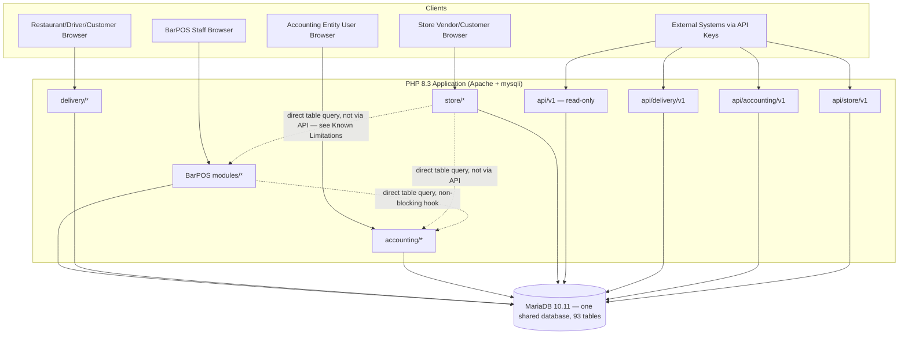
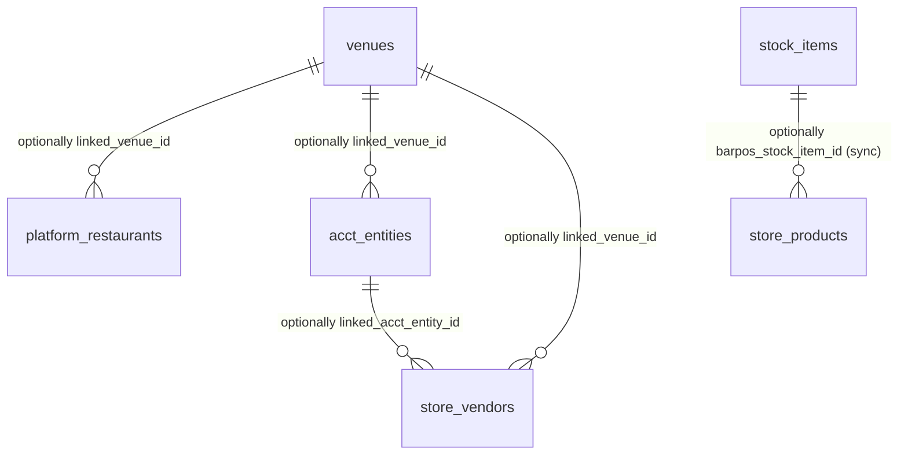

# BarPOS Platform

**A multi-tenant hospitality, delivery, accounting, and e-commerce/booking platform for small and mid-sized businesses.**

| | |
|---|---|
| **Status** | Active development — feature-complete for all four systems described below; not yet deployed to a production client (`TODO: Verify` once a real client deployment exists) |
| **Version** | Unversioned — no Git tags or `CHANGELOG.md` exist yet (`TODO: Verify` — establish semantic versioning before first release) |
| **License** | `TODO: Define project license.` No `LICENSE` file exists in the repository. |
| **Primary language** | PHP 8.3 (procedural + object-oriented service classes, no framework) |
| **Database** | MariaDB 10.11 |
| **Repository** | `TODO: Verify` — no remote origin configured in this environment |

## Executive Summary

BarPOS is not one application — it is **four independently-authenticated systems sharing one codebase and one database**:

1. **BarPOS** — the core point-of-sale system for a bar or restaurant (tables, tabs, kitchen display, inventory, staff, loyalty).
2. **Delivery Platform** — a multi-restaurant delivery marketplace (restaurant dashboard, driver app, customer app, platform admin).
3. **Accounting Module** — a real double-entry bookkeeping system that can auto-sync from BarPOS sales.
4. **Store Module** — a multi-vendor e-commerce and appointment-booking marketplace, with optional secure linking to a BarPOS venue and/or an accounting entity.

Each system has its own login, its own session namespace, its own external API, and — where relevant — its own light platform-operator oversight layer. They are **logically separate but not physically decoupled**: all four run from the same PHP codebase against the same MariaDB database, and some integration points (Store linking to BarPOS/accounting) query each other's tables directly rather than exclusively through an API boundary. See [Section 40 — Scalability](#40-scalability) and [Section 49 — Known Limitations](#49-known-limitations) for what this means in practice.

---

## Table of Contents

1. [Project Overview](#1-project-overview)
2. [Table of Contents](#table-of-contents)
3. [Product Overview](#3-product-overview)
4. [Features](#4-features)
5. [User Roles and Permissions](#5-user-roles-and-permissions)
6. [System Architecture](#6-system-architecture)
7. [Technology Stack](#7-technology-stack)
8. [Repository Structure](#8-repository-structure)
9. [Architecture and Design Principles](#9-architecture-and-design-principles)
10. [Application Data Flow](#10-application-data-flow)
11. [Database Documentation](#11-database-documentation)
12. [API Documentation](#12-api-documentation)
13. [API Conventions](#13-api-conventions)
14. [Authentication](#14-authentication)
15. [Authorization](#15-authorization)
16. [Configuration](#16-configuration)
17. [Installation](#17-installation)
18. [Local Development](#18-local-development)
19. [Docker](#19-docker)
20. [Database Setup and Migrations](#20-database-setup-and-migrations)
21. [Testing](#21-testing)
22. [Code Quality](#22-code-quality)
23. [Development Workflow](#23-development-workflow)
24. [Git and Versioning](#24-git-and-versioning)
25. [CI/CD](#25-cicd)
26. [Deployment](#26-deployment)
27. [Production Operations](#27-production-operations)
28. [Monitoring and Observability](#28-monitoring-and-observability)
29. [Logging](#29-logging)
30. [Security](#30-security)
31. [Privacy and Data Protection](#31-privacy-and-data-protection)
32. [Error Handling](#32-error-handling)
33. [Business Logic and Rules](#33-business-logic-and-rules)
34. [Integrations](#34-integrations)
35. [Background Jobs and Scheduled Tasks](#35-background-jobs-and-scheduled-tasks)
36. [Notifications](#36-notifications)
37. [File and Media Storage](#37-file-and-media-storage)
38. [Caching](#38-caching)
39. [Performance](#39-performance)
40. [Scalability](#40-scalability)
41. [Disaster Recovery](#41-disaster-recovery)
42. [Troubleshooting](#42-troubleshooting)
43. [Health Checks](#43-health-checks)
44. [API Examples](#44-api-examples)
45. [Frontend Documentation](#45-frontend-documentation)
46. [Backend Documentation](#46-backend-documentation)
47. [Environment Matrix](#47-environment-matrix)
48. [System Requirements](#48-system-requirements)
49. [Known Limitations](#49-known-limitations)
50. [Roadmap](#50-roadmap)
51. [Frequently Asked Questions](#51-frequently-asked-questions)
52. [Glossary](#52-glossary)
53. [Contribution Guide](#53-contribution-guide)
54. [Security Reporting](#54-security-reporting)
55. [Support](#55-support)
56. [License](#56-license)
57. [Changelog](#57-changelog)
58. [Documentation Roadmap](#58-documentation-roadmap)
59. [Documentation TODO](#59-documentation-todo)

---

## 1. Project Overview

BarPOS started as a point-of-sale system for **Tretat**, a bar/restaurant in Kigamboni, Dar es Salaam, and grew into four systems built to the same standard: a core POS, a multi-restaurant delivery marketplace, a real double-entry accounting module, and a multi-vendor Store (e-commerce + appointment booking).

**Problem being solved:** small hospitality and retail/service businesses in markets like Tanzania typically cannot afford (or justify) separate, specialized SaaS products for point-of-sale, delivery, bookkeeping, and e-commerce. This platform gives one operator a single system that covers all four, with each piece also independently valuable and independently sellable to a business that only needs one of them.

**Target users:**
- Bar/restaurant owners, managers, and cashiers (BarPOS)
- Restaurant owners and independent couriers on a delivery marketplace (Delivery Platform)
- Business owners, accountants, and bookkeepers (Accounting Module)
- Small vendors selling goods and/or bookable services, and their customers (Store Module)
- A platform operator overseeing each marketplace (Delivery Platform, Store Module) or ledger (Accounting Module)

**Primary use cases:** processing a bar/restaurant sale end-to-end; running a delivery marketplace connecting restaurants, drivers, and customers; keeping real, auditable double-entry books with automatic sync from POS sales; and running a shared online storefront/booking system for vendors who can't build their own.

**Core value proposition:** every system is built to the same rigor — real service-layer business logic, enforced data integrity (e.g. a journal entry can never be unbalanced), tested through both automated checks and live HTTP verification against a running server, not just unit-tested in isolation.

---

## 3. Product Overview

### What each system does

```text
┌─────────────────────────────────────────────────────────────────┐
│                         BarPOS Platform                         │
│                                                                   │
│  ┌───────────┐   ┌────────────────┐   ┌──────────────┐   ┌────┐ │
│  │  BarPOS   │   │ Delivery       │   │  Accounting  │   │Store│ │
│  │  (core    │   │ Platform       │   │  Module      │   │(e-  │ │
│  │  POS)     │   │ (marketplace)  │   │  (ledger)    │   │comm+│ │
│  │           │   │                │   │              │   │book)│ │
│  └─────┬─────┘   └───────┬────────┘   └──────┬───────┘   └──┬──┘ │
│        │                 │                    │              │   │
│        └─────────┬───────┴────────────────────┴──────────────┘   │
│                   │      one shared MariaDB database              │
└───────────────────┴────────────────────────────────────────────┘
```

### Major user types (across all four systems)

| User type | System |
|---|---|
| Admin / Manager / Cashier | BarPOS |
| Restaurant, Driver, Customer, Operator | Delivery Platform |
| Entity User (Owner/Accountant/Bookkeeper/Viewer), Operator | Accounting Module |
| Vendor, Customer, Operator | Store Module |

### Important terminology

See [Section 52 — Glossary](#52-glossary) for the full list. The most important cross-cutting concept: **an "operator"** exists independently on the Delivery Platform, the Accounting Module, and the Store Module — three separate roles, three separate login tables, never the same account.

---

## 4. Features

### 4.1 BarPOS (core POS)

| Feature | What it does | Who can use it | Key entities |
|---|---|---|---|
| Walk-up & table sales | Process an immediate sale or run a tab across a visit | Cashier, Manager, Admin | `sale_transactions`, `sale_items`, `sales` (kept in sync) |
| Split billing | Divide one table's bill evenly or by assigned items | Cashier, Manager, Admin | `sale_transactions` |
| Kitchen Display System (KDS) | Route orders to the kitchen electronically | Any role | `modules/kds/` |
| Stock & inventory | Track goods, including recipe/combo items with automatic cost rollup | Manager, Admin | `stock_items`, `stock_movements` |
| Purchase orders & suppliers | Order and receive stock | Manager, Admin | `purchase_order_items` |
| Staff scheduling & tips | Build a rota; capture and pool tips by shift | Manager, Admin | `modules/scheduling/`, `modules/tips/` |
| Loyalty / CRM | Ledger-backed points program | Cashier (apply), Admin (settings) | `modules/customers/` |
| Multi-venue | One account, several venues, fully isolated data | Admin (venue switch) | `venues` |
| Floor plan editor | Drag-and-drop table layout | Manager, Admin | `modules/tables/` |
| Modifiers | Menu item options (e.g. "no onions") | Cashier | `stock_item_modifier_groups`, `sale_item_modifiers` |
| Public API + webhooks | Read-only external access to sales/stock data | Admin (key mgmt) | `api/v1/`, `modules/webhooks/` |
| PWA offline queue | Add-to-tab actions queue while offline | Any role | Service worker (`service-worker.js`) |
| Native offline-first sync (partial) | SQLite sync engine + Capacitor scaffold | — | `native-sync/`, `native-app/` — **not wired to the live checkout UI; see Known Limitations** |
| Mobile money | Payment method alongside cash/card | Cashier | `api/mobile_money_*.php` — **stub only, requires server-side provider configuration to actually process; see Known Limitations** |

### 4.2 Delivery Platform

| Feature | What it does | Who can use it | Key entities |
|---|---|---|---|
| Restaurant onboarding | Self-service registration, starts `pending` | Restaurant | `platform_restaurants` |
| Restaurant dashboard | Manage menu, delivery fees, accepting-orders toggle, order queue | Restaurant | `delivery/restaurant/` |
| Driver onboarding | Self-service registration, starts `pending` | Driver | `drivers` |
| Driver app | Online toggle, distance-sorted job feed, one-active-delivery limit, earnings | Driver | `delivery/driver/` |
| Customer app | Browse, order, track, rate | Customer | `delivery/customer/` |
| Order lifecycle | Placed → Confirmed → Preparing → Ready → Picked Up → Delivered, or Cancelled | Restaurant/Driver/Customer/Operator | `delivery_orders`, `delivery_order_items` |
| Commission | Platform's percentage share of each order, operator-set per restaurant | Operator | `platform_restaurants.commission_pct` |
| Ratings | One rating per delivered order | Customer | `RatingService` |
| External API + webhooks | Menu and order management for a restaurant's own systems | Restaurant (key mgmt) | `api/delivery/v1/` |
| Platform operator | Approve/reject/suspend restaurants and drivers, set commission, view/force-cancel any order, manage other operators | Operator | `platform_operators` |

### 4.3 Accounting Module

| Feature | What it does | Who can use it | Key entities |
|---|---|---|---|
| Entity registration | Self-service, **active immediately** — no approval gate | Entity user | `acct_entities` |
| Double-entry ledger | Every transaction is a balanced journal entry, enforced at the service layer **and** a DB `CHECK` constraint | Any entity user | `acct_journal_entries`, `acct_journal_entry_lines` |
| Chart of accounts | 22-account default template seeded on registration | Any entity user | `acct_chart_of_accounts` |
| BarPOS auto-sync | Closed BarPOS sales/expenses post automatically as journal entries | — (automatic) | `AccountingSyncService` |
| Store auto-sync | Completed Store orders/bookings post automatically, commission as its own expense line | — (automatic) | `StoreAccountingSyncService` |
| Accounts Receivable | Customers, invoices, payments, aging | Any entity user | `acct_customers`, `acct_invoices`, `acct_payments_received` |
| Accounts Payable | Vendors, bills, payments, aging | Any entity user | `acct_vendors`, `acct_bills`, `acct_payments_made` |
| Financial reports | Trial Balance, Balance Sheet, Income Statement, Cash Flow — all computed live, never cached | Any entity user | `ReportService` |
| Bank reconciliation | CSV statement import, suggested matching, completion check | Any entity user | `acct_bank_reconciliations`, `acct_bank_statement_lines` |
| Recurring transactions | Scheduled journal entry templates | Any entity user | `acct_recurring_templates`, `acct_recurring_runs` |
| External API + webhooks | Read/write access to entries, invoices, bills, reports | Owner/Accountant (key mgmt) | `api/accounting/v1/` |
| Platform operator | Suspend/reactivate an entity, view platform stats — **no approval queue, no commission concept** | Operator | `acct_operators` |

> **Note on roles:** four roles exist on `acct_entity_users` (Owner, Accountant, Bookkeeper, Viewer), but as implemented, only API Keys and Webhooks management is actually role-restricted (Owner/Accountant only). Every other feature is available to any logged-in user of that entity regardless of assigned role. See [Known Limitations](#49-known-limitations).

### 4.4 Store Module

| Feature | What it does | Who can use it | Key entities |
|---|---|---|---|
| Vendor onboarding | Self-service registration, starts `pending` (real marketplace trust stakes, like a restaurant) | Vendor | `store_vendors` |
| Product catalog | Physical goods, optional inventory tracking | Vendor | `store_products` |
| Service catalog | Bookable services with duration + buffer time | Vendor | `store_services` |
| Staff / resources | Scheduling entities (not login accounts) — service assignment, working hours, date exceptions | Vendor | `store_staff`, `store_staff_services`, `store_staff_working_hours`, `store_staff_exceptions` |
| Availability engine | Buffer-aware conflict detection; the same logic both suggests slots and validates a booking at the moment it's placed | — (engine) | `StoreAvailabilityService` |
| Cart & checkout | Single-vendor cart, atomic order placement with stock re-verification | Customer | `store_orders`, `store_order_items` |
| Appointment booking | Book a specific staff member/time for a service | Customer | `store_bookings` |
| Order/booking lifecycle | Pending→Processing→Ready→Completed (orders); Confirmed→Completed/No-Show/Cancelled (bookings) | Vendor/Customer/Operator | `StoreOrderService`, `StoreBookingService` |
| Ratings | One rating per completed order or booking | Customer | `store_ratings` |
| Vendor analytics | Revenue, top products/services, top customers, ratings | Vendor | `StoreAnalyticsService` |
| BarPOS integration | Secure venue linking (BarPOS admin credential verification) + manual catalog sync | Vendor | `StoreIntegrationService`, `StoreCatalogSyncService` |
| Accounting integration | Secure entity linking (accounting owner/accountant credential verification) + automatic sale posting | Vendor | `StoreIntegrationService`, `StoreAccountingSyncService` |
| External API + webhooks | Products, orders, bookings, analytics for a vendor's own systems | Vendor (key mgmt) | `api/store/v1/` |
| Platform operator | Approve/reject/suspend vendors, set commission, view platform stats | Operator | `store_operators` |

> Do not claim a feature exists beyond what is listed above — this table reflects only what is implemented in the current codebase, verified by direct inspection.

---

## 5. User Roles and Permissions

Authorization across all four systems is **role-based, checked at the point of action inside each service class**, not via a centralized policy engine. There is no shared roles table — each system defines its own.

### 5.1 BarPOS

| Feature | Admin | Manager | Cashier |
|---|---|---|---|
| Walk-up sales & tabs | Yes | Yes | Yes |
| Split billing | Yes | Yes | Yes |
| Void/adjust a completed sale | Yes | Yes | |
| Add/edit stock items | Yes | Yes | |
| View stock levels | Yes | Yes | Yes |
| Purchase orders & suppliers | Yes | Yes | |
| Staff scheduling | Yes | Yes | |
| Tip payout | Yes | Yes | |
| Reports | Yes | Yes | |
| User management | Yes | | |
| Venue creation/switching | Yes | | |
| System settings | Yes | | |
| API keys & webhooks | Yes | | |

### 5.2 Delivery Platform

| Action | Restaurant | Driver | Customer | Operator |
|---|---|---|---|---|
| Register | Yes | Yes | Yes | *(CLI only)* |
| Approve/suspend a restaurant or driver | | | | Yes |
| Manage own menu/orders | Yes | | | |
| Go online, claim/deliver jobs | | Yes | | |
| Browse/order/rate | | | Yes | |
| Set commission | | | | Yes |
| View/force-cancel any order | | | | Yes |
| Create/deactivate other operators | | | | Yes |

### 5.3 Accounting Module

| Action | Owner | Accountant | Bookkeeper | Viewer | Operator |
|---|---|---|---|---|---|
| Register an entity | Yes (self-service, all roles start here) | | | | |
| Invoices, bills, reports, reconciliation | Yes | Yes | Yes | Yes | |
| API Keys & Webhooks | Yes | Yes | | | |
| Suspend/reactivate an entity | | | | | Yes |

> As implemented, Bookkeeper and Viewer are **not currently restricted** from any action Owner/Accountant can take, except API Keys/Webhooks. This is a documented gap, not an oversight in this README — see [Known Limitations](#49-known-limitations).

### 5.4 Store Module

| Action | Vendor | Customer | Operator |
|---|---|---|---|
| Register | Yes (self-service, starts pending) | Yes (self-service, active immediately) | *(CLI only)* |
| Manage catalog, staff, orders, bookings | Yes | | |
| Browse/order/book/rate | | Yes | |
| Approve/reject/suspend a vendor | | | Yes |
| Set commission | | | Yes |
| API Keys & Webhooks | Yes | | |

---

## 6. System Architecture



There is no separate frontend framework, no build step for JavaScript/CSS, and no background worker process. Every request is a single PHP script execution against Apache.

- **Frontend:** server-rendered PHP templates with vanilla JS/CSS (`assets/`); a PWA layer (`manifest.json`, `service-worker.js`) for offline tab-adding only.
- **Backend:** PHP 8.3, no framework — plain scripts under each module/system's folder, `require`-ing shared service classes.
- **Database:** a single MariaDB 10.11 database, 93 tables across four naming prefixes (native BarPOS tables, `platform_*`/`drivers`/`delivery_*`, `acct_*`, `store_*`).
- **External services:** none required for core operation. Mobile money and dompdf (PDF generation) are present as dependencies but mobile money is a stub (see [4.1](#41-barpos-core-pos)).
- **Background workers:** none. `native-sync/` is a standalone Node.js sync engine for the (unwired) native mobile app, not a server-side worker.
- **Caching:** none implemented — see [Section 38](#38-caching).
- **Messaging/queues:** none implemented — see [Section 35](#35-background-jobs-and-scheduled-tasks).

---

## 7. Technology Stack

| Layer | Technology | Version | Purpose |
|---|---|---|---|
| Language | PHP | 8.3.6 | All backend logic |
| Web server | Apache (`php:8.3-apache` base image) | — | Serves the app; `mod_rewrite`/`mod_headers` enabled |
| Database | MariaDB | 10.11 | The single shared database |
| DB access | `mysqli` (procedural extension, OO API) | PHP built-in | Every query in the codebase — no ORM |
| Dependency manager | Composer | 2.x | PHP dependencies |
| PDF generation | `dompdf/dompdf` | ^3.1 | `composer.json`'s only declared dependency |
| Frontend | Plain HTML/CSS/JS, server-rendered | — | No SPA framework |
| PWA | Web App Manifest + Service Worker | — | Offline add-to-tab queue only |
| Containerization | Docker + Docker Compose | — | `Dockerfile`, `docker-compose.yml` |
| CI/CD | GitHub Actions | — | `.github/workflows/ci.yml` |
| Testing | Custom PHP test scripts (no framework like PHPUnit) | — | `tests/run_tests.sh`, `test_*.php` |
| Native mobile app (unwired) | Capacitor + Node.js sync engine | — | `native-app/`, `native-sync/` — separate from the web app |

`TODO: Verify` — no `.nvmrc`/engine pin found for the Node.js projects (`native-app/`, `native-sync/`); their required Node version is not declared in a way this README can confirm.

---

## 8. Repository Structure

```text
barpos/
├── index.php, login.php, logout.php     # BarPOS's own entry points
├── modules/                              # BarPOS feature modules (pos, kds, stock, tables, ...)
├── delivery/
│   ├── restaurant/  driver/  customer/  operator/
├── accounting/
│   └── entity/  operator/
├── store/
│   ├── vendor/  customer/  operator/
├── api/
│   ├── v1/            # BarPOS's own read-only public API
│   ├── delivery/v1/
│   ├── accounting/v1/
│   └── store/v1/
├── includes/
│   ├── db.php, auth.php, functions.php, session_init.php   # shared by ALL four systems
│   ├── services/                          # BarPOS + delivery + accounting service classes
│   │   └── store/                         # Store's own service classes (Store-prefixed to avoid collisions)
│   ├── delivery/  accounting/  store/     # per-system auth/header/footer partials
├── database/
│   ├── 000_base_schema.sql               # the ONLY file a fresh install applies (see Section 20)
│   ├── migrate_v2.sql … migrate_v33.sql   # historical migration chain — reference only
│   └── README.md                          # explains why the above two points matter
├── scripts/
│   ├── migrate.php                        # applies 000_base_schema.sql, idempotent
│   ├── create_barpos_admin.php            # bootstrap: first BarPOS venue + admin
│   ├── create_operator.php                # bootstrap: first delivery operator
│   ├── create_accounting_operator.php     # bootstrap: first accounting operator
│   ├── create_store_operator.php          # bootstrap: first Store operator
│   ├── bootstrap_operators.sh             # runs all four of the above in one pass
│   └── deploy.sh                          # per-client Docker Compose deployment
├── docker/
│   ├── entrypoint.sh, apache-vhost.conf
├── tests/
│   └── run_tests.sh                       # BarPOS's own test suite (23 checks)
├── test_delivery_platform.php             # 46 checks
├── test_accounting.php                    # 183 checks
├── test_store.php                         # 157 checks
├── native-app/  native-sync/               # separate Node.js mobile app project — NOT part of the PHP deployment
├── assets/                                 # CSS/JS/images served to the browser
├── logs/                                   # php_errors.log — must be writable by the web server user
├── backups/                                 # not currently automated — see Disaster Recovery
├── docs/                                   # `TODO: Verify` contents — pre-existing folder, not authored as part of this README effort
├── Dockerfile, docker-compose.yml, .dockerignore, .env.example
└── DEPLOYMENT_CHECKLIST.md
```

**Architectural boundary to understand:** `includes/db.php`, `includes/auth.php`, `includes/functions.php`, and `includes/session_init.php` are shared, unversioned-per-system infrastructure — every one of the four systems' scripts `require_once`s these same physical files. This is the main reason the four systems are not currently decoupled (see [Section 40](#40-scalability)).

---

## 9. Architecture and Design Principles

- **No MVC framework.** Each PHP file under `modules/`, `delivery/`, `accounting/`, `store/`, and `api/` is both the "controller" and the "view" — it handles the request and emits HTML/JSON directly.
- **Service layer pattern.** Business logic lives in `includes/services/*.php` classes (static methods, `$conn` passed explicitly) — e.g. `JournalService`, `StoreOrderService`, `DeliveryOrderService`. Pages are thin: they call a service method and render the result.
- **No dependency injection container.** Every service method takes the `mysqli` connection as its first parameter, passed down from `includes/db.php`'s single global `$conn`.
- **No repository abstraction over the database.** Service classes write raw, parameterized SQL directly via `mysqli::prepare()`. There is no ORM.
- **Multi-tenancy by foreign key, not by schema-per-tenant.** A "venue" (BarPOS), "restaurant" (delivery), "entity" (accounting), or "vendor" (Store) is a row, and every other table in that system carries its ID — not a separate database or schema per tenant.
- **Ownership-checked service methods.** Nearly every service method that reads or mutates a specific row also verifies it belongs to the caller's own tenant (e.g. `StoreOrderService::getOwnedByVendor($conn, $vendorId, $orderId)`) — this is the primary cross-tenant isolation mechanism, enforced in application code, not database row-level security.
- **Non-blocking integration hooks.** Cross-system side effects (BarPOS→Accounting sync, Store→BarPOS/Accounting sync, all webhook dispatches) are wrapped in `try/catch` at the call site specifically so a sync/webhook failure can never roll back or block the primary action that triggered it.
- **Enforced financial integrity at two layers.** A journal entry's debits must equal its credits — checked in `JournalService::post()` in PHP, and *also* via a database `CHECK` constraint on `acct_journal_entry_lines`, so the invariant holds even against a bug that bypasses the service layer.

---

## 10. Application Data Flow

### Generic request flow (any of the four systems)

```text
Browser
 ↓ (session cookie)
includes/session_init.php   — resumes the correct one of 10 isolated session namespaces
 ↓
includes/auth.php           — requireXLogin() checks the session; CSRF token verified on POST
 ↓
Page script (e.g. store/vendor/orders.php)
 ↓
Service class (e.g. StoreOrderService::markCompleted())
 ↓
mysqli prepared statement → MariaDB
 ↓
(non-blocking) integration hook — webhook dispatch / accounting sync, wrapped in try/catch
 ↓
Response rendered as HTML, or JSON for API/AJAX endpoints
```

### Detailed example: a Store order being completed

```mermaid
sequenceDiagram
    participant V as Vendor Browser
    participant P as store/vendor/orders.php
    participant S as StoreOrderService
    participant DB as MariaDB
    participant W as StoreWebhookService
    participant A as StoreAccountingSyncService

    V->>P: POST action=completed, order_id
    P->>P: requireVendorLogin() + verifyCsrf()
    P->>S: markCompleted($conn, $orderId, $vendorId)
    S->>DB: SELECT ... WHERE id=? AND vendor_id=? (ownership check)
    S->>DB: UPDATE store_orders SET status='completed'
    S->>W: dispatch('order.completed', ...) [non-blocking]
    W->>DB: INSERT store_webhook_deliveries (logged regardless of outcome)
    S->>A: postCompletedSale(...) [non-blocking]
    A->>DB: INSERT acct_journal_entries + lines (if vendor is linked; silent no-op if not)
    S-->>P: success
    P-->>V: redirect with flash message
```

This same shape — ownership check, mutation, non-blocking side effects — repeats across every "complete/cancel" action in all four systems.

---

## 11. Database Documentation

**Technology:** MariaDB 10.11, `utf8mb4`/`utf8mb4_unicode_ci` throughout. **93 tables total**, split by naming convention into four namespaces that map directly to the four systems:

| Namespace | Table count | Example tables |
|---|---|---|
| BarPOS native (no prefix) | 39 | `venues`, `users`, `stock_items`, `sale_transactions`, `sale_items`, `stock_movements` |
| Delivery (`platform_*`, `drivers`, `delivery_*`) | 13 | `platform_restaurants`, `drivers`, `delivery_orders`, `delivery_order_items`, `platform_operators` |
| Accounting (`acct_*`) | 23 | `acct_entities`, `acct_chart_of_accounts`, `acct_journal_entries`, `acct_journal_entry_lines`, `acct_invoices`, `acct_bills` |
| Store (`store_*`) | 18 | `store_vendors`, `store_products`, `store_services`, `store_orders`, `store_bookings`, `store_ratings` |

### 11.1 Key tables and relationships

| Table | Purpose | Important columns | Relationships |
|---|---|---|---|
| `venues` | A BarPOS location | `id`, `name` | Referenced by `users.venue_id`, `stock_items.venue_id`, every sales table |
| `users` | BarPOS staff account | `id`, `username`, `password` (bcrypt), `role` (admin/manager/cashier), `venue_id` | → `venues` |
| `stock_items` | Goods/recipe items | `id`, `venue_id`, `quantity`, `cost_price`, `selling_price`, `tracking_mode` | → `venues`, `stock_movements` |
| `platform_restaurants` | A delivery-platform restaurant | `id`, `status` (pending/approved/suspended), `commission_pct`, `linked_venue_id` (nullable) | → `venues` (optional) |
| `drivers` | An independent courier | `id`, `status`, `is_online` | Referenced by `delivery_orders.driver_id` |
| `delivery_orders` | One delivery order | `id`, `platform_restaurant_id`, `driver_id`, `status`, `items_subtotal`, `delivery_fee`, `platform_commission` | → `platform_restaurants`, `drivers` |
| `acct_entities` | One set of books | `id`, `status` (active/suspended), `linked_venue_id`, `linked_acct_entity_id`-equivalent for Store links | — |
| `acct_chart_of_accounts` | An entity's accounts | `id`, `entity_id`, `code`, `normal_balance` (own column, not derived) | → `acct_entities` |
| `acct_journal_entries` | One balanced transaction | `id`, `entity_id`, `status` (draft/posted), `source_type` (enum — manual, sales_sync, invoice, bill, ...), `reverses_entry_id` | → `acct_entities`; self-referential for reversals |
| `acct_journal_entry_lines` | One debit/credit line | `journal_entry_id`, `chart_of_accounts_id`, `debit`, `credit` | **DB `CHECK` constraint enforces exactly one of debit/credit is non-zero per line**; the entry-level balance check is application-enforced in `JournalService::post()` |
| `store_vendors` | A Store seller | `id`, `status`, `commission_pct`, `rating_avg`, `rating_count`, `linked_venue_id`, `linked_acct_entity_id` | → `venues`, `acct_entities` (both optional) |
| `store_products` | A goods listing | `id`, `vendor_id`, `track_inventory`, `stock_quantity`, `barpos_stock_item_id` (sync tracking) | → `store_vendors`, `stock_items` (optional, via sync) |
| `store_services` | A bookable-service listing | `id`, `vendor_id`, `duration_minutes`, `buffer_minutes` | → `store_vendors` |
| `store_bookings` | One appointment | `id`, `customer_id`, `vendor_id`, `service_id`, `staff_id`, `booking_date`, `start_time`, `end_time`, `status` | → `store_customers`, `store_vendors`, `store_services`, `store_staff` |
| `store_ratings` | One rating | `customer_id`, `vendor_id`, `order_id` (nullable), `booking_id` (nullable), `rating` (1–5) | **`UNIQUE` on `order_id` and separately on `booking_id`** — enforces exactly one rating per order/booking |

### 11.2 Cross-system relationships (the actual coupling)



These are the only foreign-key-style links between the four namespaces. Everything else within a system stays within that system's own tables.

### 11.3 Migrations

**For a fresh install, exactly one file matters: `database/000_base_schema.sql`.** It is a complete, schema-only dump taken directly from a database that had all 32 incremental migrations (`migrate_v2.sql` through `migrate_v33.sql`) already applied and fully tested (409 automated checks passing at the time of the dump).

The individual `migrate_v*.sql` files are **not replayed automatically by anything** — running them against `000_base_schema.sql` will fail, because the base dump already contains most of what they do (it was taken partway through that same history, not from an empty database — a real issue found only by testing a fresh install, documented in `database/README.md`). They exist only as historical reference and for hand-upgrading an existing pre-`000_base_schema.sql` installation.

`scripts/migrate.php` applies `000_base_schema.sql`, tracks what's applied in a `schema_migrations` table, and is safe to re-run — an already-migrated database is left untouched.

---

## 12. API Documentation

There are **four separate API namespaces**, one per system, each with its own bootstrap, key table, and authentication. None of them share a base path beyond `/api/`.

### 12.1 BarPOS API — `api/v1/`

Read-only. No write actions exist in this namespace.

| Method | Path | Description | Auth |
|---|---|---|---|
| GET | `/api/v1/sales.php` | Read sales data for the authenticated venue | API key (read) |
| GET | `/api/v1/stock.php` | Read stock levels for the authenticated venue | API key (read) |
| POST | `/api/v1/sync/pull.php` | Native app sync: pull server state | API key |
| POST | `/api/v1/sync/tab_add.php` | Native app sync: queue an add-to-tab action | API key |
| POST | `/api/v1/sync/tab_close.php` | Native app sync: queue a tab close | API key |
| POST | `/api/v1/sync/walkup_sale.php` | Native app sync: queue a walk-up sale | API key |

> `TODO: Verify` — the `sync/` endpoints exist and are implemented, but the native app (`native-app/`) that would call them is not wired to use them end-to-end; treat this sub-namespace as scaffolding, not a proven integration path.

### 12.2 Delivery Platform API — `api/delivery/v1/`

Scoped to one restaurant per key.

| Method | Path | Description | Scope required |
|---|---|---|---|
| GET | `/api/delivery/v1/menu.php` | List the restaurant's menu | read |
| POST | `/api/delivery/v1/menu/update.php` | Create/update a menu item | write |
| POST | `/api/delivery/v1/menu/delete.php` | Remove a menu item | write |
| GET | `/api/delivery/v1/orders.php` | List/single order for the restaurant | read |
| POST | `/api/delivery/v1/orders/confirm.php` | Accept a pending order | write |
| POST | `/api/delivery/v1/orders/preparing.php` | Mark order preparing | write |
| POST | `/api/delivery/v1/orders/ready.php` | Mark order ready for pickup | write |
| POST | `/api/delivery/v1/orders/cancel.php` | Cancel an order | write |

### 12.3 Accounting Module API — `api/accounting/v1/`

Scoped to one entity per key.

| Method | Path | Actions (`POST` body `action` field) | Scope |
|---|---|---|---|
| GET | `/api/accounting/v1/accounts.php` | list chart of accounts | read |
| GET / POST | `/api/accounting/v1/journal-entries.php` | list/single (GET); `create` (POST, always immediately posted) | read / write |
| GET / POST | `/api/accounting/v1/invoices.php` | list/single (GET); `create`, `send`, `record_payment`, `void` (POST) | read / write |
| GET / POST | `/api/accounting/v1/bills.php` | list/single (GET); `create`, `approve`, `record_payment`, `void` (POST) | read / write |
| GET | `/api/accounting/v1/reports.php` | `?report=trial_balance\|balance_sheet\|income_statement\|cash_flow` | read |

### 12.4 Store Module API — `api/store/v1/`

Scoped to one vendor per key.

| Method | Path | Actions | Scope |
|---|---|---|---|
| GET / POST | `/api/store/v1/products.php` | list/single (GET); `create`, `update`, `adjust_stock` (POST) | read / write |
| GET / POST | `/api/store/v1/orders.php` | list/single (GET); `processing`, `ready`, `completed`, `cancel` (POST) | read / write |
| GET / POST | `/api/store/v1/bookings.php` | list/single (GET); `completed`, `no_show`, `cancel` (POST) | read / write |
| GET | `/api/store/v1/analytics.php` | `?report=summary\|top_products\|top_services\|top_customers` | read |

### 12.5 Common response shape (all four namespaces)

```json
{ "data": { "...": "..." } }
```
or, for a write action:
```json
{ "ok": true, "id": 123 }
```
or, on error:
```json
{ "error": "This key does not have the 'write' scope." }
```

### 12.6 Common HTTP status codes (all four namespaces)

| Code | Meaning |
|---|---|
| 200 | Success |
| 400 | Unknown/invalid action |
| 401 | Missing or invalid API key |
| 403 | Key lacks the required scope |
| 404 | Resource not found *for this key's tenant* — deliberately identical whether the resource doesn't exist or belongs to someone else, so no cross-tenant information leaks through a 404 vs. some other error |
| 422 | Valid request, rejected by business logic (e.g. unbalanced entry, overselling stock, suspended tenant) — the error message states exactly why |

---

## 13. API Conventions

- **Base URL:** relative to wherever the application is deployed, e.g. `https://yourdomain.com/api/store/v1/products.php`. There is no separate API subdomain.
- **Versioning:** path-based (`v1`); no `v2` exists yet for any namespace.
- **Authentication:** `Authorization: Bearer <key>` header. Each namespace has its own key prefix (`stor_live_`, `dlvr_live_`, `acct_live_`) and its own hashed-at-rest key table — a key from one namespace is meaningless to another.
- **Content type:** requests may send JSON body (`json_decode(file_get_contents('php://input'))`) or standard form-encoded POST; responses are always `application/json`.
- **Pagination:** simple `LIMIT`-based, not cursor-based. Most list endpoints cap at 100–200 rows with no `offset` parameter exposed consistently — `TODO: Verify` exact limits per endpoint if you need this for a specific integration.
- **Filtering:** a `status` query parameter is supported on most list endpoints (e.g. `?status=pending`).
- **Sorting:** fixed, not configurable by the caller (typically `created_at DESC`).
- **Error format:** always `{"error": "human-readable message"}`, never a machine-parseable error code — `TODO: Verify` whether callers need structured error codes before building critical automation against this.
- **Idempotency:** no idempotency-key mechanism exists. A duplicate POST (e.g. two "create invoice" calls) creates two records.
- **Rate limiting:** none implemented at the application level.
- **Request/Correlation IDs:** none implemented.
- **Date/time format:** MySQL's native `YYYY-MM-DD` / `YYYY-MM-DD HH:MM:SS`, not ISO 8601 with timezone — the application assumes a single server timezone throughout.
- **Currency:** stored as `DECIMAL`, no currency-code field on most monetary columns except the accounting module's `acct_entities.currency` — amounts are implicitly in whatever currency the tenant operates in (TZS, USD, EUR, KES were used during testing).

---

## 14. Authentication

There are **10 independent, session-based login systems**, sharing nothing but the same PHP session mechanism and the same `includes/session_init.php`/`includes/auth.php` infrastructure:

| # | System | Login path | Session key |
|---|---|---|---|
| 1 | BarPOS staff | `/login.php` | `user_id` |
| 2 | Delivery restaurant | `/delivery/restaurant/login.php` | `restaurant_id` / `restaurant_user_id` |
| 3 | Delivery driver | `/delivery/driver/login.php` | `driver_id` |
| 4 | Delivery customer | `/delivery/customer/login.php` | `customer_id` |
| 5 | Delivery operator | `/delivery/operator/login.php` | `operator_id` |
| 6 | Accounting entity user | `/accounting/entity/login.php` | `entity_id` / `entity_user_id` |
| 7 | Accounting operator | `/accounting/operator/login.php` | `acct_operator_id` |
| 8 | Store vendor | `/store/vendor/login.php` | `store_vendor_id` / `store_vendor_user_id` |
| 9 | Store customer | `/store/customer/login.php` | `store_customer_id` |
| 10 | Store operator | `/store/operator/login.php` | `store_operator_id` |

**Password storage:** `password_hash()` with `PASSWORD_BCRYPT`, cost 12, consistently across every one of the 10 systems. Verified with `password_verify()`.

**Registration:**
- **Self-service, starts `pending`** (needs operator approval before going live): delivery restaurants, delivery drivers, Store vendors — all real marketplace participants with money/trust at stake.
- **Self-service, active immediately**: accounting entities, delivery customers, Store customers — no safety-vetting reason to gate signup.
- **CLI-only, no web form at all**: the very first account on each of BarPOS, and the first operator on delivery/accounting/Store (`scripts/create_barpos_admin.php`, `scripts/create_operator.php`, `scripts/create_accounting_operator.php`, `scripts/create_store_operator.php`). Delivery operators can create further operators from within their own dashboard afterward; accounting and Store operators cannot — every additional one of those requires the CLI script again.

**Session invalidation:** standard PHP session destruction on logout (`session_destroy()` after unsetting the relevant keys). No server-side session revocation list — a stolen session cookie remains valid until it naturally expires or the user logs out.

**Password reset, email verification, MFA, refresh tokens:** **not implemented in any of the 10 systems.** `TODO: Verify` if any of this is planned — nothing in the codebase suggests it.

**CSRF protection:** every state-changing form includes a CSRF token (`csrfField()` / `verifyCsrf()` in `includes/auth.php`), checked on every POST.

---

## 15. Authorization

Authorization is **role-checked inside each service method or page script**, not via middleware/route guards or a centralized policy engine (there is no framework to provide one).

- **BarPOS:** `role` column on `users` (admin/manager/cashier), checked per-action in module scripts.
- **Delivery:** restaurant/driver/customer/operator are structurally separate login systems — "authorization" is mostly "which login system are you in," plus ownership checks (a restaurant can only see its own orders).
- **Accounting:** `role` column on `acct_entity_users` (owner/accountant/bookkeeper/viewer) — **only actually enforced for API Keys/Webhooks management**; every other action checks only that the user belongs to that entity, not which role they hold. This is a genuine, documented gap, not a design choice — see [Known Limitations](#49-known-limitations).
- **Store:** a single role per vendor account (no internal hierarchy) — same "which login system" model as delivery, plus ownership checks throughout (`StoreOrderService::getOwnedByVendor()`, etc.).
- **Platform operators** (delivery/accounting/Store): a flat, single-role account with full authority within their own system only — a delivery operator cannot touch accounting or Store data, and vice versa.
- **Resource-level authorization:** enforced by an explicit `WHERE tenant_id = ?` on nearly every read/write, checked in the service layer (e.g. `StoreBookingService::getOwnedByVendor($conn, $vendorId, $bookingId)`), not by database row-level security policies.

---

## 16. Configuration

All runtime configuration is via environment variables, read directly in `includes/db.php`. There is no separate config file layer, no feature-flag system, and no runtime-configurable settings beyond what's stored in the database itself (e.g. a venue's tax rate).

| Variable | Required | Description | Example | Sensitive |
|---|---|---|---|---|
| `BARPOS_ENV` | No (defaults to showing errors) | `production` suppresses on-screen PHP errors and logs them instead; anything else shows them | `production` | No |
| `BARPOS_DB_HOST` | Yes | Database hostname | `db` (Docker) or `localhost` | No |
| `BARPOS_DB_USER` | Yes | Database username | `barpos` | No |
| `BARPOS_DB_PASS` | Yes | Database password | `<your-database-password>` | **Yes** |
| `BARPOS_DB_NAME` | Yes | Database name | `barpos` | No |
| `MYSQL_ROOT_PASSWORD` | Yes (Docker Compose only) | MariaDB container root password | `<your-root-password>` | **Yes** |
| `MYSQL_DATABASE` | Yes (Docker Compose only) | Must match `BARPOS_DB_NAME` | `barpos` | No |
| `MYSQL_USER` | Yes (Docker Compose only) | Must match `BARPOS_DB_USER` | `barpos` | No |
| `MYSQL_PASSWORD` | Yes (Docker Compose only) | Must match `BARPOS_DB_PASS` | `<your-database-password>` | **Yes** |
| `APP_PORT` | No (defaults to 8080) | Host port the app container is published on | `8081` | No |

There is **no separate port variable the application itself reads** — it always connects to MySQL's default port 3306; run MariaDB on the standard port.

```env
BARPOS_ENV=production
BARPOS_DB_HOST=<your-db-host>
BARPOS_DB_USER=<your-db-user>
BARPOS_DB_PASS=<your-db-password>
BARPOS_DB_NAME=barpos
```

**No secrets are hardcoded anywhere in the codebase** — API keys, webhook secrets, and session data are all generated at runtime (`random_bytes()`) and hashed/stored, never checked into source.

---

## 17. Installation

### Prerequisites

- A Linux server or workstation (any modern distribution)
- Docker Engine + the Docker Compose plugin (the supported installation path — see [Section 19](#19-docker))
- For **non-Docker** installation: PHP 8.3 with the `mysqli`, `curl`, `gd`, `zip`, `mbstring` extensions; Apache or Nginx+PHP-FPM; MariaDB 10.11; Composer 2.x
- Git, to clone the repository

### Repository setup

```bash
git clone <this repository> barpos
cd barpos
```

### Dependency installation

```bash
composer install --no-dev --optimize-autoloader
```

### Database setup

See [Section 20](#20-database-setup-and-migrations) — in short, `php scripts/migrate.php` against a running, empty MariaDB database.

### Environment configuration

```bash
cp .env.example .env
# edit .env with real values
```

### Initial setup (bootstrap the first account on each system)

```bash
bash scripts/bootstrap_operators.sh
```

This is the **Docker-based** path end-to-end; see [Section 19](#19-docker) for the exact one-command version via `scripts/deploy.sh`.

---

## 18. Local Development

```bash
# 1. Install PHP dependencies
composer install

# 2. Configure environment
cp .env.example .env
# set BARPOS_DB_HOST=localhost (or wherever your local MariaDB runs)

# 3. Start a local MariaDB (if not already running)
#    e.g. on Ubuntu: sudo systemctl start mariadb
#    or via Docker alone: docker run -d -p 3306:3306 -e MYSQL_ROOT_PASSWORD=root mariadb:10.11

# 4. Apply the schema
export BARPOS_DB_HOST=localhost BARPOS_DB_USER=root BARPOS_DB_PASS=root BARPOS_DB_NAME=barpos
php scripts/migrate.php

# 5. Bootstrap the first account on each system
bash scripts/bootstrap_operators.sh

# 6. Start the PHP built-in server (development only — never use this in production)
php -S 0.0.0.0:8080
```

**Expected ports:** the app listens on whatever port you pass to `php -S` (commonly 8080) or, under Docker Compose, whatever `APP_PORT` resolves to (default 8080, published to the host). MariaDB listens on 3306.

**Verifying it's running:**
```bash
curl -s -o /dev/null -w "%{http_code}\n" http://localhost:8080/login.php
# expect: 200
```
Then log in with the credentials `bootstrap_operators.sh` created, at each of the four systems' login paths listed in [Section 14](#14-authentication).

> **Do not use `php -S` for anything beyond local development.** It is single-threaded and explicitly unsuited to production traffic — this is exactly why the Docker/Apache path exists for real deployments.

---

## 19. Docker

### Files

- `Dockerfile` — `php:8.3-apache` base, installs `mysqli`/`gd`/`zip` extensions, verifies `curl` is present at build time, runs `composer install`, copies the application, sets `logs/`/`backups/` to be writable by `www-data`.
- `docker-compose.yml` — two services (`app`, `db`), a shared internal bridge network, three named volumes (`db_data`, `app_logs`, `app_backups`).
- `docker/entrypoint.sh` — runs `scripts/migrate.php` (idempotent) before handing off to `apache2-foreground`.
- `docker/apache-vhost.conf` — `DocumentRoot /var/www/html`; explicitly denies HTTP access to `logs/`, `database/`, and `backups/`.
- `.dockerignore` — excludes `native-app/`, `native-sync/` (a separate Node.js project, never served by Apache), `.git/`, and runtime log/backup files.

### Build and run

```bash
docker compose --env-file .env up -d --build
```

### One command per client (recommended — see `scripts/deploy.sh`)

```bash
bash scripts/deploy.sh --client <client-name> --port 8081
```

This generates a per-client `.env.<client-name>` with random passwords, sets `COMPOSE_PROJECT_NAME` so multiple clients' containers/volumes never collide on the same host, builds, starts, and polls until the app responds.

### Practical commands

```bash
# View logs
docker compose logs -f app
docker compose logs -f db

# Run the bootstrap script inside the running container
docker compose exec app bash scripts/bootstrap_operators.sh

# Open a shell in the app container
docker compose exec app bash

# Stop / start / restart
docker compose stop
docker compose start
docker compose restart app

# Tear down (keeps volumes, so data survives)
docker compose down

# Tear down AND delete all data — destructive, confirm first
docker compose down -v
```

**Health checks:** the `db` service has a Compose healthcheck (`healthcheck.sh --connect --innodb_initialized`); the `app` service depends on it reporting healthy before starting. There is no application-level `/health` endpoint — see [Section 43](#43-health-checks).

> **Honesty note:** Docker itself was not available in the environment this platform was originally built and tested in. The Dockerfile and Compose configuration were carefully reviewed and the YAML syntax-validated, but **never actually build-tested end-to-end**. Run `docker compose config` and a real build before trusting this on a client. `TODO: Verify` with an actual build.

---

## 20. Database Setup and Migrations

### Fresh install

```bash
php scripts/migrate.php
```

Applies `database/000_base_schema.sql` — the single, complete, tested schema (see [Section 11.3](#113-migrations)). Safe to re-run; an already-migrated database is left untouched (tracked via a `schema_migrations` table).

### Rolling back

**Not implemented.** There is no down-migration mechanism anywhere in this codebase. Recovering from a bad schema change means restoring from a backup ([Section 41](#41-disaster-recovery)).

### Seeding data

**Not implemented as a generic seed script.** The closest equivalent is `scripts/bootstrap_operators.sh`, which creates the first account on each system — not sample/demo data.

### Resetting development data

```bash
docker compose down -v   # deletes the db_data volume entirely
docker compose up -d --build
php scripts/migrate.php  # re-applies the schema fresh
```

### Production migration procedure

For a schema change to an **already-running** production database (not a fresh install): apply the specific new SQL by hand, in a maintenance window, after taking a fresh backup. There is currently no tooling in this repository for incrementally migrating a live production database beyond the historical `migrate_v*.sql` files, which are not designed to run against `000_base_schema.sql`-based installations. `TODO: Verify` — a real production-migration procedure needs to be established before this matters in practice.

### Backup / restore

See [Section 41 — Disaster Recovery](#41-disaster-recovery).

---

## 21. Testing

There is **no unit-testing framework** (no PHPUnit, no Pest). Testing is done via custom, standalone PHP scripts that exercise real service classes against a real database, and — for the most critical flows — real HTTP requests against a running server.

| Suite | File | Checks | What it covers |
|---|---|---|---|
| BarPOS | `tests/run_tests.sh` | 23 | Core POS flows, largely via real HTTP against a running `php -S` server |
| Delivery Platform | `test_delivery_platform.php` | 46 | Restaurant/driver/customer/operator flows, cross-tenant isolation |
| Accounting Module | `test_accounting.php` | 183 | Ledger balancing, AR/AP, reports, reconciliation, recurring transactions, API/webhooks/operator oversight |
| Store Module | `test_store.php` | 157 | Catalog, e-commerce, booking/availability engine, integrations, API/webhooks/operator oversight |
| **Total** | | **409** | |

### Running the tests

```bash
# BarPOS — requires a running server first
php -S 0.0.0.0:8080 &
cd tests && bash run_tests.sh

# The other three — pure PHP, no running server required
php test_delivery_platform.php
php test_accounting.php
php test_store.php
```

All four suites are **self-cleaning**: they delete their own test fixtures (prefixed `__TEST_...`) at the start of each run, and are safe to run repeatedly without accumulating data.

**Test data isolation:** every suite creates fixtures under a distinctive name prefix so it can find and clean up its own rows without touching real data — this matters if you ever run these against a database that also has real production data (**not recommended**; run them against a disposable database).

**Coverage:** no line/branch coverage tooling is configured. `TODO: Verify` if this is wanted before a real release.

---

## 22. Code Quality

**No linter, formatter, or static analysis tool is configured** (no PHP_CodeSniffer, no PHPStan/Psalm, no `.editorconfig`). `TODO: Verify` — none of these were found in the repository; adding them is a reasonable next step, not something to assume exists.

**Naming conventions actually followed in the codebase** (observed, not enforced by tooling):
- Service classes: `PascalCase`, one class per file, matching filename (`StoreOrderService.php` → `class StoreOrderService`).
- Store-specific classes are deliberately prefixed `Store` (e.g. `StoreVendorService`, not `VendorService`) specifically to avoid colliding with the accounting module's own `VendorService` (AP vendors) — both would otherwise declare the same class name if ever loaded in the same request.
- Database tables: `snake_case`, prefixed by system (`acct_`, `store_`, `platform_`) except BarPOS's own native tables.

**Pre-commit hooks / CI checks:** see [Section 25 — CI/CD](#25-cicd). The only automated "code quality" check in CI is a brace/paren balance sweep across every `.php` file (a cheap sanity check for corrupted edits) and the four test suites themselves.

---

## 23. Development Workflow

```text
Issue / task
 ↓
Branch (naming convention: TODO: Verify — none established yet)
 ↓
Development
 ↓
Run the relevant test suite(s) locally
 ↓
Codebase balance sweep (brace/paren check — see CI)
 ↓
Push → CI runs automatically (see Section 25)
 ↓
Code review (TODO: Verify — no CODEOWNERS or branch protection rules found)
 ↓
Merge
 ↓
Deploy (manual — see Section 26)
```

`TODO: Verify` — there is currently no enforced branch protection, no required review count, and no defined release process beyond what's described in this README. These should be established before onboarding additional contributors.

---

## 24. Git and Versioning

**No branch strategy, commit convention, or versioning scheme is currently enforced or documented in the repository** (`TODO: Verify` / `TODO: Define`). Recommendations, not existing practice:
- Adopt [Semantic Versioning](https://semver.org/) once the first real release is tagged.
- Adopt [Conventional Commits](https://www.conventionalcommits.org/) if automated changelog generation is wanted later.

There is no existing Git history analyzed as part of this README (the repository this README was generated from has no remote/tag information available) — do not infer a versioning history that hasn't been established.

---

## 25. CI/CD

**Pipeline:** `.github/workflows/ci.yml`, two jobs.

### `test` job
Runs on every push and pull request, against any branch:
1. Checks out code.
2. Starts a MariaDB 10.11 service container.
3. Sets up PHP 8.3 with the required extensions.
4. `composer install`.
5. `php scripts/migrate.php` against the CI database.
6. Starts the PHP built-in server.
7. Runs all four test suites (409 checks) against it.
8. Runs the brace/paren balance sweep across every `.php` file.

### `docker-build` job
Runs after `test` passes:
1. Builds the Docker image (validates the `Dockerfile` builds).
2. Does **not** push to any registry — the push step is commented out in the workflow file, deliberately, because the right registry (Docker Hub, GHCR, a private registry) and its credentials depend on your own infrastructure and were never assumed.

**What happens on a pull request:** the `test` job runs; a failure blocks merge only if branch protection is configured to require it (`TODO: Verify` — not confirmed as configured).

**What happens on a push to any branch:** the same `test` job, plus `docker-build`.

**Environment promotion / rollback:** **not implemented in CI.** There is no staging-then-production promotion pipeline — deployment is the manual process in [Section 26](#26-deployment).

---

## 26. Deployment

Full step-by-step checklist: **`DEPLOYMENT_CHECKLIST.md`** at the repository root. Summary here.

**Only one environment currently exists in tooling terms: "a Docker Compose stack for one client."** There is no separate staging/production Compose file or environment-specific override — you create one stack per client via `scripts/deploy.sh --client <name>`, and nothing distinguishes "staging" from "production" except which domain you point at it and whether `BARPOS_ENV=production` is set (it should always be, for any client-facing deployment).

### Steps (see `DEPLOYMENT_CHECKLIST.md` for full detail)

1. **Infrastructure:** a Linux server with Docker + Compose installed; a domain/subdomain with editable DNS.
2. **Deploy the stack:** `bash scripts/deploy.sh --client <name> --port <port>`.
3. **Bootstrap accounts:** `docker compose --env-file .env.<name> exec app bash scripts/bootstrap_operators.sh`.
4. **Domain, HTTPS, reverse proxy:** point DNS at the server; install Nginx/Caddy/Traefik in front of the container's port; obtain a certificate (Let's Encrypt). **This project includes no reverse proxy or certificate automation itself** — it serves plain HTTP inside its container by design, expecting something else in front of it.
5. **Security hardening:** confirm `BARPOS_ENV=production`; firewall the app's raw port once the proxy is working; never expose MariaDB's port 3306 outside the Docker network.
6. **Backups:** not automated — see [Disaster Recovery](#41-disaster-recovery).
7. **Post-deploy verification:** create a test sale/order/booking on each system actually being used; confirm the accounting Trial Balance shows "Balanced" on a fresh entity.
8. **Handoff:** give the client their credentials and the relevant user manual(s) (produced separately from this README).

---

## 27. Production Operations

```bash
# Start / stop / restart
docker compose --env-file .env.<client> up -d
docker compose --env-file .env.<client> stop
docker compose --env-file .env.<client> restart app

# View logs
docker compose --env-file .env.<client> logs -f app
docker compose --env-file .env.<client> logs -f db

# Application error log (inside the app_logs volume)
docker compose --env-file .env.<client> exec app tail -f logs/php_errors.log

# Database shell
docker compose --env-file .env.<client> exec db mysql -u root -p

# Disk / memory / CPU on the host
df -h
free -h
docker stats
```

**No dedicated health/readiness/deployment-verification tooling beyond the checks above exists.** See [Section 43](#43-health-checks) for exactly what is and isn't implemented.

---

## 28. Monitoring and Observability

**None of the following are implemented:** structured logging, an error-tracking service (e.g. Sentry), metrics collection, dashboards, or alerting. This is a real, current gap, not an oversight in this README.

What exists today:
- `logs/php_errors.log` — plain PHP error log, written when `BARPOS_ENV=production` (otherwise errors are shown directly in the browser response instead — appropriate for local development, never for a real deployment).
- Application-level audit logging for certain administrative actions (`auditLog()` calls scattered through operator-facing scripts) — see [Section 29](#29-logging).
- Docker Compose's own container logs (`docker compose logs`) for stdout/stderr from Apache/PHP.

**Where an operator should look when something fails, today:**
1. `docker compose logs app` — Apache/PHP startup and request-level errors.
2. `logs/php_errors.log` inside the app container/volume — application-level PHP errors and warnings.
3. The relevant `acct_journal_entries`/`store_webhook_deliveries`/etc. tables directly, for a specific failed business operation — there is no aggregated view of "everything that went wrong" across the four systems.

`TODO: Verify` — before a real production client depends on this platform, adding at minimum a real error-tracking integration and a `/health` endpoint (see [Section 43](#43-health-checks)) should be a priority, not an afterthought.

---

## 29. Logging

- **Log levels:** none formally defined — PHP's own error levels (Notice/Warning/Fatal) are what land in `logs/php_errors.log`; there is no application-level `debug`/`info`/`warn`/`error` logger.
- **Log format:** plain text, PHP's default error-log line format (timestamp, error type, message, file, line).
- **Important events actually logged today:** administrative actions via `auditLog($conn, $eventType, $description)` — e.g. `operator_approve`, `acct_operator_suspend` — written to an `audit_log` table (BarPOS-native), **not** to the file-based log.
- **Authentication logging:** login success/failure is not separately logged anywhere beyond whatever a failed `password_verify()` naturally does *not* log (i.e., failed logins are currently silent from a logging perspective).
- **Sensitive information that must never be logged:** passwords (never logged — only ever passed through `password_hash()`/`password_verify()`), full API keys (only the 12-character prefix is ever stored or would be safe to log; the full key is shown to the user exactly once, at creation, and never stored in plaintext anywhere), webhook signing secrets.

---

## 30. Security

| Control | Status | Notes |
|---|---|---|
| Password hashing | Implemented | `bcrypt`, cost 12, across all 10 login systems |
| CSRF protection | Implemented | Token required on every state-changing POST |
| SQL injection prevention | Implemented | Every query uses `mysqli::prepare()` with bound parameters — no string-concatenated SQL found in the service layer |
| XSS protection | Partial | `htmlspecialchars()` used consistently in page templates observed; **no centralized output-encoding enforcement** — a missed call in a new template would not be caught automatically |
| CORS | Not implemented | The APIs have no `Access-Control-Allow-Origin` handling — browser-based cross-origin calls to any of the four API namespaces will fail by default |
| Rate limiting | Not implemented | No throttling on login attempts or API calls anywhere |
| Security headers (CSP, HSTS, X-Frame-Options, etc.) | Not implemented at the application level | Would need to be added at the reverse-proxy layer (see [Deployment](#26-deployment)) |
| File upload security | `TODO: Verify` | An `uploads/` directory exists at the repository root; its handling was not part of this session's built systems and is not verified here |
| Dependency security | `TODO: Verify` | No `composer audit` or Dependabot configuration found |
| Session security | Partial | Standard PHP sessions, no explicit `session.cookie_secure`/`httponly` configuration verified in code — `TODO: Verify` these are set appropriately for production (they should be forced by the deployment environment, e.g. `php.ini`, since the code doesn't set them explicitly) |
| API key security | Implemented | SHA-256 hashed at rest; only a 12-character prefix is ever stored/displayed after creation; shown in full exactly once |
| Webhook signing | Implemented | HMAC-SHA256, every delivery attempt logged regardless of outcome |
| Cross-tenant data isolation | Implemented, application-level | Every service method checks tenant ownership explicitly; proven via deliberate cross-tenant attack tests in all three multi-tenant systems' test suites |
| Financial integrity | Implemented, two layers | Balanced-entry check in `JournalService::post()` **and** a database `CHECK` constraint |

### Security checklist for a new deployment

- [ ] `BARPOS_ENV=production` set
- [ ] Database port (3306) not exposed outside the Docker network
- [ ] Reverse proxy + valid TLS certificate in front of the app
- [ ] Firewall rules restrict direct access to the app's raw port once the proxy is working
- [ ] Randomly generated, unique passwords per client (handled automatically by `scripts/deploy.sh`)
- [ ] `.env.<client>` backed up somewhere outside the server itself
- [ ] `TODO: Verify` — add rate limiting on login endpoints before any public-facing production use
- [ ] `TODO: Verify` — add security headers at the reverse-proxy layer

**No credentials, API keys, or secrets are present anywhere in this repository or this README.** Every example uses a `<placeholder>`.

---

## 31. Privacy and Data Protection

- **Data collected:** names, phone numbers, (optionally) email addresses, physical addresses/coordinates, transaction/financial records, and — for accounting entities specifically — full double-entry bookkeeping data.
- **Data classification:** no formal classification scheme exists in the codebase (no field-level "PII" tagging).
- **Sensitive fields:** passwords (hashed, never retrievable), API keys (hashed, never retrievable in full), payment method labels (no actual card/account numbers are collected or stored anywhere in the codebase — there is no live payment gateway integration).
- **Data retention / deletion:** **not implemented.** There is no user-initiated data export or account/data deletion flow in any of the four systems. `TODO: Verify` — if this platform will operate somewhere with a right-to-erasure requirement (e.g. GDPR-adjacent regulation), this needs to be built before that matters.
- **Auditability:** partial — see [Section 29](#29-logging); `audit_log` covers BarPOS administrative actions specifically, not a platform-wide audit trail across all four systems.
- **Compliance requirements:** `TODO: Verify.` No specific regulatory framework (GDPR, PCI-DSS, etc.) is referenced or accounted for anywhere in the codebase. Given there is no payment card data collected, PCI-DSS scope is likely minimal, but this has not been formally assessed.

---

## 32. Error Handling

- **Backend:** PHP exceptions (`Exception`, and `mysqli_sql_exception` since PHP 8.1+'s default `mysqli` error-reporting mode) are used throughout the service layer; page scripts wrap service calls in `try/catch` and set a flash-message session variable (`$_SESSION['store_flash']`, `$_SESSION['delivery_flash']`, etc. — one per system) rather than letting an exception surface as a raw error page under normal use.
- **API errors:** every API endpoint catches `Exception` and returns `{"error": "..."}` with an appropriate HTTP status (see [Section 12.6](#126-common-http-status-codes-all-four-namespaces)).
- **Validation errors:** performed inline in service methods (e.g. "Rating must be between 1 and 5"), raised as `Exception`, caught and surfaced as a user-facing message.
- **Database errors:** surfaced as `mysqli_sql_exception` (thrown automatically by PHP 8.1+'s default mysqli error-reporting mode) — caught at the same `try/catch` boundary as any other exception.
- **External service errors** (webhook delivery failures): explicitly swallowed at the call site (`catch (Throwable $e) { /* swallowed deliberately */ }`) so a webhook or sync failure can never block or roll back the action that triggered it — logged as a failed delivery attempt in the relevant `*_webhook_deliveries` table, not surfaced to the user at all.
- **User-facing errors:** rendered as an inline alert (`<div class="alert alert-error">`) on the same page, using the caught exception's message directly — service-layer exception messages are written to be end-user-readable (e.g. "This time slot is no longer available — please choose another"), not internal stack traces.
- **Uncaught errors:** in `BARPOS_ENV=production`, written to `logs/php_errors.log`, nothing shown to the visitor. In any other value of `BARPOS_ENV`, shown directly in the browser response — **never set anything other than `production` for a real client.**

---

## 33. Business Logic and Rules

This section covers the domain rules that are not obvious from the API/database documentation alone.

### 33.1 A journal entry must always balance (Accounting Module)

1. **Precondition:** an entity exists and is `active` (not suspended).
2. **Validation:** every line has exactly one of `debit`/`credit` non-zero; total debits across all lines equal total credits, to the cent.
3. **Business rule:** enforced in `JournalService::post()` in PHP, **and again** via a database `CHECK` constraint on `acct_journal_entry_lines` — belt and suspenders, specifically because a bug bypassing the service layer should still be caught by the database itself.
4. **Database changes:** the entry and its lines are inserted with `status='posted'`; posted entries are immutable — **the only way to "undo" one is a reversing entry** (`JournalService::reverse()`), never an `UPDATE`/`DELETE` on a posted row.
5. **Side effects:** none beyond the entry itself; report queries (Trial Balance, etc.) are always computed live, never cached, so they reflect the new entry immediately.
6. **Failure behavior:** an unbalanced entry is rejected with a 422/`Exception` stating the exact debit/credit mismatch, before anything is written.

### 33.2 A Store order can never oversell stock, even across a rollback (Store Module)

1. **Precondition:** the vendor is `approved`, every product in the cart is active.
2. **Validation:** for each line item, if the product tracks inventory, the requested quantity must not exceed current stock.
3. **Business rule:** stock is deducted **atomically, inside the same database transaction as the order itself** — if any single line item in a multi-item order can't be fulfilled, the **entire order** rolls back, not just that line.
4. **Database changes:** `store_orders` + `store_order_items` inserted; `store_products.stock_quantity` decremented per tracked item — all in one transaction.
5. **Side effects:** none until the order is later completed (see 33.4).
6. **Failure behavior:** the customer sees which item(s) couldn't be fulfilled; no partial order and no partial stock deduction ever occurs — proven directly by a test that intentionally oversells one item in a multi-item order and confirms the *other* item's stock is untouched afterward.

### 33.3 An appointment booking is re-verified at the moment of booking, not just when shown as available (Store Module)

1. **Precondition:** the vendor is approved; the requested staff member is assigned to the requested service.
2. **Validation:** `StoreAvailabilityService::isSlotAvailable()` — the exact same conflict-detection logic that generated the "available slots" list the customer saw — is called again, live, at the moment `book()` executes.
3. **Business rule:** buffer time is computed **dynamically at conflict-check time** by extending each *existing* booking's occupied window by *that booking's own service's* buffer — not baked into a stored end-time — because two different bookings for the same staff member could carry different buffers.
4. **Database changes:** one `store_bookings` row; `end_time` is always the raw appointment end (start + duration), buffer never included in the stored value.
5. **Side effects:** none until completed (triggers accounting sync if linked; see 33.4).
6. **Failure behavior:** if the slot was taken between being shown and being booked, the booking is rejected with "This time slot is no longer available" — proven directly by a test that sends a forged direct API request for a slot inside another booking's buffer window, bypassing the UI's slot list entirely, and confirms the server-side check (not just the UI) rejects it.

### 33.4 Completing a Store sale posts gross revenue, with commission as its own expense (Store Module to Accounting Module)

1. **Precondition:** the vendor is linked to an accounting entity (`store_vendors.linked_acct_entity_id` is set). If not linked, this entire workflow is a silent no-op — never an error.
2. **Business rule:** the vendor's **true revenue is the full amount the customer paid**, not just what the vendor receives after the platform's cut — so the journal entry debits Cash for the vendor's actual payout, debits an expense account for the commission, and credits Sales Revenue for the full gross amount. This mirrors how real marketplace fees (e.g. Etsy, Shopify) are conventionally accounted for.
3. **Database changes:** one new `acct_journal_entries` row (`source_type='sales_sync'`, reusing BarPOS's own sync category rather than inventing a new one) with two or three balanced lines.
4. **Side effects:** none beyond the entry — this hook is wrapped in `try/catch` specifically so a sync failure never undoes the sale that triggered it.
5. **Failure behavior:** if the linked entity's chart of accounts is missing an expected account code, the sync silently skips rather than failing the sale.

---

## 34. Integrations

### 34.1 Store ↔ BarPOS (venue linking + catalog sync)

- **Purpose:** let a Store vendor's product catalog mirror their existing BarPOS stock.
- **Authentication:** the vendor submits a **real BarPOS Administrator username and password**, verified server-side with `password_verify()` against the actual `users` table — not a bare venue ID. This is the security-critical design decision of this integration: a bare ID would let one vendor silently attach to a venue they don't own.
- **API:** none — this is a direct, same-database service call (`StoreIntegrationService`, `StoreCatalogSyncService`), not an HTTP integration. See [Known Limitations](#49-known-limitations) for what this means for decoupling.
- **Request flow:** vendor submits credentials → verified against `users` (role must be `admin`, must have a `venue_id`) → duplicate-link check (a venue can only be linked to one vendor) → `store_vendors.linked_venue_id` set.
- **Sync:** a **manual** "Sync Now" action pulls `stock_items` for the linked venue into `store_products`, matched by a `barpos_stock_item_id` column so a repeat sync updates rather than duplicates.
- **Failure handling:** a failed sync attempt leaves the existing catalog untouched; simply retried by pressing the button again.

### 34.2 Store ↔ Accounting Module (entity linking + automatic sales sync)

- **Purpose:** let a Store vendor's completed sales post automatically to their real books.
- **Authentication:** the vendor submits real accounting Owner/Accountant credentials, verified against `acct_entity_users`.
- **Sync:** **automatic**, firing the moment an order/booking is marked `completed` — see [Section 33.4](#334-completing-a-store-sale-posts-gross-revenue-with-commission-as-its-own-expense-store-module-to-accounting-module).
- **Failure handling:** non-blocking; a sync failure never blocks the sale itself.

### 34.3 BarPOS to Accounting Module (sales sync)

- **Purpose:** a BarPOS venue linked to an accounting entity has its closed sales and recorded expenses post automatically as journal entries.
- **Mechanism:** `AccountingSyncService`, called as a non-blocking hook directly from BarPOS's own checkout code paths (`modules/sales/index.php`).
- **Failure handling:** non-blocking, same principle as 34.2; a batch safety-net (`syncPendingSales`/`syncPendingExpenses`) exists for anything that failed the first time.

### 34.4 External systems to any of the four APIs

Any external system can integrate via the four API namespaces documented in [Section 12](#12-api-documentation), authenticated with a per-tenant API key. This is the only integration path that crosses a real network/HTTP boundary rather than a direct database call.

### 34.5 Mobile money (BarPOS)

- **Status:** scaffolding only. `api/mobile_money_push.php` and `api/mobile_money_callback.php` exist, but there is no configured payment provider behind them — see [Known Limitations](#49-known-limitations). Do not present this as a working payment method to a client without first configuring and testing a real provider integration.

---

## 35. Background Jobs and Scheduled Tasks

**None exist.** There is no queue system, no worker process, and no cron-based scheduler anywhere in this codebase.

The closest equivalents are **manual or on-demand "batch" actions triggered by a user**, not true background jobs:
- `AccountingSyncService::syncPendingSales()` / `syncPendingExpenses()` — a safety-net re-sync, invoked as part of normal application flow, not on a schedule.
- `RecurringTransactionService::runDue()` — generates any due recurring journal entries when a user clicks "Run Due Now"; **not automatically triggered by a scheduler.** `TODO: Verify` — if recurring transactions need to actually run on their due date without a human clicking a button, a real cron job calling this method needs to be set up; nothing in this repository does that today.

---

## 36. Notifications

**None of email, SMS, push, or WhatsApp notifications are implemented anywhere in the four systems.** All "notification" behavior today is either:
- **In-app only** — a new order appearing in a dashboard's queue, a low-stock indicator, a pending-approval banner.
- **Webhooks** — the closest thing to an outbound notification, but scoped to a tenant's own configured external system, not a human-facing channel.

`TODO: Verify` — if a client needs an actual email/SMS notification (e.g. "your order is ready"), this needs to be built; nothing in the codebase sends one today.

---

## 37. File and Media Storage

An `uploads/` directory exists at the repository root. **Its actual usage was not part of the systems built and verified in this development session, and is not documented further here** — `TODO: Verify` what, if anything, currently writes to it, what file types/size limits apply, and whether access is public or restricted, before relying on it for anything client-facing.

No product/menu image upload capability was observed in any of the four systems' catalog features (products, services, menu items) — catalogs are text/price/quantity only.

---

## 38. Caching

**None implemented.** There is no Redis, Memcached, or in-application cache layer anywhere in the codebase. Every report (financial statements, analytics summaries) is deliberately computed **live, on every request**, specifically so a cached number can never silently drift from what the underlying data actually says — a conscious design choice, not a gap, for the reporting use cases. For a busy production deployment this may eventually become a real performance concern — see [Section 39](#39-performance).

---

## 39. Performance

- **Database indexing:** foreign key columns and common filter columns (`status`, `booking_date`, `vendor_id`, etc.) are indexed per-table in the migration files; a full audit of every query's execution plan was not performed as part of this README.
- **Query optimization:** service methods issue targeted, parameterized queries rather than broad `SELECT *` scans in most observed cases; `TODO: Verify` for any specific slow query under real production load, since none has been measured yet.
- **Pagination:** simple `LIMIT`-based on list endpoints (see [Section 13](#13-api-conventions)) — fine at current scale, would need cursor-based pagination at a much larger row count.
- **Connection pooling:** none — each PHP request opens its own `mysqli` connection via `includes/db.php`; standard for a non-persistent PHP/Apache deployment, but a genuine constraint at high concurrency (see [Scalability](#40-scalability)).
- **Concurrency:** MariaDB's own `InnoDB` row-locking is the only concurrency control; there is no application-level distributed lock or queue to serialize, e.g., simultaneous booking attempts for the same slot — correctness there instead relies on the `isSlotAvailable()` re-check happening inside the request, not a lock (a genuine, small race-condition window exists between the check and the `INSERT`, though the check-then-insert pattern combined with the earlier proven test of the buffer logic makes a *successful* double-booking unlikely in practice — `TODO: Verify` under real concurrent load).
- **Known bottlenecks:** none measured under real load — this platform has been tested functionally (409 automated checks, extensive live HTTP verification) but never load-tested. `TODO: Verify` before assuming it handles any particular request volume.

---

## 40. Scalability

**Current architecture is a single-server, single-database monolith.** How each dimension would need to change to scale further:

- **Horizontal scaling (app tier):** possible in principle — PHP/Apache request handling is stateless aside from the session, so multiple app containers behind a load balancer would work, **provided** session storage is moved to something shared (currently PHP's default file-based sessions, which do not work correctly across multiple app instances without a shared session backend — e.g. Redis-backed sessions). `TODO: Verify`/implement before running more than one app container.
- **Vertical scaling:** works today with no code changes — the simplest path to more headroom.
- **Database scaling:** a single MariaDB instance; no read replicas, no sharding. All four systems' tenants share one database, so a single client's heavy usage shares resources with every other client on that instance — genuinely fine for a small number of clients, a real constraint if the platform grows to many concurrent, high-volume clients on one shared install.
- **Stateless services:** the application itself is stateless per-request (aside from sessions, above); there are no background workers to scale independently, because none exist.
- **Load balancing:** not configured; would sit at the reverse-proxy layer, which is also not included in this repository (see [Deployment](#26-deployment)).
- **Queues:** none exist (see [Background Jobs](#35-background-jobs-and-scheduled-tasks)) — nothing to scale here yet, because nothing asynchronous exists to begin with.

**The most consequential current limitation for scaling is architectural, not infrastructural:** the four systems are **not decoupled**. They share one codebase, one database, and — for Store's BarPOS/accounting integrations specifically — query each other's tables directly rather than exclusively through an API boundary (see [Section 34](#34-integrations)). Splitting them into independently-scalable services would require: separating each system into its own database, replacing every direct cross-table query with a call to the relevant system's own external API, and extracting the currently-shared `includes/db.php`/`auth.php`/`session_init.php` infrastructure into either a shared library each system depends on independently, or duplicating it per system. This is real, identified, non-trivial work — not a small configuration change.

---

## 41. Disaster Recovery

**No backup automation exists in this repository today.** This is a genuine, acknowledged gap — `DEPLOYMENT_CHECKLIST.md` calls it out explicitly as something to set up per client before they have real data worth losing.

| Item | Status |
|---|---|
| Backup strategy | `TODO: Define` — recommended: scheduled `mysqldump`, off-server storage, periodic restore testing (see `DEPLOYMENT_CHECKLIST.md` Section 5) |
| Backup frequency | `TODO: Define` — not automated; daily is suggested as a minimum in the checklist, not enforced by any tooling |
| Backup storage | `TODO: Define` — the `backups/` directory and `app_backups` Docker volume exist as a *location*, but nothing currently writes scheduled backups into them |
| Restore procedure | `TODO: Define` — standard `mysql < backup.sql` against a fresh database would work, but has not been formally documented or drilled |
| Recovery Point Objective (RPO) | `TODO: Define` — depends entirely on whatever backup schedule an operator sets up manually |
| Recovery Time Objective (RTO) | `TODO: Define` — not measured |
| Failover | Not implemented — single server, single database, no redundancy |

**Do not deploy a real client to this platform without first setting up a real, tested backup schedule** — see `DEPLOYMENT_CHECKLIST.md` Section 5 for the concrete steps.

---

## 42. Troubleshooting

### Application won't start

- **Possible cause:** MariaDB isn't reachable yet when the app container starts. **Diagnosis:** check `docker compose logs app` for a "Waiting for database..." loop from `scripts/migrate.php`'s own retry logic. **Solution:** confirm the `db` service is healthy (`docker compose ps`); the `app` service's `depends_on: condition: service_healthy` should already prevent a premature start, but a misconfigured healthcheck could still let it through.
- **Possible cause:** a required PHP extension is missing. **Diagnosis:** `docker compose exec app php -m | grep -i mysqli`. **Solution:** rebuild the image — the `Dockerfile` installs `mysqli`, `gd`, `zip` explicitly and verifies `curl` at build time; a custom image change that removed one of these would need to be reverted.

### Database connection failure

- **Possible cause:** `BARPOS_DB_*` environment variables don't match the actual MariaDB credentials. **Diagnosis:** compare `.env.<client>`'s `MYSQL_USER`/`MYSQL_PASSWORD`/`MYSQL_DATABASE` against `BARPOS_DB_USER`/`BARPOS_DB_PASS`/`BARPOS_DB_NAME` — they must be identical pairs. **Solution:** fix the mismatched value and restart both services.
- **Possible cause:** MariaDB hasn't finished initializing on first run. **Diagnosis:** `docker compose logs db` — look for "ready for connections." **Solution:** wait; `scripts/migrate.php` retries for up to 60 seconds automatically.

### Authentication failure

- **Possible cause:** trying to log in to the wrong one of the 10 login systems (e.g. a BarPOS admin credential at `/store/vendor/login.php`). **Diagnosis:** confirm which of the 10 systems in [Section 14](#14-authentication) the account was actually created on. **Solution:** use the matching login URL.
- **Possible cause:** account is `pending` or `suspended` (delivery restaurants/drivers, Store vendors). **Diagnosis:** check the account's status via the relevant operator panel. **Solution:** an operator must approve/reactivate it — login itself may still succeed for a pending/suspended account, but marketplace-facing actions (receiving orders, going online) will be blocked with an explicit error.

### API errors

- **Possible cause:** using a key from the wrong namespace (e.g. a `dlvr_live_...` key against `/api/store/v1/`). **Diagnosis:** the key prefix must match the namespace being called. **Solution:** generate a key from the correct system's own dashboard.
- **Possible cause:** a read-only key attempting a write action. **Diagnosis:** response is `403` with `"This key does not have the 'write' scope."` **Solution:** generate a new key with the write scope enabled.

### Frontend cannot reach backend

- Not generally applicable — there is no separate frontend service; the browser talks directly to the same PHP/Apache process serving everything. If a page fails to load, it's an application or infrastructure issue, not a frontend/backend split issue.

### Docker problems

- **Possible cause:** port conflict — another process already using the chosen `APP_PORT`. **Diagnosis:** `docker compose up` fails with a bind error. **Solution:** choose a different `--port` in `scripts/deploy.sh`, or free the conflicting port.
- **Possible cause:** stale volumes from a previous failed deployment. **Diagnosis:** `scripts/migrate.php` refuses to proceed with "Database already has N table(s) but is not marked as migrated" — a deliberate safeguard against clobbering data. **Solution:** inspect the database first; if it should genuinely be a fresh install, `docker compose down -v` to remove the volume, then redeploy.

### Migration problems

- **Possible cause:** attempting to replay the historical `migrate_v*.sql` files against `000_base_schema.sql`. **Diagnosis:** "duplicate key" or syntax errors. **Solution:** don't — see [Section 11.3](#113-migrations) and `database/README.md`; only `000_base_schema.sql` should be applied to a fresh database.

### Production deployment failure

- **Possible cause:** `.env.<client>` missing or using placeholder values from `.env.example`. **Diagnosis:** `scripts/deploy.sh` generates one automatically on first run with random passwords if it doesn't exist — check it was actually created and matches expectations. **Solution:** review `.env.<client>`, correct as needed, redeploy.

---

## 43. Health Checks

- **Docker Compose level:** the `db` service has a real healthcheck (`healthcheck.sh --connect --innodb_initialized`); the `app` service depends on it.
- **Application level:** **no dedicated `/health`, `/ready`, or `/live` endpoint exists in any of the four systems.** `curl http://localhost:8080/login.php` returning `200` is the closest available proxy for "the app is up," used throughout `scripts/deploy.sh` and this README's own verification steps — it is not a purpose-built health endpoint and doesn't check database connectivity independently of a full page render.
- `TODO: Verify` / recommend: add a lightweight `/health.php` that checks the database connection explicitly and returns a simple JSON status, before wiring this platform into any real uptime-monitoring service.

---

## 44. API Examples

### Create a Store product (write-scoped key required)

```bash
curl -H "Authorization: Bearer <your-store-api-key>" \
     -H "Content-Type: application/json" \
     -X POST "https://yourdomain.com/api/store/v1/products.php" \
     -d '{
       "action": "create",
       "name": "Example Widget",
       "price": 18000,
       "track_inventory": true,
       "stock_quantity": 15,
       "sku": "EX-001"
     }'
```

Response:
```json
{ "ok": true, "id": 375 }
```

### List an accounting entity's Trial Balance

```bash
curl -H "Authorization: Bearer <your-accounting-api-key>" \
     "https://yourdomain.com/api/accounting/v1/reports.php?report=trial_balance"
```

Response:
```json
{
  "data": {
    "rows": [
      { "account_id": 1000, "code": "1000", "name": "Cash on Hand", "debit": "12000.00", "credit": "0.00" }
    ],
    "balanced": true,
    "total_debit": 12000,
    "total_credit": 12000
  }
}
```

### Mark a delivery order as ready (write-scoped key required)

```bash
curl -H "Authorization: Bearer <your-delivery-api-key>" \
     -H "Content-Type: application/json" \
     -X POST "https://yourdomain.com/api/delivery/v1/orders/ready.php" \
     -d '{"order_id": 42}'
```

### Attempt a write with a read-only key (illustrating the 403 behavior)

```bash
curl -H "Authorization: Bearer <a-read-only-key>" \
     -H "Content-Type: application/json" \
     -X POST "https://yourdomain.com/api/store/v1/products.php" \
     -d '{"action": "create", "name": "Should Fail", "price": 100}'
```

Response:
```json
{ "error": "This key does not have the 'write' scope." }
```

> No real API keys, credentials, or client data appear anywhere in this README — every value above is illustrative.

---

## 45. Frontend Documentation

There is no separate frontend application, build step, or JavaScript framework. Each system's UI is server-rendered PHP:

- **Pages:** one PHP file per screen (e.g. `store/vendor/dashboard.php`), each including a shared header/footer partial for its system (`includes/store/vendor_header.php` / `vendor_footer.php`, and equivalents for delivery/accounting/BarPOS).
- **Components:** none in the framework sense — shared UI fragments are plain `include`d PHP/HTML partials.
- **State management:** none beyond PHP sessions and standard HTML form submission; no client-side state store.
- **Routing:** file-path-based — the URL *is* the PHP file path (e.g. `/store/vendor/orders.php`), no router.
- **API communication:** most pages submit standard HTML forms (full page reload); a few use small inline `fetch()`/`XMLHttpRequest` calls for specific interactions — `TODO: Verify` exact AJAX usage per page if building on top of a specific screen.
- **Validation:** primarily server-side, inside the relevant service class; minimal client-side validation (HTML5 `required` attributes on some forms).
- **Offline support (BarPOS only):** a Web App Manifest (`manifest.json`) and Service Worker (`service-worker.js`) queue "add to tab" actions while offline, syncing once connectivity returns. This is the **only** offline capability in the platform — it does not extend to payments or any other action.
- **UI conventions:** consistent card-based layout (`class="card"`), a shared color/badge system for status (`badge-drinks` for a positive/active state, `badge-other` for a neutral/inactive one) reused across all four systems' dashboards, sourced from `assets/`.

---

## 46. Backend Documentation

- **Modules (BarPOS):** `modules/{pos,kds,stock,tables,customers,scheduling,tips,reports,users,venues,system,api_keys,webhooks,audit,expenses,modifiers,purchase_orders,suppliers,dashboard,sales}/` — one folder per feature area, each with its own set of page scripts.
- **Controllers/handlers:** the page scripts themselves (e.g. `store/vendor/orders.php`) — there is no separate controller class; a page script both handles the request and renders the response.
- **Services:** `includes/services/*.php` (BarPOS, delivery, accounting) and `includes/services/store/*.php` (Store) — static-method classes containing all real business logic; see [Section 9](#9-architecture-and-design-principles).
- **Repositories:** none as a distinct layer — service classes issue SQL directly.
- **Models/DTOs:** none as distinct classes — data is passed around as plain associative arrays (`mysqli`'s `fetch_assoc()` / `fetch_all(MYSQLI_ASSOC)` results).
- **Middleware:** `includes/auth.php`'s `require*Login()` functions, called explicitly at the top of each page script — not registered as framework-level middleware, since there is no framework.
- **Error handling:** see [Section 32](#32-error-handling).
- **Database access:** exclusively through `mysqli`, connected once per request in `includes/db.php`, the single `$conn` object passed into every service method call.

---

## 47. Environment Matrix

**Only one deployment shape currently exists in tooling: one Docker Compose stack per client**, distinguished by `.env.<client-name>` and a chosen port. There is no separate staging/production Compose configuration.

| Configuration | Local Development | Per-Client Deployment |
|---|---|---|
| Web server | PHP built-in server (`php -S`) | Apache, inside the `app` container |
| Database | Local/Docker MariaDB, any credentials | MariaDB container, per-client random credentials |
| `BARPOS_ENV` | unset or `development` (shows errors) | `production` (logs errors, shows nothing) |
| Logging | Browser-visible errors | `logs/php_errors.log` inside the `app_logs` volume |
| TLS | None | Terminated at a reverse proxy you configure (not included) |
| Debug output | Enabled (raw PHP errors) | Disabled |

`TODO: Define` a true staging environment if one is needed before this platform's next client — today, "staging" would just mean a second `--client` stack pointed at a non-public domain.

---

## 48. System Requirements

| Resource | Minimum (estimate) | Recommended (estimate) |
|---|---|---|
| CPU | 1 vCPU | 2 vCPU |
| RAM | 1 GB | 2 GB+ |
| Storage | 5 GB | 20 GB+ (grows with transaction volume and any backups stored locally) |
| OS | Any Linux distribution supporting Docker | Ubuntu 22.04/24.04 LTS or equivalent |
| Database | MariaDB 10.11 (as tested) | MariaDB 10.11+ |
| Browser (client-facing) | Any current Chrome, Firefox, Edge, or Safari | Same |
| Network | Outbound internet for webhook delivery to external systems (if configured) | Same |

**These figures are estimates, not measured under real production load** (`TODO: Verify`) — this platform has been functionally tested (409 automated checks, live HTTP verification) but never load- or capacity-tested. Actual requirements scale with the number of concurrent client businesses sharing one deployment and their transaction volume.

---

## 49. Known Limitations

This section exists specifically so nothing here is discovered the hard way later.

- **The four systems are not decoupled.** They share one codebase, one database, and — for Store's BarPOS/accounting integrations — direct cross-table queries rather than exclusively API-based communication. See [Section 40](#40-scalability) for what real decoupling would require.
- **No live payment gateway anywhere in the platform.** BarPOS's mobile money integration is a stub requiring server-side provider configuration that doesn't exist yet; none of the four systems can actually collect online payment. Every "payment" today is either cash/card handled outside the software, or a recorded-but-unenforced payment status.
- **Accounting module's role system is only partially enforced.** Four roles exist (Owner/Accountant/Bookkeeper/Viewer) but only API Keys/Webhooks management actually checks which role a user holds — every other action is available to any logged-in user of that entity.
- **No self-service linking UI for BarPOS↔Delivery or BarPOS↔Accounting** (only Store has one). Establishing those links today requires a direct database update by whoever administers the server.
- **BarPOS's native offline-first sync engine is not wired to the live checkout UI.** The SQLite sync engine and Capacitor app scaffold (`native-sync/`, `native-app/`) exist and were built, but a cashier's actual checkout screen does not currently call them — only the PWA's simpler "add to tab while offline" queue is live.
- **No background job/scheduler.** Recurring accounting transactions require a human to click "Run Due Now"; nothing runs them automatically on their due date.
- **No email/SMS/push notifications anywhere.** All notification is in-app or via webhooks to a tenant's own systems.
- **No backup automation.** See [Section 41](#41-disaster-recovery) — this must be set up per client before real data exists.
- **No rate limiting, CORS handling, or security headers at the application level.** These would need to be added at a reverse-proxy layer or in application code before public-facing production use at scale.
- **Docker Compose setup was never actually build-tested** (Docker was unavailable in the environment this was built in) — YAML-validated and carefully reviewed, not proven end-to-end.
- **No automated backup/restore, health endpoint, or error-tracking service integration** — see Sections 41, 43, and 28 respectively.
- **No file upload / media handling was verified** for the `uploads/` directory that exists in the repository — its actual behavior is undocumented here (`TODO: Verify`).
- **No load or capacity testing has been performed** — every one of the 409 automated checks and every live-HTTP verification in this platform's development tested *correctness*, not *scale*.

---

## 50. Roadmap

### Completed

- BarPOS: tables/tabs, split billing, KDS, inventory (incl. recipes/combos), purchase orders, staff scheduling/tips, loyalty/CRM, multi-venue, floor-plan editor, read-only public API + webhooks, PWA offline queue.
- Delivery Platform: restaurant/driver/customer apps, full order lifecycle, commission, ratings, external API + webhooks, platform operator oversight (incl. in-panel operator management).
- Accounting Module: double-entry ledger, BarPOS auto-sync, AR/AP, all four financial statements (live-computed), bank reconciliation, recurring transactions, external API + webhooks, platform operator oversight.
- Store Module: product + bookable-service catalog, buffer-aware staff scheduling/availability engine, e-commerce (cart/checkout/orders), appointment booking, BarPOS + accounting integrations (with secure credential-based linking), vendor analytics, ratings, external API + webhooks, platform operator oversight.
- Deployment tooling: Dockerfile, Docker Compose, CI/CD (GitHub Actions), per-client deploy script, cross-system operator bootstrap script, deployment checklist.
- Nine user manuals covering every role across all four systems (BarPOS staff, Restaurant Dashboard, Driver App, Delivery Platform Admin, Accounting Module, Accounting Module Platform Admin, Store Vendor Dashboard, Store Customer App, Store Platform Admin).

### In Progress

- `TODO: Verify` — nothing is currently mid-implementation as of this README; the above is a complete snapshot of what exists.

### Planned

- Nothing is formally planned/committed beyond the items listed under Known Limitations — this section intentionally does not invent a roadmap the project hasn't stated.

### Future (candidate ideas, not commitments)

- Real payment gateway integration (would resolve the "no live payment" limitation across all four systems).
- Self-service linking UI for BarPOS↔Delivery and BarPOS↔Accounting, matching what Store already has.
- Decoupling the four systems into independently deployable services (see [Section 40](#40-scalability)).
- A background job scheduler for recurring accounting transactions and any future async work.
- Email/SMS notification delivery.

---

## 51. Frequently Asked Questions

**How do I start the application?**
`docker compose --env-file .env up -d --build`, or `php -S 0.0.0.0:8080` for local development. See [Section 18](#18-local-development).

**How do I reset the database?**
`docker compose down -v` (deletes the data volume) then redeploy and re-run `php scripts/migrate.php`. See [Section 20](#20-database-setup-and-migrations).

**How do I create an administrator?**
`php scripts/create_barpos_admin.php "Venue Name" "Full Name" username password` for BarPOS; the equivalent `create_*_operator.php` scripts for the other three systems' first operator. Or run all four at once: `bash scripts/bootstrap_operators.sh`.

**How do I run migrations?**
`php scripts/migrate.php` — applies the single, complete schema for a fresh install. See [Section 11.3](#113-migrations) for why the historical `migrate_v*.sql` files are not used directly.

**Where are the logs?**
`logs/php_errors.log` inside the app container/volume; `docker compose logs app` for Apache/PHP process output.

**How do I configure the database connection?**
Via `BARPOS_DB_HOST`/`BARPOS_DB_USER`/`BARPOS_DB_PASS`/`BARPOS_DB_NAME` environment variables — see [Section 16](#16-configuration).

**How do I deploy for a new client?**
`bash scripts/deploy.sh --client <name> --port <port>`, then follow `DEPLOYMENT_CHECKLIST.md`.

**How do I troubleshoot an authentication failure?**
Confirm which of the 10 login systems the account belongs to, and whether it's `pending`/`suspended` — see [Section 42](#42-troubleshooting).

**How do I add a new feature?**
Add a service method to the relevant `includes/services/*.php` (or `includes/services/store/*.php`) class first, with its own ownership checks if it touches tenant data; then add the page script(s) that call it; then add tests to the relevant `test_*.php` suite following the existing self-cleaning fixture pattern.

---

## 52. Glossary

| Term | Definition |
|---|---|
| Venue | A single BarPOS location. |
| Tab | An open running bill for a table, closed when the guest pays. |
| KDS | Kitchen Display System — the kitchen's electronic order screen. |
| Restaurant / Driver / Customer (Delivery) | The three participant types in a delivery order; each has its own login. |
| Commission | The platform's percentage share of a sale, set per-tenant by an operator (delivery, Store) or not applicable (accounting has none). |
| Entity | One business's set of books in the Accounting Module. |
| Journal Entry | A balanced set of debit/credit lines recording one financial event. |
| Posted | A finalized journal entry — permanent, correctable only by a reversing entry, never edited. |
| Vendor | A Store seller's account. |
| Buffer Time | Time reserved after a booked appointment before the next one can start. |
| Staff/Resource (Store) | A scheduling entity a service is booked against — a person or a physical resource; not a login account. |
| Operator | A platform-wide administrator — a separate role/login on each of the delivery, accounting, and Store systems (never shared between them). |
| Pending | A newly registered restaurant/driver/vendor, not yet approved to operate. |
| Suspended | A tenant blocked from new activity by an operator, for administrative reasons; existing data remains visible. |
| API Key | A per-tenant credential (`stor_live_...`, `dlvr_live_...`, `acct_live_...`) authenticating external API calls, hashed at rest. |
| Webhook | An automatic, signed HTTP notification sent to a tenant's own configured URL when a subscribed event occurs. |

---

## 53. Contribution Guide

`TODO: Define` — no `CONTRIBUTING.md`, issue templates, or PR templates currently exist. Until a formal process is established, the practical minimum expected of any change:

1. **Branch** from the main branch (naming convention: `TODO: Define`).
2. **Make the change**, following the architectural patterns already in place (service classes for logic, ownership checks on every tenant-scoped method, non-blocking `try/catch` around any cross-system side effect).
3. **Run the relevant test suite(s) locally** (see [Section 21](#21-testing)) — and if you touched shared infrastructure (`includes/db.php`, `includes/auth.php`, etc.), run **all four** suites, since every system depends on those same files.
4. **Run the codebase balance sweep** (a quick brace/paren check — see the CI workflow for the exact script) before committing, especially after any find/replace-style edit.
5. **Push** — CI runs automatically (see [Section 25](#25-cicd)).
6. **Open a pull request** for review. `TODO: Define` — no required reviewer count or branch protection is currently configured.
7. **Document** any new environment variable, API endpoint, or database table in this README, in the same style as the existing entries — do not let documentation drift from what the code actually does.

---

## 54. Security Reporting

`TODO: Define security reporting contact.` No `SECURITY.md` or designated security contact currently exists in this repository. Until one is established, do not publicly disclose a discovered vulnerability — hold it and escalate directly to whoever administers the specific deployment in question.

---

## 55. Support

`TODO: Define support channel.` No issue tracker, support email, or escalation procedure is currently documented for this project. Until one is established, refer to whoever deployed a specific client's instance (see the "Handing off to the client" section of `DEPLOYMENT_CHECKLIST.md`) for that deployment's actual support arrangement.

---

## 56. License

`TODO: Define project license.` No `LICENSE` file exists in this repository as of this README. Do not assume any particular license (including "all rights reserved" vs. an open-source license) applies until one is explicitly added.

---

## 57. Changelog

No release history currently exists (no Git tags, no prior `CHANGELOG.md`). Starting structure for future use:

```markdown
## [Unreleased]

### Added
### Changed
### Fixed
### Security
### Deprecated
### Removed
```

Do not backfill this with invented historical entries — start recording from the first real tagged release going forward.

---

## 58. Documentation Roadmap

This README is currently the **single master document** for the entire platform. As the project grows, the sections above are natural candidates to split into a `docs/` tree such as:

```text
docs/
├── architecture/        ← Sections 6, 9, 10 (System Architecture, Design Principles, Data Flow)
├── api/                 ← Sections 12, 13, 44 (API Documentation, Conventions, Examples)
├── database/            ← Section 11 (Database Documentation) — note database/README.md already
│                           covers the migration-file situation specifically and should stay there
├── development/         ← Sections 17, 18, 21, 22, 23, 24 (Installation, Local Dev, Testing,
│                           Code Quality, Dev Workflow, Git/Versioning)
├── deployment/           ← Sections 19, 20, 26 (Docker, DB Setup/Migrations, Deployment) —
│                           DEPLOYMENT_CHECKLIST.md already exists and should absorb most of this
├── operations/            ← Sections 27, 28, 29, 43 (Production Operations, Monitoring, Logging,
│                           Health Checks)
├── security/              ← Sections 14, 15, 30, 31, 54 (Authentication, Authorization, Security,
│                           Privacy, Security Reporting)
├── testing/                ← Section 21 (Testing) if it grows beyond a short summary
├── integrations/            ← Section 34 (Integrations)
├── business/                 ← Sections 4, 5, 33 (Features, Roles/Permissions, Business Logic)
└── troubleshooting/            ← Section 42 (Troubleshooting)
```

Sections that should likely **remain in the root README permanently**, even after a split: Project Overview, Table of Contents (updated to link out to the new docs), Technology Stack, Repository Structure, Known Limitations, Roadmap, License, and this Documentation Roadmap itself.

**No files under `docs/` should be created as part of this effort** — this README remains the single source of truth until a deliberate, separate decision is made to split it.

---

## 59. Documentation TODO

Centralized list of everything this README could not verify from the repository alone, or that does not yet exist and should before this platform is treated as production-ready for a real client:

- [ ] TODO: Establish semantic versioning and tag a first real release.
- [ ] TODO: Add a `LICENSE` file and update Section 56 accordingly.
- [ ] TODO: Define a security vulnerability reporting contact/process (Section 54).
- [ ] TODO: Define a support channel/issue tracker (Section 55).
- [ ] TODO: Confirm the Node.js version required by `native-app/`/`native-sync/` and pin it.
- [ ] TODO: Verify `docs/` folder's existing contents (pre-dates this README effort) and reconcile with it or remove if stale.
- [ ] TODO: Verify and document the `uploads/` directory's actual purpose, file types, size limits, and access control.
- [ ] TODO: Actually build-test the Dockerfile/Docker Compose setup end-to-end (was reviewed and YAML-validated only, per Section 19).
- [ ] TODO: Establish a branch naming convention, commit message convention, and required-review policy (Sections 23, 24, 53).
- [ ] TODO: Decide whether/how to enforce accounting module role permissions (Bookkeeper/Viewer) beyond API Keys/Webhooks (Section 49).
- [ ] TODO: Build a self-service linking UI for BarPOS↔Delivery and BarPOS↔Accounting, matching Store's existing pattern (Section 49).
- [ ] TODO: Configure and test a real mobile money provider before presenting that payment method as functional to any client (Section 34.5).
- [ ] TODO: Establish an actual backup schedule and test a real restore, per client (Section 41).
- [ ] TODO: Add a real `/health` endpoint that checks database connectivity independently of a full page render (Section 43).
- [ ] TODO: Add rate limiting, CORS handling, and security headers before any public-facing production use at scale (Section 30).
- [ ] TODO: Load/capacity-test the platform — no measurement of this exists today (Sections 39, 48).
- [ ] TODO: Decide on and implement a data retention/deletion policy if operating anywhere with a right-to-erasure requirement (Section 31).
- [ ] TODO: Verify exact AJAX/fetch usage per frontend page if extending a specific screen (Section 45).
- [ ] TODO: Confirm intended behavior when a driver is suspended mid-delivery, and when an accounting entity with an active BarPOS link is suspended — neither is explicitly documented in the code today (Sections FAQ entries under Delivery Platform Admin and Accounting Module Platform Admin manuals).

---

*This README was generated by direct inspection of the repository's source code, database schema, migration files, test suites, and deployment configuration. Where the repository did not provide enough information to state something with confidence, it is marked `TODO: Verify` or `TODO: Define` rather than assumed.*
